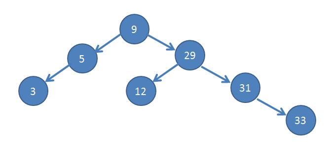
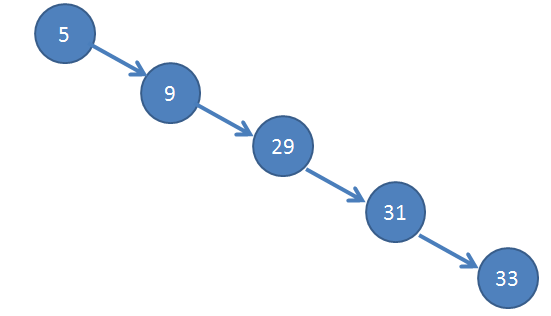
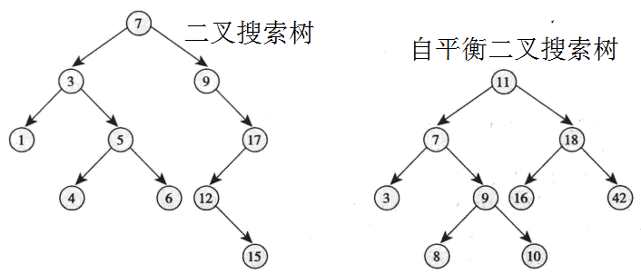
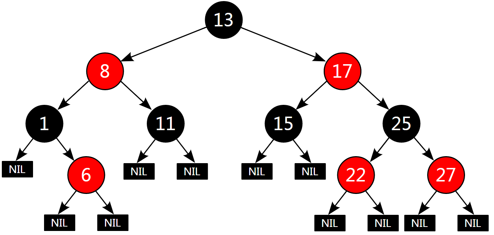
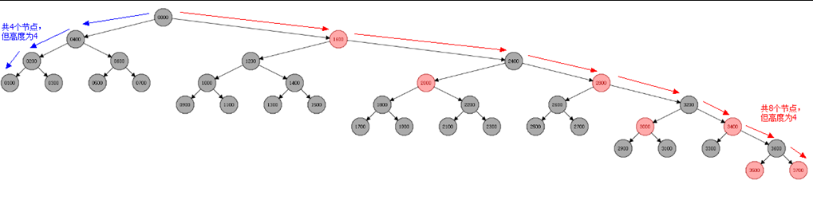
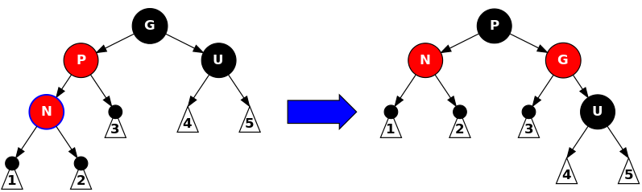

[toc]

转自：https://blog.popkx.com/the-principles-and-characteristics-of-linux-learning-21-self-balanced-binary-tree-and-red-black-tree/

# 自平衡二叉树和红黑树的原理和特点

## 二叉搜索树的局限性

上一节较为详细的介绍了C语言中的二叉搜索树，提到数据采取二叉搜索树的结构存储，可以获得不错的搜索性能。



二叉搜索树之所以有不错的搜索效率，是因为在往树中插入数值时，始终严格的遵守左子节点值比父节点值小，右子节点值比父节点大的准则。以搜索 12 为例：

```
从根节点开始，
12 比 9 大，所以转向右节点；
12 比 29 小，所以转向左节点；
查找完毕。
```

这样就避免了遍历所有数值。稍微思考一下应该能发现，当二叉搜索树的每个节点都有两个子节点时，树才是最优的，这时二叉搜索树才能在存储尽可能多数值的同时，保留优秀的搜索性能。为什么呢？我们考虑一下极端情况，假设所有节点（除了最后一个节点）都只有一个子节点，如下图：

这种情况的二叉树就是一个链表了，搜索时只能像链表一样线性遍历，丢失了二叉树应有的搜索性能。

## 自平衡二叉搜索树

为了解决二叉搜索树的这种缺陷，自平衡二叉搜索树就被提出了。平衡二叉搜索树本质上也是一个二叉搜索树，只不过它的所有叶子节点深度差不超过 1。


> 节点的深度是指从根节点起，达到它一共需要经过的父节点数目。处于树最末端的节点称为叶子节点。

按照之前的分析，上图右图显然比上图作图具备更优异的性能。

## 红黑树

虽然自平衡二叉树更能发挥二叉搜索树的优异搜索特性，但是维护起来却非常的麻烦，很难保证插入新数据的时候也具备不错的效率，所以红黑树就被提出了。一个典型的红黑树结构如下图：

红黑树是一种半平衡的二叉搜索树，它放弃了二叉搜索树的绝对平衡，换来了较为简单的可维护性，使得二叉搜索树插入新数据，以及搜索数据时，都具有不错的搜索性能。

之所以说红黑树是一种**半平衡**的二叉搜索树，是因为红黑树中所有叶子节点的深度相差不会超过一倍。为什么呢？在解答这个问题之前，先来看看红黑树的几条特性：
\* 所有节点要么是红色，要么是黑色
\* 根节点必须是黑色
\* 所有叶子（NULL，or NIL）节点都是黑色的
\* 红色节点的两个子节点必须是黑色（不能有连续的红色节点）
\* 从根节点到任意叶子节点，黑色节点的数目是相等的

只要二叉搜索树符合以上 5 条性质，它就是红黑树。事实上，提出这 5 条性质的目的就是为了获得红黑树的“所有叶子节点的深度相差不会超过一倍”这个特性。请看下图：

叶子节点最浅的路径必定出现在全是黑色节点的路径，最深的路径必定既有黑色节点，又有红色节点。**性质5**要求所有路径的黑色节点数目相等，所以对比叶子节点的最深路径和最浅路径时，只需考虑最深路径中的红色节点。**性质4**要求路径中不能出现连续的红色节点，所以最深的路径必定是红黑节点相间的，这就解释了为什么叶子节点最深的路径最多是最浅的路径的 2 倍。

如果插入和删除操作都遵循红黑树的 5 条规则，那么这个树就会始终保持是一个红黑树，即一个半平衡树，也就能维持树的插入和查询时的优异性能。之所以这么费尽心思的维护一个红黑树，是因为实践证明红黑树的这些规则遵循起来是相对简单的。

## 树节点的左旋和右旋

虽然红黑树的几条规则看来比较容易遵循，但是在使用C语言编程实现时，还是有些繁琐的。向红黑树插入数据时，一般分为两个步骤，首先把红黑树当作一棵普通的二叉搜索树插入数据，然后再进行旋转变换以及重新着色的操作，调整二叉树仍然是一个红黑树。

应该明白，红黑树也是一棵二叉搜索树，所以二叉搜索树的性质红黑树也应遵循。在向红黑树插入数据后的变换和重新着色操作中，着色显然不会影响二叉搜索树的性质，“红黑色”只是节点的一个标记而已，它不影响节点记录的数据，也不影响节点间的相对关系。真正改变树结构的是“旋转”操作，应该尽力避免会破坏**二叉搜索树性质**的操作，所以人们定义了“树节点的左旋和右旋”，如下图：

树节点的左旋和右旋均不改变二叉搜索树的性质，β始终介于 A、B之间。@Sun_TTTT 的动图更清晰一点，清楚的反应了左旋和右旋的特点：


只要在努力把二叉搜索树变换成红黑树的过程中，始终遵循不破坏**二叉搜索树性质**的操作，那么最后得到的红黑树一定仍然也是二叉搜索树。下图就是一次变换，按照前文的分析，显然变换后的二叉树的总体搜索性能更好。




那么，该怎样变换呢？其实还是有些复杂的，限于篇幅，本节不做介绍，下一节再结合 linux 内核中关于红黑树的C语言代码深入讨论之。

## 小节

我们费尽心思的琢磨出红黑树，又提出看起来非常拗口的红黑树 5 条性质，其实目的只有一个：尽可能**方便**的维持二叉搜索树的**平衡性**。这样就避免了文章一开头提到的“不合理树的结构”导致的二叉树搜索性能的下降，也不会出现“极端情况”：使用二叉树的数据结构，却生成了一条链表。。。


