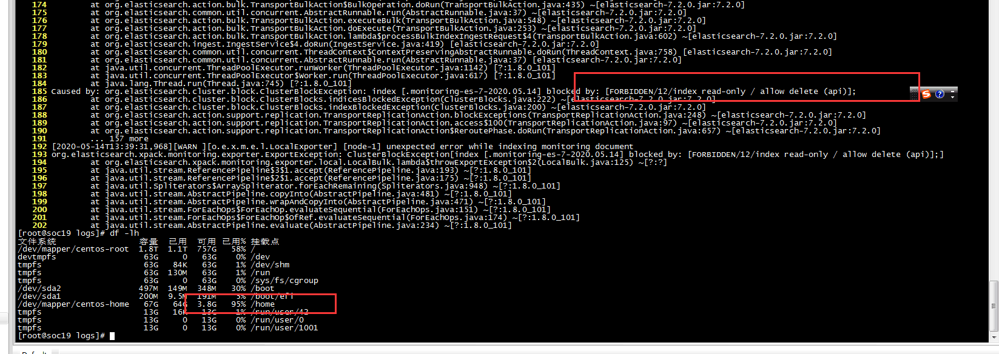
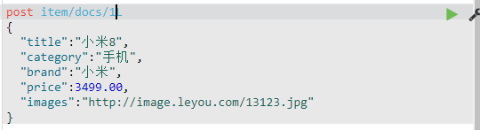
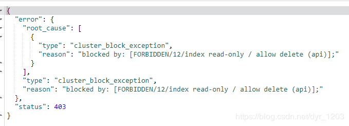
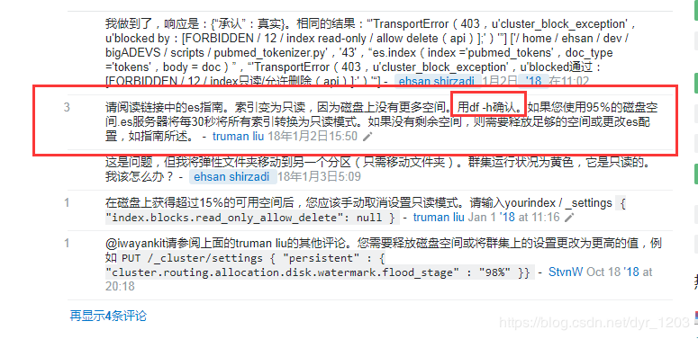
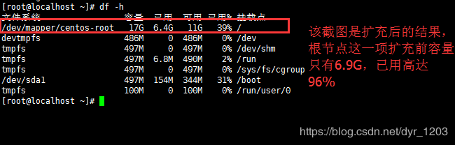
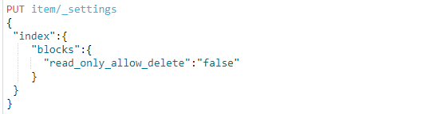
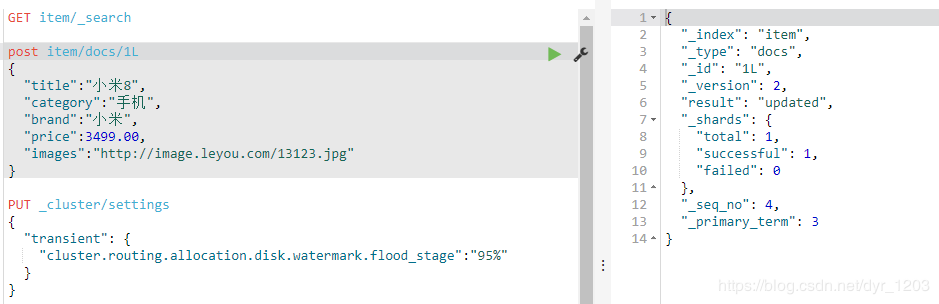

[toc]

转自：https://blog.csdn.net/dyr_1203/article/details/85619238

**记一次磁盘满了导致ES不能写的问题**

ES后台日志报错如下：

es单元测试时报：[FORBIDDEN/12/index read-only / allow delete (api)] - read only elasticsearch indices

之后用Kibana测试也是一样的报错

> ElasticSearch进入“只读”模式，节点无法更改

官方论坛找到的答案如下：

**stackoverflow的答案**

地址：https://stackoverflow.com/questions/48032661/transporterror403-ucluster-block-exception-ublocked-by-forbidden-12-inde

两个答案都提到了磁盘空间的问题，而我确实是跑在自己搭的虚拟机上，而且这个虚拟机镜像还是其他人那拷贝的一份，

执行df -h

接下来就是尝试扩充根目录，

具体看这篇博客即可https://blog.csdn.net/Penpower_generals/article/details/71088214

操作的时候跟博客内容不一样的回车即可

扩充后执行命令df -h就上上图看到的结果了

**之后还是要设置read_only_allow_delete为false才行**

问题解决

 
