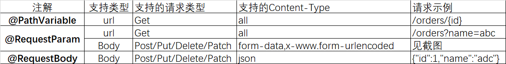
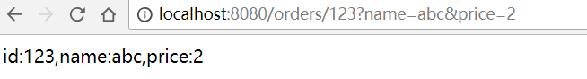
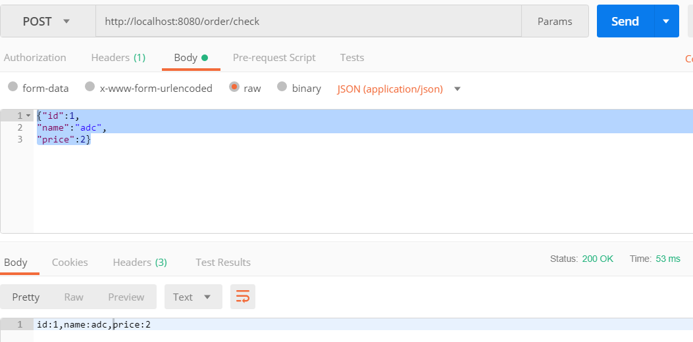

[toc]

转自：https://www.cnblogs.com/anywherego/p/9600871.html

一：获取参数

SpringBoot提供的获取参数注解包括：@PathVariable，@RequestParam，@RequestBody,三者的区别如下表：



 

示例代码：


Order：

```java
package com.example.demo.controller.user.entity;

public class Order {
    private Integer id;
    private String name;
    private Integer price;

    public Integer getId() {
        return id;
    }

    public void setId(Integer id) {
        this.id = id;
    }

    public String getName() {
        return name;
    }

    public void setName(String name) {
        this.name = name;
    }

    public Integer getPrice() {
        return price;
    }

    public void setPrice(Integer price) {
        this.price = price;
    }
}
```


```java
package com.example.demo.controller.user.controller;

import com.example.demo.controller.user.entity.Order;
import org.springframework.web.bind.annotation.*;

@RestController
public class OrderController {

    /**
     * Get请求的参数可以通过@PathVariable和@RequestParam获取
     * @param id 必填
     * @param name 必填
     * @param price 选填，默认值为0
     * @return
     */
    @GetMapping("/orders/{id}")
    public String getOrder(@PathVariable(value = "id")Integer id,
                           @RequestParam(value = "name")String name,
                           @RequestParam(value = "price",required = false,defaultValue = "0") Integer price){
        String result = "id:"+id+",name:"+name+",price:"+price;
        return result;
    }

    /**
     * Post使用@RequestBody注解将Json格式的参数自动绑定到Entity类
     * @param order
     * @return
     */
    @PostMapping("/order/check")
    public String checkOrder(@RequestBody Order order){
        String result = "id:"+order.getId()+",name:"+order.getName()+",price:"+order.getPrice();
        return result;
    }

    /**
     * Post使用@RequestParam获取请求体中非Json格式的数据
     * @param amount
     * @param discount
     * @return
     */
    @PostMapping("/order/checkmore")
    public String checkMore(@RequestParam(value = "amount")Integer amount, @RequestParam(value = "discount")float discount){
        String result = "amount:"+amount+",discount:"+discount;
        return result;
    }

    /**
     * Post请求也可以直接与对象类绑定，但需要参数名一致，不支持json格式，只支持form-data和x-www.form-urlencoded格式
     * @param order
     * @return
     */
    @PostMapping("/order/add")
    public String addOrder(Order order){
        String result = "id:"+order.getId()+",name:"+order.getName()+",price:"+order.getPrice();
        return result;
    }

    /**
     * Put请求可以直接与对象类绑定，但需要参数名一致
     * @param id
     * @param order
     * @return
     */
    @PutMapping("/order/{id}/update")
    public String updateOrder(@PathVariable(value = "id")Integer id,Order order){
        String result = "pathid:"+id+"===Order(id:"+order.getId()+",name:"+order.getName()+",price:"+order.getPrice()+")";
        return result;
    }


}
```

注意点：

1.针对一些非必填的参数，可以使用required关键字来标识，同时必须设置默认值defaultValue,如getOrder方法中对price参数的获取：

　　@RequestParam(value = "price",required = false,defaultValue = "0") Integer price

2.参数可以直接与Entity类绑定，但不支持json格式，只支持form-data和x-www.form-urlencoded格式

　　@PostMapping("/order/add")

　　public String addOrder(Order order){

3.使用的Postman做的测试，所有接口都测试通过，也推荐大家使用Postman作为日常的接口测试工具，安装和操作都很简单。

 附部分截图：

 　　Get:@PathVariable,@RequestParam



　　Post:@RequestBody



 

获取到参数以后就是要对数据做校验了，在下一篇中进行介绍

