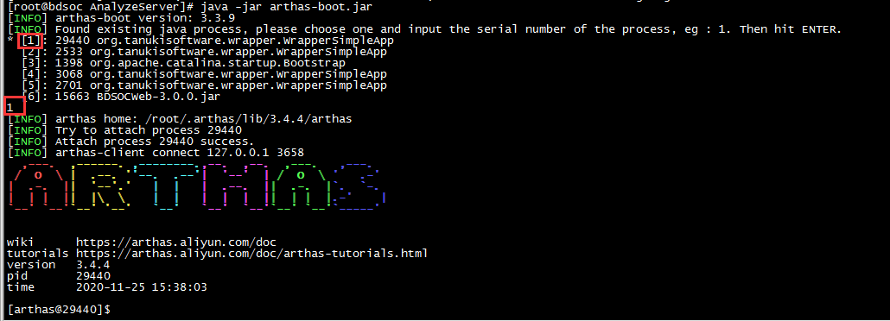
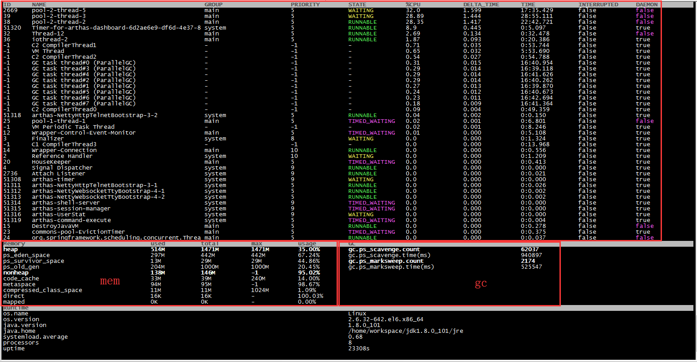
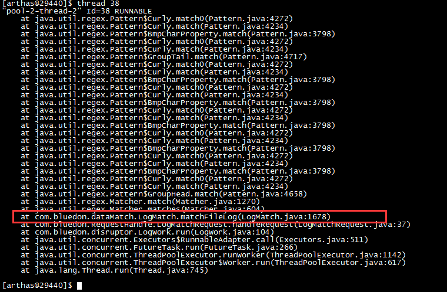
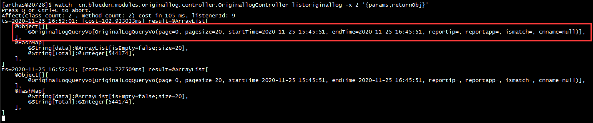
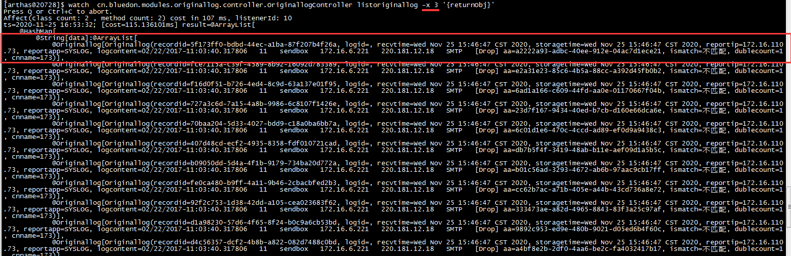

[toc]

`Arthas` 是Alibaba开源的Java诊断工具，官网：https://arthas.aliyun.com/doc/

# CPU问题定位

一般就是cpu,memory很高，需要定位导致这个问题的具体代码，而arthas可以做到这点

```shell
#启动
java -jar arthas-boot.jar 

#选择对应pid的应用
```



```shell
#查看应用的CPU，mem的占用情况
[arthas@29440]$ dashboard 
```



```shell
#查看某个线程(查看线程的堆栈)（我们查看CPU很高的thread），可以看到是哪个线程的哪里的代码导致CPU很高
thread 38
```




# 前后端调试

有时候需要线上查看前端传过来的参数，此时可以使用watch

```shell
#查找某个类的路径（注意管道前后一定要有空格）
Affect(row-cnt:105) cost in 134 ms.
[arthas@20728]$ sc *Controller* | grep Ori
cn.bluedon.modules.RetrievalCenter.controller.OriginalLogController
cn.bluedon.modules.RetrievalCenter.controller.OriginalLogController$$EnhancerBySpringCGLIB$$a5d88736
[arthas@20728]$ 

#查看传参
[arthas@20728]$ watch  cn.bluedon.modules.originallog.controller.OriginallogController listoriginallog -x 2 '{params,returnObj}'
```



```shell
#查看返回参数（-x 指定深度）
[arthas@20728]$ watch  cn.bluedon.modules.originallog.controller.OriginallogController listoriginallog -x 3 '{params,returnObj}'
```




参考：https://www.wdbyte.com/2019/11/arthas/


