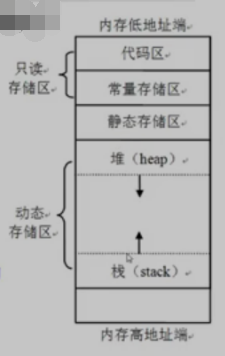
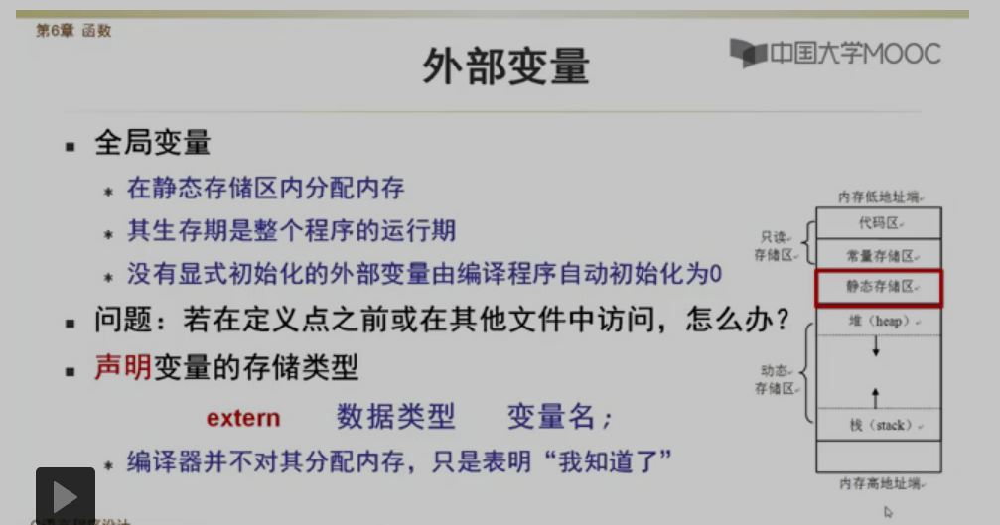
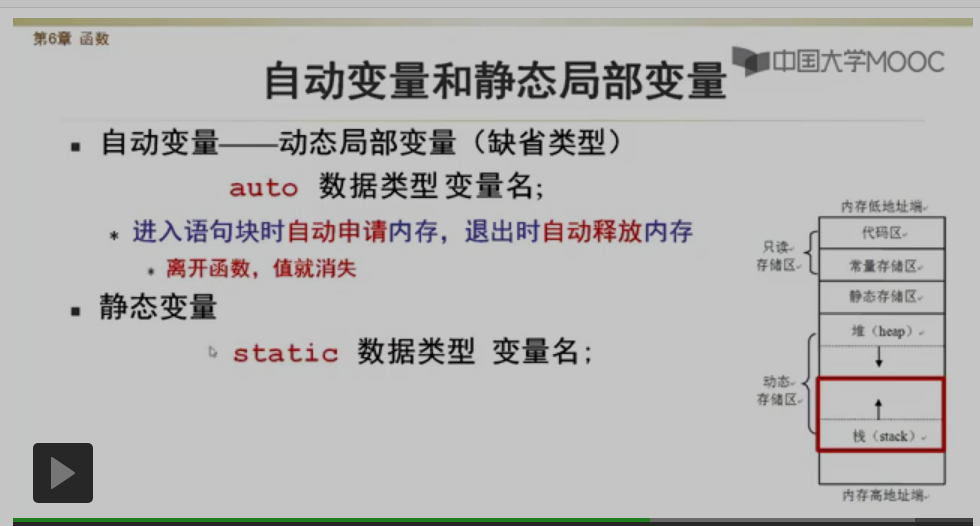
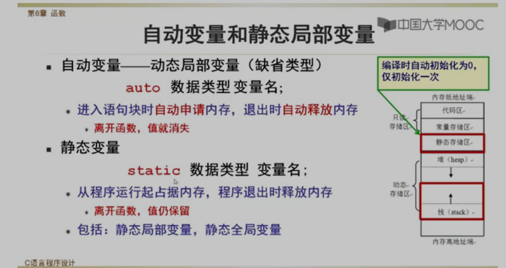
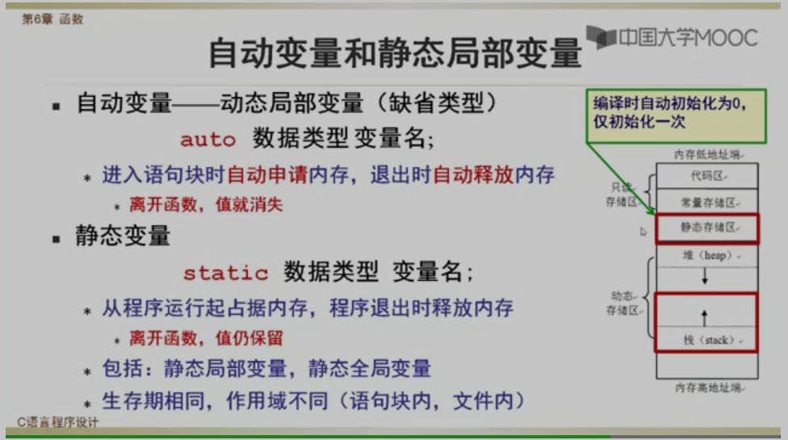
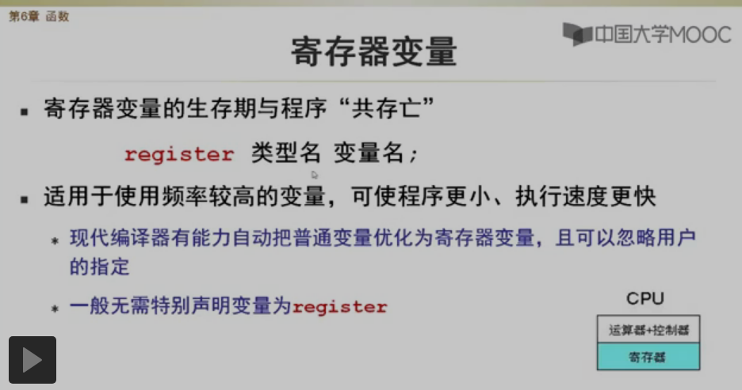

[toc]

# 程序变量在内存中的位置

* 只读存储区

  存放机器代码和常量等只读数据

* 静态存储区

  存放程序中的全局变量和静态变量（静态局部和静态全局变量）

  静态：发生在程序编译或链接时

* 动态存储区

  包括堆和栈，其中，栈用于保存函数调用时的返回地址，函数的形参，局部变量等信息

  动态：发生在程序载入和运行时



# 变量的存储类型

* 编译器为变量分配内存的方式，决定了变量的生存期（Lifetime）
* 在静态存储区中分配内存的变量：生存期是整个整个程序，**全局占据内存**
* 在动态存储区中分配的内存变量：生存期是定义他的语句块

```c
// 声明存储类型
存储类型	数据类型	变量名;

// C储存类型关键字
auto (自动变量)
static （静态变量）
extern	（外部变量）
register (寄存器变量)
```


# 外部变量




# 自动变量和静态局部变量








**静态局部变量，会一直保留，尽管语句块退出，静态局部变量的内存也是不会释放的，在下一次进入该语句块时，还是上一次访问的结果**

# 寄存器变量




```c
/*变量的作用域和存储类型
				  ---------- 静态全局变量 （只限本文件使用）
-----------全局变量 |
|				  |---------外部变量 （非静态外部变量允许其他文件引用）
|									（定义点之前使用，需要extern声明）
|
|				  |---------静态局部变量 （离开函数，值仍保留）
-----------局部变量  |
				  ----------动态局部变量 （自动变量） （离开函数，值就消失）
*/
```

