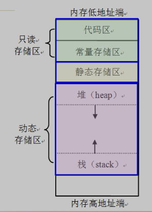

[TOC]

# 作用域

代码块作用域

```c
int main(void)
{
  int a = 10;
  a = 1;
  {
    int a = 100;
  }
  
  printf("%d\n", a);//1
}
```

全局作用域

```c
int a = 200;//全局变量
int main(void)
{
  int a = 10;
  a = 1;
  {
    int a = 100;
  }
  
  printf("%d\n", a);//1
}
```

文件中定义变量

```c
//vi a.c
int a = 10;

//vi main.c
extern int a;//有一个int类型的变量，名字为age，已经在其他文件中定义了，这里可以直接使用
void set_age(int n)
{
  age = n;
}
void get_age()
{
  printf("%d\n", age);
}
int main(void)
{
  set_age(10);
  get_age();
}
```

auto自动变量

```c
auto int a = 0;//
int a = 0;//不写auto，C语言默认变量都是auto，signed
//自动变量，不需要关心变量在内存中什么时候创建和释放，由编译器解决
```

register寄存器变量

```c
/**
通常变量在内存当中，如果能把变量放到CPU的寄存器中，代码的执行效率会更高
*/
register int i = 0;//建议：如果有寄存器空闲，那么这个变量将放入寄存器中
//int *p = &i;//error，因为指针中存放的是内存地址，但是寄存器是没有内存地址的，所以对于一个寄存器变量是不能取地址的
```

静态局部变量

```c
void mystatic()
{
  static int i = 0;//这句话只会执行一次，不管函数调用多少次
  printf("%d", i);//静态变量，只初始化一次，并且程序运行期间，静态变量一直存在
  i++;
}
int main(void)
{
  int i = 0;
  for(;i<10;i++)
  {
    mystatic();
  }
}
```


静态全局变量

```c
static int a = 20;//静态全局变量
int main(void)
{
  return 0;
}
```

静态函数

```c
//此函数只能在该文件中使用
static void test()
{
    int a = 2;
}

//默认情况下，此函数是全局的
void test()
{
    int a = 2;
}
```

调用其他文件的函数extern

```c
//vim a.c
void test2()
{
    int a = 2;
}

//============================
//vim main.c
void test2();//声明
//extern void test2();//等价声明

/*
extern int age;//1个含义，声明一个变量，此时变量一定已经定义了
int age;//2个含义：1.声明一个变量（如果已经定义了一个变量）；2.定义一个变量
*/
int main()
{
    test2();//调用
    
    return 0;
}
```

# 内存四区

## 代码区，静态区，堆区，栈区介绍

```c
/**
代码区：程序被操作系统加载到内存的时候，所有的可执行代码都被加载到代码区，也叫代码段（指令），这块内存是不可以在运行期间修改的

静态区：静态变量和全局变量和常量

堆区：heap和栈一样，也是在程序运行过程中可以随时修改的内存区域，但是没有栈那样先进后出的顺序
//堆是一个大容器，他的容量要远远大于栈，但是在C语言中，堆内存空间的申请和释放是需要手动通过代码来完成的

栈区：stack是一种先进后出的内存结构，所有的自动变量，函数的形参都是由编译器自动放出栈中，当一个自动变量超出其作用域时，自动从栈中弹出
//对于自动变量，什么时候入栈，什么时候出栈，是不需要程序控制的，由C语言编译器实现
//栈不会很大，一般都是以K单位的
//如果一个程序有多个线程在跑，那么会有多个栈的存在
//栈溢出：当栈空间已满，但是还在往栈内存压保留，这就叫做栈溢出，对于一个32位操作系统，最大管理4G内存，其中1G是给操作系统自己用，剩下的3G都是给用户程序的，一个用户程序理论上可以使用3G的内存空间
//多层递归，会有栈溢出的问题
*/
```




```c
int c = 0;//静态区


//正确的写法，常量是在静态区
const char *getstring()
{
  return "hello";//返回静态区中常量的地址
}

int main(void)
{
  const char *ss = getstring();
  printf("ss = %s\n", ss);
}

void test(int a, int b)
{
    //打印a,b的地址
    printf("%d, %d\n", &a, &b);
}

int main()
{
    int a = 0;//栈区
    auto int b = 0;//所有的自动变量都在栈区
   
    printf("%d,%d\n", &a, &b);//分别打印变量a,b的地址
    //他们的地址相差四个字节，说明他们的地址是紧挨着的
    
    printf("%d,%d,%d\n", &a, &b, &c);//打印c的地址
    
    printf("%d,%d,%d,%d\n", &a, &b, &c, main);//打印main函数的地址
    //main函数是在代码区
    
    static int d = 0;//静态区，和上面的静态变量c是挨着的
    printf("%d,%d,%d,%d,%d\n", &a, &b, &c, &d, main);
    
    //打印函数形参的地址
    test(a, b);
}
```


## 静态区


## 代码区


## 栈区

栈区地址比较


栈区：函数形参


栈结构说明


操作栈地址，无效

```c
int * geta()
{
    int a = 100;
    return &a;//不能将一个栈变量的地址通过一个函数的返回值返回，因为在函数返回的时候，栈变量就会释放，这个地址是一个无效的地址
}

//不合法
char *getstring()
{
  char array[10] = "hello";
  return array;//error，不能将一个栈区地址返回，因为函数返回之后，栈变量就释放了
}


//合法
char *getstring()
{
  static char array[10] = "hello";
  return array;//返回静态区的地址
}


int main()
{
    int *p = geta();//这里返回的是一个栈的变量的地址，这个地址在函数返回的时候，会释放，所以这个地址是无效的
    *p = 1000;//对无效地址进行操作
    printf("%d\n", *p);
}
```

栈溢出

```c
int main()
{
    //分配了一个100M空间,会产生栈溢出
    char array[1024*1024*100] = {0};//定义一个超大的数组，一定会栈溢出
    array[0] = 'a';
	
    return 0;
}
```

## 堆的分配和释放

```c
//malloc
void * malloc(size_t _Size);
//malloc函数在堆中分配参数_Size指定大小的内存，单位：字节，函数返回void*指针

#include <stdlib.h>
int main(void)
{
    //在堆中申请了10个int大小的空间,返回分配内存的首地址
    int *p = (int *)malloc(sizeof(int)*10);//在堆中间申请内存，堆的内存在32位系统中接近3G
    //在堆中申请了10char这么大的空间
    char *p1 = (char *)malloc(sizeof(char)*10);
    
    
    //malloc和free一定要成对使用：即有分配就有释放，不然会有内存泄漏的问题
    //释放空间
    free(p);//释放通过malloc分配的堆内存
    //free(p);//释放两次，error,一块内存不能free两次
    free(p1);//释放通过malloc分配的堆内存
    
}
```

使用分配的堆内存

```c
#include <stdlib.h>

void* malloc(unsigned int size);
void* calloc(unsigned int num, unsigned int size);
// calloc更明智，自动将分配的内存初始化为0

/**
void * 型指针不指定其指向哪一种类型，可指向任意类型的变量
使用时，需要强转 （Type*）为其他类型
**/
int *p = (int *)malloc(sizeof(int)*10);

//释放:释放由malloc or calloc申请的内存块
void free(void* p);
```


```c
#include <stdlib.h>
int main(void)
{
    //栈数组
    int array[10] = {0};
    //堆数组
    int *p = (int *)malloc(sizeof(int)*10);
    
    //p = array;//指针指向了栈空间的地址
    
    //首先清空这块堆内存
    memset(p, 0, sizeof(int)*10);
    //赋值
    int i;
    for(i=0; i<10; i++)
    {
        p[i] = i;
    }
    
    //释放空间
    free(p);//释放通过malloc分配的堆内存
    //如果p指向的是栈空间的地址，那么此时不需要free，栈空间程序会自动释放
}
```

函数中返回堆地址

```c
int * geta1()//可以通过函数的返回值返回一个堆地址，但是记得一定要free
{
    int *p = (int *)malloc(sizeof(int));//申请了堆空间
    return p;
}

int *geta2()//合法的，
{
    static int a = 0;
    return &a;//返回静态区的地址
}

int main(void)
{
    int * p = geta1();
    *p = 100;
    free(p);
    
    int * p2 = geta2();//ok
    *p2 = 100;//ok
    //free(p);//error，静态区的内存不能free
    
    return 0;
}
```

指针值传递问题

```c
void getheap(int *P)//这是两个不同的变量
{
    printf("p=%p\n", &p);
    //分配空间
    p = malloc(sizeof(int)*100);  
    //整个函数执行完之后，p这个栈变量就不存在了，导致他指向的具体堆空间的没有释放，那么就会有内存泄漏问题
}

int main(void)
{
    int *p = NULL;
    printf("address p=%p\n", &p);
    getheap(p);//error，此时p还是指向的是NULL
    printf("%d\n", p);
    p[0] = 1;//p没有指向任何内存，不能进行这样的操作
    p[1] = 2;

    free(p);
    
    return 0;
}
```


解决上面问题的方式

```c
//使用二级指针
void getheap1(int **p)
{
  *p = malloc(sizeof(int)*10);
}

int main(void)
{
  int *p = NULL;//
  getheap1(&p);
	p[0] = 1;
  p[1] = 2;
  free(p);
  
  return 0;
}
```


# 堆，栈，内存映射

* 每个线程都有自己的栈，现金又出（LIFO）
* 栈的最大尺寸固定，超出则引起栈溢出
* 变量离开作用范围后，栈上的数据会自动释放
* 堆上内存必须手工释放(C/C++),除非语言环境支持GC
* 栈还是堆？
  * 明确知道数据占用多少内存, 数据很小---栈
  * 大量内存,不确定需要多少内存---堆

```c
int main()
{
  int i = 0;
  scanf("%d", &i);
  //int array[i];//error，定义数组的时候，必须是常量
  
  //使用堆动态创建数组
  int *array = malloc(sizeof(int)*i);
  free(array);
  
}
```


# 栈实现原理

C语言的函数入栈是从右往左进行的


# 查看程序运行时，栈和堆的内存大小

```c
int main(void)
{
  int i = 0;
  getchar();//这样程序就会等待在这里，我们可以在Linux下看程序的内存分布情况
  
  return 0;
}

//ll /proc/pid/maps
```

查看程序执行时栈空间的大小


查看程序执行时，堆空间的大小

```c
int main(void)
{
  char *p = malloc(1024);
  int i = 0;
  getchar();//这样程序就会等待在这里，我们可以在Linux下看程序的内存分布情况
  
  return 0;
}

//ll /proc/pid/maps
```


操作系统在管理内存的时候，最小单位不是字节，而是内存页


查看Linux的内存页的大小

```shell
cat /proc/pid/smaps #和maps显示的内容是一样的，只不过是human话
```


# calloc,realloc函数

## calloc

```c
int main(void)
{
  char *p = malloc(10);//10byte
  memset(p, 0, 10);//将分配的内存空间清0
  int i;
  for(i=0; i<10; i++)
  {
    printf("%d\n", p[i]);//打印分配的内存中的值
  }
  free(p);
  
  return 0;
}
```


自动清理分配的内存空间

```c
//void * calloc(size_t _Count, size_t _Size);
//calloc与malloc类似，负责在堆中分配内存

//char *p = malloc(10);
char *p  = calloc(10, sizeof(char));//分配了10个sizeof(char)类型的大小的内存
free(p);//最后还是要释放空间
```

## realloc

需要分配连续的空间

```c
char *p1  = calloc(10, sizeof(char));
char *p2  = calloc(10, sizeof(char));
//不能保证上面分配的两块内存是连续的

char *p3 = realloc(p2, 20);//在p1的内存基础上，扩展连续的内存20字节,如果原有内存没有连续空间，那么将会分配一个新空间，将原来的内存空间copy到新空间，然后释放原有内存空间
//realloc和malloc一样，只是分配内存，不进行内存初始化的清理
//最后释放p3
free(p3);//同时释放p2,p3
free(p1);

```


将原有内存缩小

```c
char *p2  = calloc(10, sizeof(char));

char *p3 = realloc(p2, 5);//减小原有内存

```

在空的基础上进行扩展

```c
char *p = realloc(NULL, 5);//等于malloc(5);
```

内存分配失败（没有剩余的堆内存可以使用了）

```c
//malloc, calloc, realloc都有内存分配失败的时候
int *p  = malloc(sizeof(int)*10);
if(p==NULL)//没有堆内存可以使用了，这个时候的错误往往是致命的
{
  exit(0);//程序直接退出，没有内存了，做什么都没有意义了
}

```

