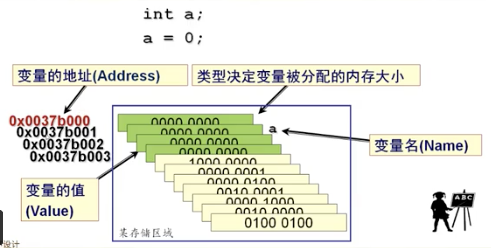
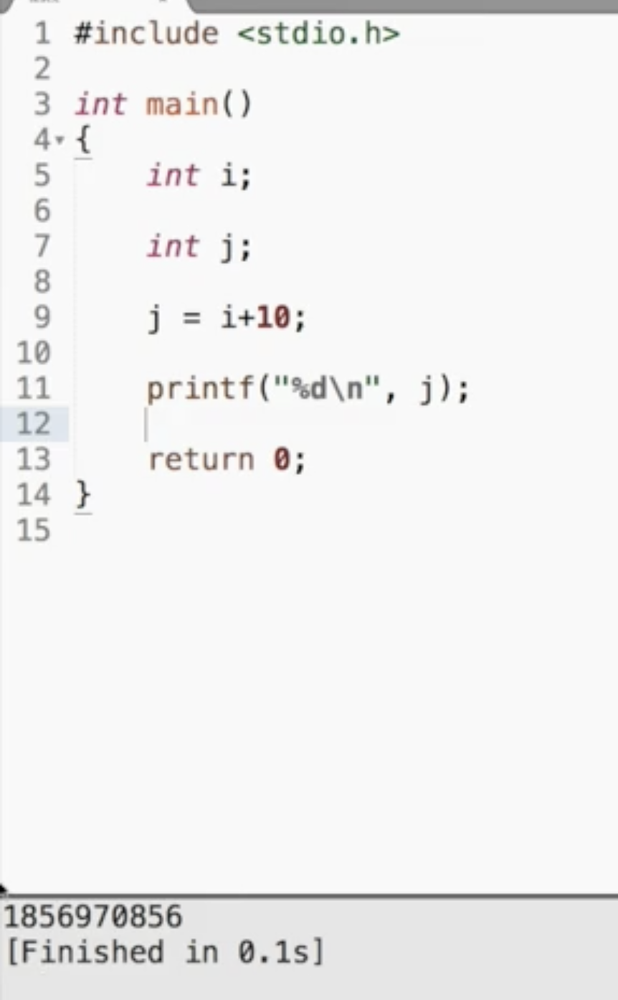
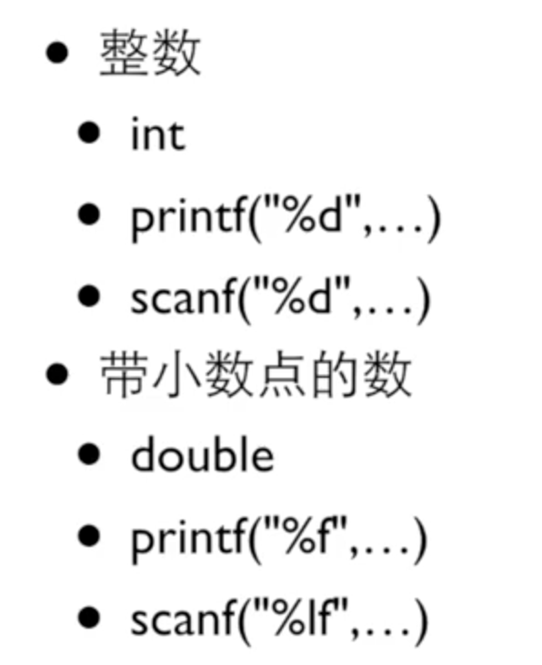
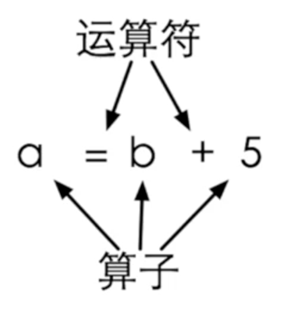
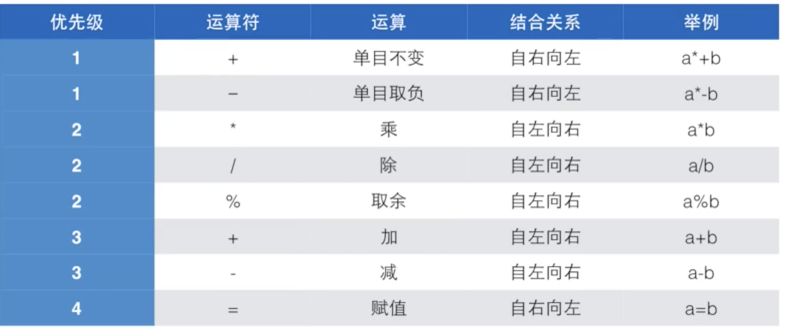

[TOC]

# 变量

* 变量必须先定义，后使用

* C89规定所有变量必须在第一条可执行语句前定义（C99取消了这一规定，但是许多程序员还是遵循着C89的定义）

```c
#include "stdio.h"

int main()
{
 int price = 0;
 printf("please input price=");
 scanf("%d", &price);
 
 int change = 100 - price;

 printf("hai ni %d \n", change);
 
 return 0;

}


/*
变量定义的一般形式：
<类型> <变量名称>
int price;
int amount;
double money;

变量需要一个名字(标识符)：由字母，数字，下划线，以字母和下划线开头，C中有一些关键字不能用作标识符
*/

```


变量的属性




* 如何计算变量占内存空间的大小？

  * 用sizeof运算符

  * 编译时执行的运算符，不会导致额外的运行时间的开销

    ```c
    //sizeof是一个运算符，而不是一个函数
    sizeof(int)
      
    sizeof(类型)
    
    //变量或表达式所属类型占的内存字节数
    sizeof(变量 or 表达式)
    sizeof(a+b)
    ```

    


# 赋值和初始化

* 如果在变量在定义的时候没有初始化

  

  > 如果变量在没有被初始化的时候使用，那么变量所**指向的内存中原来有什么值**，那么就是什么值，所以建议一般变量都会进行初始化


```c
//定义变量的初始值
int price = 0;
int amount = 0;
//一行中定义多个变量
int price =0,amount = 100;
```

# 常量

在程序中不能改变其值的量

```C
const int AMUONT = 100;

/*
const是一个修饰符，加在int前面，用来给这个变量加上一个const(不变)的属性，这个const的属性表示这个变量的值一旦初始化，就不能再修改了
*/
```

* 在程序中直接使用的常数，称为幻数（Magic Number）

* 使用幻数存在的问题

  * 程序的可读性变差
  * 容易发生书写错误
  * 当常数需要改变时，需要修改的地方较多，繁琐，而且可能遗漏

* 良好的程序设计风格建议把幻数定义为：

  * 宏常量
  * const常量

  ```c
  #define 标识符(一般大写)  字符串
  #define PI 3.14159
  #define PI 3.14159; //错误，没有分号
  ```

* 因为是编译预处理指令，所以在编译的时候会进行宏展开，宏替换（这也是为什么，后面不需要分号）

  

  

* 问题：宏常量存在的问题

  * 没有数据类型，编译器在宏替换的时候不进行类型检查
  * 只进行简单的字符串替换，极易产生意想不到的错误

* 能否声明具有某种数据类型的常量呢？

  const常量

  

  


# 浮点数

* 两个整数的运算的结果只能是整数，如:1/2=0, 10/3=3 ,只是取了整数部分

* 10.0/3=3.33333

* 当浮点数和整数放到一起运算时，C会将整数转换成浮点数，然后进行浮点数的运算
* 


# 表达式

* 运算符(operator)：进行运算的动作，比如加法运算符"+"，减法运算符"-"

* 算子(operand):是指参与运算的值，这个值可能是常数，也可能是变量，还可能是一个方法的返回值

  

# 运算符的优先级



