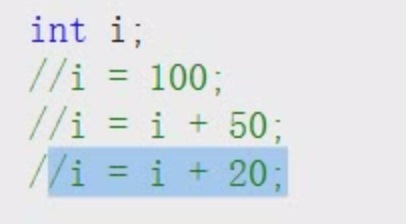
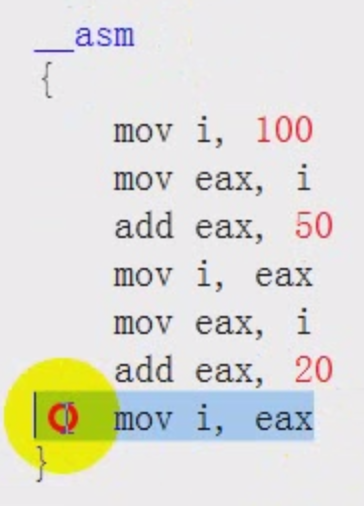
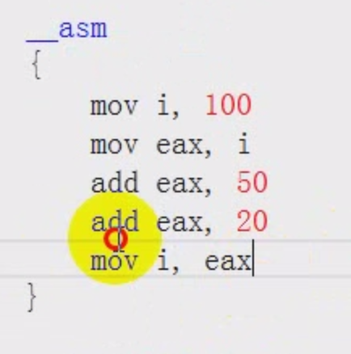
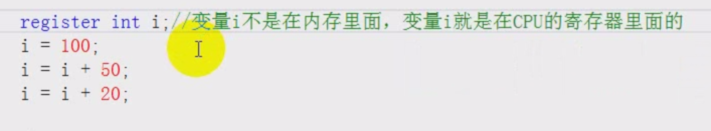
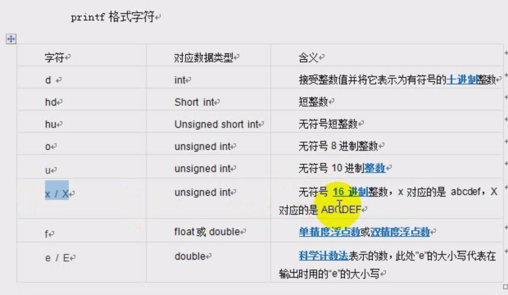
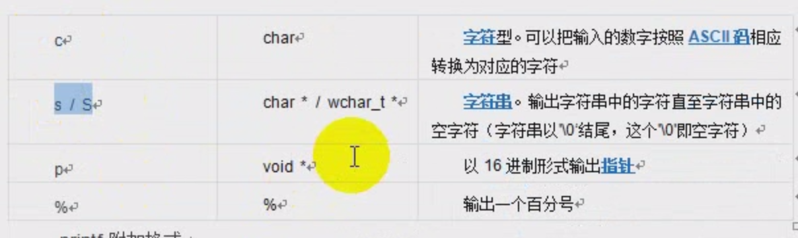

[TOC]

# 常量

常量就是在程序中不可变的量，常量在定义的时候就必须定义一个初值

* define

```c
#include <stdio.h>

#define MAX 10  //定义一个宏常量，值为10

int main()
{
    int i;
    i = 100;//定义一个变量，名字为i，值是可以变的
    // MAX = 2000; //error 常量的值不能修改
    printf("%d\n", MAX);
    
    return 0;
}
```

* const

```c
#include <stdio.h>

int main()
{
    const int a = 20; //定义了一个const常量，值为20
  	a = 30;//error 常量的值不能修改
    printf("%d\n", MAX);
    
    return 0;
}
```

* 字符串常量

```c
#include <stdio.h>

#define STRING "hello world\n"  //定义一个字符串常量

int main()
{
    printf(STRING);
 	
    //定义字符串const常量
    const char *str = "hello c";
    return 0;
}
```

> 对于#define类型的常量，c语言的习惯是常量名称为大写，但对于普通类型的常量，使用小写

# 二进制，八进制，16进制

## 二进制

二进制：逢二进一

一个二进制的位只能表示0或者1，两种状态，简称bit

一个字节为8个二进制，称为8位，简称Byte

一个字为2个字节，简称WORD

两个字为双字，简称DWORD

500GB (500GByte)

10Mb  (10Mbit)

## 8进制

八进制：逢八进一

```c
printf("%d", 010);//8进制前面加0，表示8进制
```

## 16进制

逢16进1

```c
0,1,2...,9,a,b,c,d,e,f
printf("%d\n",0x10);//十六进制前加0x,表示16进制
```

## 进制转换

```CQL
#2进制	111		101	 	111
#8进制	

#2进制	0001	1110	1111
#16进制
```


# 原码，补码，反码

为了便于计算，计算机内部都是按照补码进行存储和计算的

| 数字 | 原码      | 反码      | 补码      |
| ---- | --------- | --------- | --------- |
| 7    | 0000 0111 | 0000 0111 | 0000 0111 |
| -7   | 1000 0111 | 1111 1000 | 1111 1001 |

```c
//十六进制输出数据，这样就是是补码输出
//16进制数是二进制的简单表达，所以他不表达负数
printf("%x\n", -10);
printf("%X\n", -10);//用大写输出16进制
printf("%o\n", -10);//用八进制输出，8进制也是表示的二进制的，没有正负之分

//sizeof求指定数据类型在内存中的大小，如果机器是32位，那么输出4byte
printf("%d\n", sizeof(10));
int i = 10
printf("%d\n", sizeof(i));
```


# int，unsigned int 类型

int就是32位的一个二进制整数，在内存中占据4个字节的空间

```c
//输出一个有符号的十进制的整数
printf("%d", 10);
//输出无符号整数,忽略最高位是符号位，正数输出
printf("%u", 10);

//unsigned表示无符号整数，无符号数都是正数；例如8位的有符号数：-128~127，但是如果是无符号数：0~255
unsigned int e = 10;
printf("%d\n", sizeof(e));

unsigned short f;//无符号的short
unsigned long g;//无符号的long
unsigned long long l;//无符号的long long
```


# short,long, long long 

```c
//短整数，在32位系统下是2个字节，16位
short i = 10;
printf("%d\n", sizeof(i));

//长整数，在32位系统下，long都是4字节，在64位系统下，Windows下还是4个字节，Linux下是8个字节，int无论是在32位系统还是64位系统下，都是4个字节
long i = 10;
printf("%d\n", sizeof(i));

//64位，8字节大小的整数,和平台无关，对于32位操作系统，CPU寄存器是32位，所以计算long long的效率很低
long long i = 10;
printf("%d\n", sizeof(i));
```

# 整数溢出

计算一个整数的时候超过整数能够容纳的最大单位后，整数会溢出，结果是：高位舍弃

```c
unsigned short number = 0xffff;
number = number+1;
printf("%d\n", number);
```

# 大端对齐和小端对齐

对于Intel这种x86这种复杂的指令CPU，整数在内存中是倒着存放的，低地址放低位，高地址放高位，这就是小端对齐

但对于Unix服务器的CPU，更多的采用大端对齐的情况


```c
//内存都是以字节为单位的
int a1 = 0x12345678;
printf("%p\n", &a1);//%p的意思是显示一个内存的地址
printf("%p\n", &a1+1);//%p的意思是显示一个内存的地址
printf("%p\n", &a1+2);//%p的意思是显示一个内存的地址
printf("%p\n", &a1+3);//%p的意思是显示一个内存的地址
```

# char

```c
char ch;
ch = 'a';
printf("%c", ch);

//占用1个字节
printf("%d\n", sizeof(ch));

//ch等于一个整数
ch = 52;
printf("%c", ch);
ch = '4';

//52就是4这个字符的ASCII码
printf("%d", ch);

//char的本质就是只有一个字节大小的整数
//有符号：-128~127
//无符号：0~255
unsigned char a = 0;
char a = 0;//有符号数
```

# 特殊字符

不可见字符

```c
//报警
char c = '\a';
//以字符输出
printf("%c\n", c);

//退格
char c = '\b';
printf("%c\n", c);

//换行
char c = '\n';

//回车
char c = '\r';

/*
回车：将打字机的头移动到行首
换行：将打字机的头移动到下一行
*/

//制表符
char c = '\t';

//斜杠
char c = '\\';

//单引号
char c = '\'';
//双引号
char c = '\"';

//问号
char c = '\?';
```


# 浮点数

浮点数的效率是很低的，如果只是整数计算，那么就避免使用浮点数

```c

float -->4字节
printf("%d\n", sizeof(float));

double --->8字节
printf("%d\n", sizeof(double));

long double
printf("%d\n", sizeof(long double));


//打印浮点数
printf("%f\n", d);

//浮点数的四舍五入
float f = 3.4;
int i = f+0.5;
```


# 类型限定

const, volatile, register

```c
//const：是代表一个不能改变值的常量
//volatile:代表变量是一个可能被CPU指令之外的地方改变
int i = 100;
i = i+1;
i = i+10;
i = i+35;
//编译器会将上面的语句合并成一种
i = i+45;

volatile int i = 100;//告诉编译器，不要自作聪明的给我优化这个变量的代码,编译器就不会针对这个变量去优化目标代码

//register
//变量在CPU寄存器里面，而不是在内存里面，但是register是建议型的指令，而不是命令型指令
```



编译器按照原始的语句进行如下转换成汇编



以上的汇编效率并不高，怎么能够转换成如下的汇编呢？





# 字符串的格式化输出和输入

* printf

字符串是内存中一段连续的char空间，是以`\0`结尾





```c
printf("%s" , "hello world");

//输出%
printf("%%");

//输出多种类型
printf("%s, %d\n", "acb", 10);
```


* putchar

  ```c
  //打印字符
  putchar(97);
  putchar('A');
  
  ```

* scanf

  接收输入

  ```c
  int a = 0;
  int b = 0;
  scanf("%d", &a);//用&取地址
  scanf("%d", &b);
  ```

* getchar

  得到用户键盘输入的字符

  ```c
  char a = 0;
  a = getchar();//得到用户键盘的按键
  printf("%c", a);
  ```

  

  

# 运算符

```c
//取余数%
//+=加上自身，赋值给自身
//--,++
//a++;++a;表达式返回值的不同，a最后自身的值相同

//逗号运算符,逗号表达式，先求逗号左边的值，然后求逗号右边的值，整个语句的值是逗号右边的值
int i = (a=b, c+d);
int i = (a=b, a+d);
```

# 复合语句

```c
int i = 9;
{
  i = 100;
}
printf("%d\n", i);//100
```


# 逻辑运算符与if语句

在C语言中0表示false，非0表示true

```c
int i = (3<6);
printf("%d\n", i);//1

int i = (3>6);
printf("%d\n", i);//0

//==来判断两个变量是否相等
//!=

int main() //一个函数在C语言里面，如果只是空(),代表整个函数可以有参数，也可以没有参数
int main(void)//如果是(void)就是明确的表达，没有任何参数
int main() //在C++中，那么就是没有参数
 
//switch
int i = 0;
switch (i)
{
  case 0:
    printf("i=0\n");
    break;//停止继续执行
  case 1:
    printf("i=2\n");
    break;
  default:
    printf("i=default\n");
}

//?
int i = -9;
int x = (i<0) ? -i : i;


//goto语句,无条件跳转
goto end;//无条件的跳转到标号处执行
//....
end://标号
printf("end\n");


//while
while(1)
{
  printf("true\n");
}

int i = 9;
while(i)
{
  printf("%d\n", i);
  i--;
}

//打印三角
****
 **
  *
```


# 求余运算

```c
//H(k)=k%p
//将一个大范围的自然数集合映射到一个只有p个元素的小集合上


//example
//随机数rand()， 生成一个在0-32767之间的随机数

//如何生成一个指定范围如1-100内的随机数呢？
magic = rand()%100;//0-99
magic = rand()%100+1;//1-100
```


