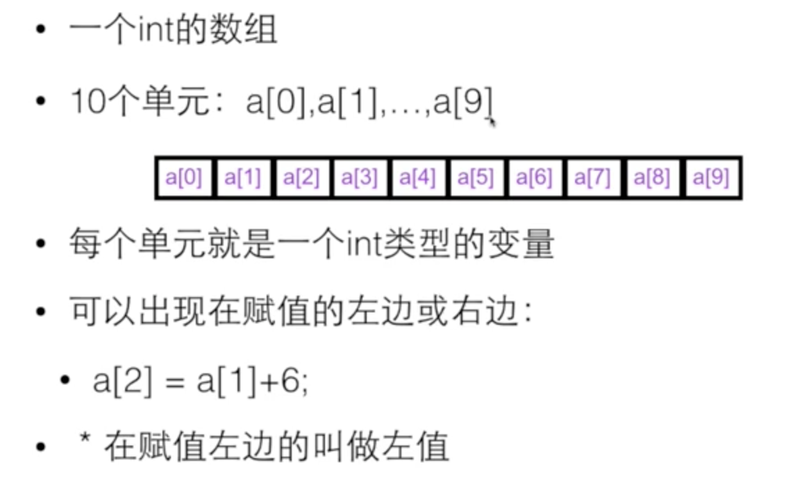
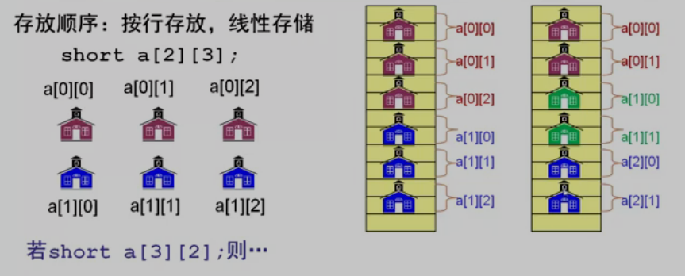

[TOC]

# 数组

```c
<类型> 变量名称[元素数量]

int grades[100];
```

- 元素数量必须是整数

- C99之前，元素数量必须是编译时刻确定的字面量

- 其中所有的元素具有相同的数据类型

- 一旦创建，不能改变大小

- 数组中的元素在内存中是连续依次排列的

  

- 下标，从0开始计数

- 编译器和运行环境都**不会检查数组下标是否越界**，无论是对数组单元做读还是写

  

- 数组的初始化

  ```c
  int a[] = {2,3,4};//a.lenght=2
  
  int a[10] = {2};//a.length=10; a[0]=2,a[1]=0...a[9]=0
  
  int count[10] = {0};
  ```

  

- 二维数组

  


# 可变数组	

我们要对数组的大小进行扩展

* 数组是可变的
* 能够得到当前数组的大小
* 能够访问数组中的元素

```c
//创建数组
Array array_create(int init_size);

//释放数组空间
void array_free(Array *a);

//get当前数组大小
int array_size(const Array *a);

//获取数组元素
int *array_at(Array *a, int index);

//扩展数组
void array_inflate(Array *a, int more_size);

```

```c
const BLOCKSIZE = 20;
typedef struct{
  int *array;
  int size;
} Array;

//创建数组
Array array_create(int init_size){
  Array a;
  a.size = init_size;
  a.array = (int *)malloc(sizeof(int*)*init_size);
  
  return a;
}

//释放数组空间
void array_free(Array *a){
  free(a->array);
  a->array = NULL;
  a->size = 0;
}

//get当前数组大小
int array_size(const Array *a){
  return a->size;
}

//获取数组元素
int* array_at(Array *a, int index){
  //越界了
  if(index >= a->size){
    array_inflate(a, 
                   (index/BLOCKSIZE+1)*BLOCKSIZE - (a->size));
  }
  return &(a->array[index]);
}

//扩展数组
void array_inflate(Array *a, int more_size){
  int *p = (int*)malloc(sizeof(int)*(a->size+more_size));
  
  int i;
  for(i=0; i<a->size; i++){
    p[i] = a->array[i];
  }
  //释放原来的空间
  free(a->array);
  
 	//重新改变数组的指针和size
  a->array = p;
  a->size += more_size;
}


int main(int argc, char const *argv[]){
  Array a = array_create(100);
  array_free(&a);
  
  printf("%d\n", array_size(&a));
  
  // 返回指针的好处是：我们可以对其中的值进行修改
  *array_at(&a, 0) = 10;
  printf("%d\n", *array_at(&a, 0));
  
  return 0;
}
```


# 数组在物理内存中的存储结构




