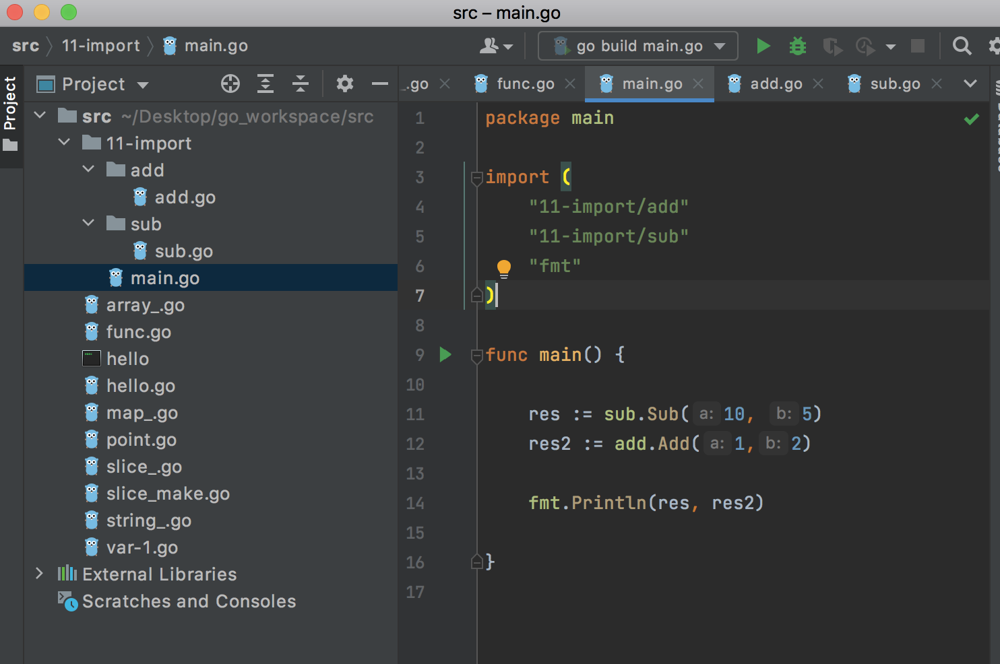

[toc]


# 变量

```go
package main

import "fmt"

func main() {
	//变量定义：var
	//常量定义：const

	//1.先定义变量，再赋值，var var_name var_type
	var name string
	name = "zhangsan"

	//2.定义时赋值
	var age int = 20
	var age2  = 20 //如果是已经赋值了，不用指定类型的，可以自动推导的，上面的int是灰色的

	fmt.Println(name)//goland会自动导入程序中使用的包
	fmt.Print(age2)
	fmt.Printf("name is :%s, age is %d\n", name, age)

	//3.定义直接赋值，使用自动推导（最常用的）
	address := "bejing"
	fmt.Println(address)

	//4.平行赋值
	i, j :=10,20
	fmt.Println(i, j)
	i,j = j,i  // 平行赋值

}
```


# 基础数据类型

```go
int 
int8
int16
int32
int64

uint8,...uint64

float32, float64

boolean (true/false)
```


# 自增语法

```go
//go语言只有：i++, i--两个，同时要求自增的语法必须单独一行


	index := 20
	index++
	fmt.Println(index)
	fmt.Println("index:", index++)//error,不允许和其他代码放在一起，必须单独起一行
```


# 指针

```go
package main

import "fmt"

func main() {

	//go语言的指针
	// 结构体成员调用： c语言：ptr->name; go : ptr.name
	/* go语言使用指针时，会使用内部的垃圾回收机制gc
		开发人员不需要手动释放内存
		c语言不允许返回栈上指针，但是go语言可以返回栈上指针，程序会在编译的时候就确定这个变量的分配位置
		编译的时候，如果发现有必须的话，就将变量分配到堆上，如果是临时使用，那么会被分配到栈上
	*/

	//1.
	name := "lily"
	ptr := &name

	fmt.Println("name:", *ptr) //lily
	fmt.Println("name ptr:", ptr) //地址 0xc000096220

	//2.使用new关键字定义指针
	namePtr := new(string)
	*namePtr = "wangwu"
	fmt.Println("name2:", *namePtr)


	//3.返回栈上指针
	res := testPtr()//编译器在编译程序时，会自动判断这段代码，将city变量分配在堆上（内存逃逸）
	//即使只有一行代码的代码块，也必须使用{}
	if res == nil {//空指针
		fmt.Println("res is nil")
	}
	fmt.Println("res city:", *res)


}

// 函数的嗯返回值写在参数列表的后面
func testPtr() *string{
	city := "shenzheng"
	//定义一个指针
	ptr := &city

	//将函数内部即栈上的指针返回
	return ptr
}


/*
空指针
c-language: null
c++: nullptr
go:nil

if res == nil {
	//...
}
*/
```


# go不支持的语法

```go
1. 自增，自减： --i, ++i
2. 不支持地址加减
3. 不支持三目运算
4. 只有false才能代表逻辑假，数值0和nil不能


	if 0 { // error
		
	}

	if nil { // error
		
	}

	if false { // ok
		
	}

```


# string

```go
package main

import "fmt"

func main()  {

	// 1.定义字符串
	name := "zhangsan"
	fmt.Println(name)

	// 2.print multi line
	// need to new line, use ` ,在c 中是使用 \
	usage := `./a.out <option>
				-h help
				-a xxx`
	fmt.Println(usage)


	//3. length of str
	// go 没有.length()函数，可以使用自由函数len()
	ll := len(name)
	fmt.Println("len is :", ll)

	for i:=0; i<len(name); i++ {
		fmt.Printf("i:%d,v:%c\n", i, name[i])

	}

	firstStr, secondStr := "hell", "world"
	fmt.Println("contract=", firstStr+secondStr)//hellworld

	//如果是const不用自动推导，并且const不能修改
	const address = "beijing lu"
	address = "shanghai"//error

}

```


# 数组

* 定长数组

  ```go
  package main
  
  import "fmt"
  
  func main()  {
  
  	//1. 定义数组
  	// c 的定义 int num[10] = {1,3,4}
  	// go的定义：nums := [10]int{1,2,3}  //常用的方式
  
  	nums := [10]int{1,23}
  
  	// 2.遍历
  	// 遍历方式1
  	for i:=0; i<len(nums); i++ {
  		nums[i] = i
  		fmt.Println(nums[i])
  	}
  
  	// 遍历方式2, for range ===> python 支持
  	for idx,value := range nums {//value是nums[0]的副本
  		// value = 111 ----> nums[0] = 1
  		fmt.Println("idx", idx, ",value:", value)
  	}
  
  	// go中如果想要忽略一个值，可以使用_
  	for _, value := range nums {
  		fmt.Println("value:", value)
  	}
  
  	for _, _ := range nums { //error 如果两个都忽略，那么就不能使用 :=
  
  	}
  	for _, _ = range nums {//ok
  
  	}
  
  }
  ```

  


* 不定长数组(切片， slice)

  slice，他的底层也是数组，可以动态改变长度

  ```go
  package main
  
  import (
  	"fmt"
  )
  
  func main()  {
  
  	// 定义一个切片，包含多个地名
  	//names := [10]string{"beijing", "shanghai", "guangzhou"}
  	names := []string{"beijing", "shanghai", "guangzhou"}
  
  	for i, v := range names {
  		fmt.Println("i:", i, "v:", v)
  	}
  	/*
  	i: 0 v: beijing
  	i: 1 v: shanghai
  	i: 2 v: guangzhou
  	*/
  
  
  	// 2.追加数据
  	name2 := append(names, "wuhan")
  
  	fmt.Println("names:", names)
  	fmt.Println("name2:", name2)
  	/*
  	names: [beijing shanghai guangzhou]
  	name2: [beijing shanghai guangzhou wuhan]
  	*/
  
  	// 3.对于一个slice，不仅有len(), 还有容量cap()
  	fmt.Println("befor append,len=", len(names), "cap:", cap(names))
  	names = append(names, "tianjin")
  	fmt.Println("after append,len=", len(names), "cap:", cap(names))
  	/*
  	befor append,len= 3 cap: 3
  	after append,len= 4 cap: 6  //如果cap不够，那么会一个分配原来的两倍的cap
  	 */
  	names = append(names, "tianjin2")
  	fmt.Println("after append,len=", len(names), "cap:", cap(names))
  	/*
  	befor append,len= 3 cap: 3
  	after append,len= 4 cap: 6
  	after append,len= 5 cap: 6  //此时cap还是6，如果超过6个，那么cap变成12，1k之后，比率不再是2，而是1.x
  	 */
  
  }
  
  ```

  

* 切片截取

  ```go 
  package main
  
  import "fmt"
  
  func main()  {
  
  	// 定义一个切片，包含多个地名
  	names := [5]string{"beijing", "shanghai", "guangzhou", "wuhan", "xian"}
  
  	// copy 数组的部分元素
  	name1 := [3]string{}
  	name1[0] = names[0]
  	name1[1] = names[1]
  	name1[2] = names[2]
  
  
  	// 切片可以基于一个数组，灵活的创建新的数组
  	name2 := names[0:3] // [0,3) 得到的是一个切片
  	fmt.Println("name2:", name2)
  	/*
  	name2: [beijing shanghai guangzhou]
  	*/
  
  	// modify name2 element
  	name2[0] = "hello"
  	fmt.Println("names:", names)
  	fmt.Println("name2", name2, "cap:", cap(name2))
  	/*
  	names: [hello shanghai guangzhou wuhan xian]
  	name2 [hello shanghai guangzhou] cap: 5
  	*/
  
  	// 如果从0元素开始
  	name3 := names[:3]
  	fmt.Println("name3:", name3)
  
  	// 如果截取到末尾
  	name4 := names[3:]
  	fmt.Println("name4:", name4)
  
  	// 如果是全部
  	name5 := names[:]
  	fmt.Println("name5:", name5)
  
  	// 也可以基于一个字符串进行切片截取，取字符串的子串
  	sub1 := "helloworld"[5:7]
  	fmt.Println("sub1:", sub1)//sub1: wo
  
  	// 可以在创建空切片的时候，明确指定切片的容量
  	str2 := make([]string, 10, 20) // len, cap
  	fmt.Println("str2:", len(str2), "cap:", cap(str2))//str2: 10 cap: 20
  
  	// 一般常用的方式,创建空切片，明确指定容量，这样可以提供运行效率
  	str3 := make([]string, 0, 20)//cap这个参数并不是必须的，如果没有，默认与length相同
  	fmt.Println(str3)
  
  
  
  	// 如果想要使切片完全独立于原始数组（深拷贝），可以使用copy()函数来完成
  	namesCopy := make([]string , len(names))
  	copy(namesCopy, names[:]) //copy的参数都是切片
  
  }
  ```

  

# 字典map

```go
package main

import "fmt"

func main()  {

	// 哈希表，key=>value, 存储的key是经过哈希运算的
	//1. 定义： (studId,studName)
	var stdMap map[int]string// 这里只是定义变量，并没有初始化他

	//2. 分配空间,可以不指定长度，建议指定
	stdMap = make(map[int]string, 10)
	stdMap[0] = "zhangsan"
	stdMap[1] = "lisi"

	for stdId, name := range stdMap {
		fmt.Println(stdId, name)
	}
	/*
	0 zhangsan
	1 lisi
	*/

	// 定义的时候，直接分配空间
	stdMap2 := make(map[int]string, 10)
	fmt.Println(stdMap2)


	// 如何确定一个key是否存在map中
	name9 := stdMap2[111]
	fmt.Println("name9:", name9)
	//name9:
	// 在map中，他认为所有的key都是有效的，他返回这个数字的零值
	// 零值：bool=false ， 数字=0； str=空
	// 无法通过获取value的值，来判断一个key是否存在，因此需要一个机制：能够校验一个key是否存在
	value, ok := stdMap2[222]
	if ok {//通过判断ok的返回值判断value是否存在
		fmt.Println(value)
	} else {
		fmt.Println("key not exist")
	}


	// del key of map
	delete(stdMap2, 1)//ok
	delete(stdMap2, 111)//ok

}

```


# 函数

```go
package main

import "fmt"

func main()  {
	
	v1, s1,_ := func222(10, 20, "hello")

	fmt.Println("v1:", v1, ",s1:", s1)
	
}

//1. 函数的返回值在参数列表之后，如果有多个返回值，需要使用 ()
func func222(a int, b int, c string) (int, string, bool) {
	return a+b, c,true
}

//2. 类型一样，可以一起定义
func test333(a, b int, c string) (res int, str string, b1 bool) {

	// 直接使用返回值的变量名字，参与运算
	res = a+b
	str = c
	b1 = true

	//3. 当返回值有名字的时候，可以直接写return，返回值就可以返回了
	return
	//equal return res, str, b1

}
```


内存逃逸（原本在栈上的变量，最终在堆上了）

```go

func funcPtr() *string {
	adName := "shengzhang"
	namePtr := &adName

	return namePtr
}


func main()  {

	v1, s1,_ := func222(10, 20, "hello")

	fmt.Println("v1:", v1, ",s1:", s1)

	p1 := funcPtr()
	fmt.Println(*p1)

}
```


# import

```go
package add

// 手写字母大写表示public，小写是protected，只有相同包名的文件才能使用(此时不需要使用包名作前缀)
func Add(a, b int) int {

	return a+b
}
```

```go
package sub

// 需要导出的函数，首字母要大写
func Sub(a, b int) int {

	return a-b
}
```

```go
package main

import (
	"11-import/add"
	"11-import/sub"
	"fmt"
)

func main() {

	res := sub.Sub(10, 5)
	res2 := add.Add(1,2)

	fmt.Println(res, res2)

}
```




> 同一个目录下不同的文件中不能出现 package xxx , package yyy 多个包名


# 获取命令行参数

```go
package main

import (
	"fmt"
	"os"
)

func main() {
	// c: argc, argv
	//go: os.Args ==> 直接可以获取命令输入，是一个字符串切片
	cms := os.Args
	/**
	os.Args[0] ===> 程序名
	os.Args[1] ===> 第一个参数，以此类推
	 */
	for key, cmd := range cms {
		fmt.Println(key,":", cmd)
	}
	
}


/**
wxr-xr-x  3 chenyansong  staff   102B Apr 11 16:13 add
-rw-r--r--  1 chenyansong  staff   364B Apr 11 16:27 main.go
drwxr-xr-x  3 chenyansong  staff   102B Apr 11 15:58 sub
-rw-r--r--  1 chenyansong  staff   253B Apr 11 16:27 switch_.go
 ~/De/g/s/11-import  go build switch_.go              ok | 16:28:02 

~/De/g/s/11-import  ll                               ok | 16:28:10 
total 3976
drwxr-xr-x  3 chenyansong  staff   102B Apr 11 16:13 add
-rw-r--r--  1 chenyansong  staff   364B Apr 11 16:27 main.go
drwxr-xr-x  3 chenyansong  staff   102B Apr 11 15:58 sub
-rwxr-xr-x  1 chenyansong  staff   1.9M Apr 11 16:28 switch_
-rw-r--r--  1 chenyansong  staff   253B Apr 11 16:27 switch_.go

 ~/De/g/s/11-import  ./switch_ 22 33 44               ok | 16:28:20 
0 : ./switch_
1 : 22
2 : 33
3 : 44
 ~/De/g/s/11-impor

*/
```


# switch

```go
package main

import (
	"fmt"
	"os"
)

func main() {
	// c: argc, argv
	//go: os.Args ==> 直接可以获取命令输入，是一个字符串切片
	cms := os.Args
	/**
	os.Args[0] ===> 程序名
	os.Args[1] ===> 第一个参数，以此类推
	 */
	for key, cmd := range cms {
		fmt.Println(key,":", cmd)
	}

	if len(cms) <2 {
		fmt.Println("pls args..")
		return
	}

	//go的switch默认加上break了
	switch cms[1] {
	case "hello":
		fmt.Println("hellow")
		// 如果需要向下穿透的话，需要加关键字： fallthrough
		fallthrough
	case "world":
		fmt.Println("world")
	default:
		fmt.Println("default")
	}
}

```

# 标签goto,break,continue

```go
package main

import "fmt"

func main() {

	//label
	//goto label
	//break label
	//continue label
	LABEL1:
	for i :=0; i<5; i++ {
		for j :=0; j<5; j++ {
			if j==3 {
				//goto LABEL1 // i 从0开始
				//continue LABEL1 // i从上一次的值开始
				//break // 结束当前循环
				break LABEL1 //直接跳出所有的循环
			}
			fmt.Println("i:", i , ",j:", j)
		}
	}
}

```


# 变量组

```go
	var number int
	var name string
	var flag bool
	
	// 等价于
	var (
		number int
		name string
		flag bool
	)
```


# iota枚举

在go中是没有枚举类型的，但是可以使用const + iota(自动累加器)来进行模拟

```go
package main

import "fmt"


/*
iota：
1.常量组累加器，从0开始，
2.每换一行递增1；
3.常量组有个特点，如果不赋值，默认与上一行表达式相同
4.如果同一行出现了两个iota，那么两个iota的值是相同的
5.每个常量组的iota是独立的，每一个const里面iota会清零
 */
const (
	MONDAY = iota //0
	TUESDAY = iota //1
	WEDESDAY = iota //2
	THURS // 默认与上一行表达式相同，即 ： =iota
	FRIDAY
	SATUDAY
	SUNDAY
	M, N = iota, iota
)

const (
	FIRST = iota + 1 //1
	SECOND //2
	THird //3
)

func main() {

	fmt.Println(MONDAY, TUESDAY, FRIDAY)//0 1 4
	fmt.Println(MONDAY, TUESDAY, M, N)//0 1 7 7
	fmt.Println(FIRST, SECOND, THird)//1 2 3

	//var number int
	//var name string
	//var flag bool
	//
	//var (
	//	number int
	//	name string
	//	flag bool
	//)

}

```


# 结构体

```go
package main

import "fmt"

// 使用type + struct
type Student struct {
	name string
	age int
	score float64
}

type Myint int

func main() {
	var i, j Myint
	i, j = 10, 20

	fmt.Println(i, j)

	//定义变量，并初始化
	lily := Student{
		name:  "lily",
		age:   20,
		score: 80, //这里的 , 是必须的；如果不加逗号，必须与）同一行
	}
	//引用结构体
	fmt.Println(lily.name, lily.age, lily.score)

	s1 := &lily
	// -> 不同于c 的指针
	fmt.Println(s1.name, s1.age, s1.score)

	// 如果是全部的字段，可以不用key
	duke := Student{
		"zhangsan",
		23,
		333,
	}

	duke.score = 88
	fmt.Println(duke)//{zhangsan 23 88}

}

```

结构体与json

```go
[{"name":"zhangsan"}, {}]

//序列化：把go语言中的结构体变量--->json格式的字符串
//反序列化：json格式的字符串 ----> go中的结构体

type persion struct{
  Name string `json:"name" db:"name" ini:"ini_name"` //当使用json解析的时候使用的是name替换Name
  Age int `json:"age"`
}


func main(){
  
  p1 := persion{
    Name:"zhansan",
    Age:22,
  }
  
  
  //序列化
  b, err := json.Marshal(p1)//b --> []byte
  if err != nil {
    fmt.Print("error %s", err)
    return
  }
  fmt.Printf("%v\n", string(b))//"{'Name':'zhangsan', 'Age':22}"
  
  
  //反序列化
  str := '{"name":"zhangsan", "age":11}'
  var p2 persion
  json.UnMarshal([]byte(str), &p2)
  fmt.Printf("%v\n", p2)
  
  
  
  
  
}


```


# init函数

go语言自带init函数，每一个包都可以包含一个或多个init函数，这个init会在包被引用的时候（import的时候）自动调用

用于加载系统配置

```go
package sub

import (
	"fmt"
	_ "database/sql/driver"
)

//init函数没有参数，没有返回值
//一个包中包含多个init时，调用的顺序是不确定的
//init函数是不允许用户显示调用的
//如果只想要使用一个包中的init函数（比如MySQL的init对驱动进行初始化）,为了防止编译器报错，可以使用 _ 处理
import _ "database/sql/driver"
func init() {

	fmt.Println("this is first in package sub")

}

func init() {

	fmt.Println("this is 222 in package sub")

}
// 需要导出的函数，首字母要大写
func Sub(a, b int) int {

	return a-b
}

```


# defer(延迟)

用于修饰语句、函数，确保这条语句可以在当前栈退出的时候执行，一般用于资源清理

```go
lock.Lock()
a = "hello"
lock.Unlock() //如果代码过长，经常忘掉解锁
```

go语言可以使用defer来解决这个问题

```go
lock.Lock()
defer lock.Unlock() //当前栈退出的时候(比如函数结束)执行
a = "hello"


//打开，关闭文件
{
  f1 := file.Open()
  defer f1.Close()
}
```

```go
package main

import (
	"fmt"
	"os"
)

func main() {

	//可以在一个函数中多次调用defer,执行时类似于栈的机制，先入后出
	fileName := "defer_.go"
	readFile(fileName)


}


func readFile(filename string) {
	//go会将错误码作为最后一个参数返回,error =nil 执行成功
	f1, err := os.Open(filename)
	//defer f1.Close()


	// 在函数退出的时候会执行这里
	defer func(){
		fmt.Println("准备关闭文件！")
		f1.Close()
	}()//创建一个匿名函数，并调用

	//多个defer
	defer fmt.Println("00000")
	defer fmt.Println("11111")
	defer fmt.Println("22222")
	/**
	22222
	11111
	00000
	准备关闭文件！
	*/

	if err != nil {
		fmt.Println("open file failure")
	}
	buf := make([]byte, 1024)

	n, err := f1.Read(buf)
	fmt.Println("读取文件长度n=", n)
	fmt.Println("file content:", string(buf))

	//f1.Close()

}

```


