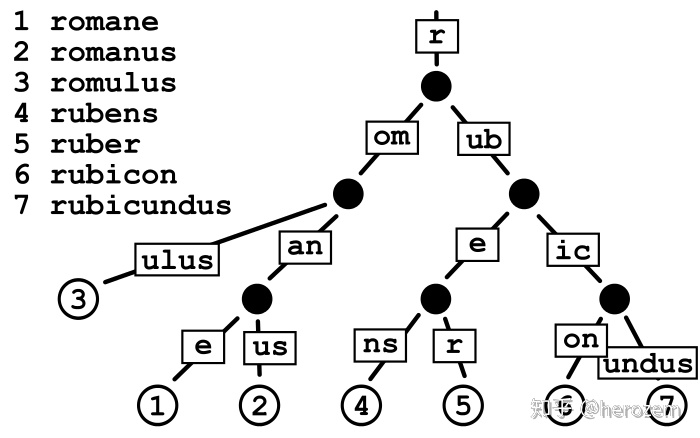

[toc]


# gin路由

1. API参数

   ```go
   //curl ip:8000/user/:name
   //curl ip:8000/user/:name/*action
   
   	r.GET("/user/:name/*action", func(c *gin.Context) {
   		name := c.Param("name")
   		action := c.Param("action")
   		c.String(http.StatusOK, name + " is " + action)
   
   		c.String(http.StatusOK, "hello world")
   	})
   ```

   

2. URL参数

   ```go
   /*
   URL参数可以通过DefaultQuery or Query方法获取
   DefaultQuery：若参数不存在返回指定的默认值
   Query：若参数不存在，返回空串
   curl ip:8000/user/add?name=zs
   */
   
   
   // curl ip:8000/welcome?name=zhangsan
   	r.GET("/welcome", func(c *gin.Context) {
   		name := c.DefaultQuery("name", "jacck")
   
   		c.String(http.StatusOK, name)
   	})
   ```

   

3. 表单参数

   ```html
   <html>
       <head>
           <body>
               <form action="http://local:8000/form" method="post" enctype="application/x-www-form-urlencoded">
                   user name : <input type="text" name="username">
                   <br>
                   密码 : <input type="password" name="password">
                   <br>
                   兴趣: <input type="checkbox" name="hobby" value="run">
                   兴趣: <input type="checkbox" name="hobby" value="game">
                   兴趣: <input type="checkbox" name="hobby" value="money">
                   <br>
                   <input type="submit" value="login">
               </form>
           </body>
       </head>
   </html>
   ```

   

   ```go
   
   	r.POST("/form", func(c *gin.Context) {
   		//表单参数也可以设置默认值
   		typel := c.DefaultPostForm("type", "alert")
   		username := c.PostFormArray("username")
   		password := c.PostFormArray("password")
   		//多选
   		hobbys := c.PostFormArray("hobby")
   
   		c.String(http.StatusOK,
   			fmt.Sprintf("type is %s, uername is %s ,password is %s" +
   				" hobby is %v", typel, username, password, hobbys ))
   
   	})
   ```

   

4. 上传单个文件

   * mutipart/form-data格式用于文件上传
   * gin文件上传与原生的net/http方法类似，不同在于gin把原生的request封装到c.Request中

   ```html
   <html>
       <head>
           <body>
               <form action="http://local:8000/upload" method="post" enctype="mutipart/form-data">
                   file1 : <input type="file" name="file">
                  <br>
                   <input type="submit" value="upload">
               </form>
           </body>
       </head>
   </html>
   ```

   ```go
   	r.POST("/upload", func(c *gin.Context) {
   		//表单文件
   		file, _ := c.FormFile("file")
   
   		log.Println(file.Filename)
   
   		//传到项目的根目录
   		c.SaveUploadedFile(file, file.Filename)
   
   		//response
   		c.String(http.StatusOK, fmt.Sprintf("upload ok"))
   
   	})
   ```

   

5. 上传多个文件

   ```html
   <html>
       <head>
           <body>
               <form action="http://local:8000/upload" method="post" enctype="mutipart/form-data">
                   file1 : <input type="file" name="file" multiple>
                  <br>
                   <input type="submit" value="upload">
               </form>
           </body>
       </head>
   </html>
   ```

   ```go
   //限制表单的文件的大小：默认是32M
   	r.MaxMultipartMemory = 8<<20
   	r.POST("/upload", func(c *gin.Context) {
   		form, err := c.MultipartForm()
   		if err != nil {
   			c.String(http.StatusBadRequest, fmt.Sprintf("get err %s", err.Error()))
   		}
   
   		//获取所有的file
   		files := form.File["file"]
   		for _, file := range files {
   			//逐个存file
   			if err := c.SaveUploadedFile(file, file.Filename); err != nil {
   				c.String(http.StatusBadRequest, fmt.Sprintf("get err %s", err.Error()))
   			}
   		}
   
   		c.String(http.StatusOK, fmt.Sprintf("upload ok %d files ", len(files)))
   
   
   	})
   ```

   

6. routes group

   ```go
   r := gin.Default()
   
   //路由组，处理GET请求
   v1 := r.Group("/v1")
   {
     v1.GET("/login", login)
     v1.GEt("/submit", submit)
   }
   
   v2 := r.Group("v2")
   {
     v2.Post("/login", login)
     v2.Post("/submit", submit)
   }
   
   
   
   func login(c *gin.Context){
     name := c.DefaultQuery("name", "jack")
     c.String(200, fmt.Sprintf("hello %s\n", name))
   }
   
   
   func submit(c *gin.Context){
     
     
   }
   ```

   

7. 路由原理

   https://github.com/julienschmidt/httprouter

   httprouter将所有的路由规则构造一棵前缀树

   

   ```go
   r := gin.Default()
   
   r.Post("/", xx)
   r.Post("/search", x2x)
   r.Post("/support", xx)
   r.Post("/blog/:post", xx)
   r.Post("/contact", xx)
   r.Post("/about", xx)
   
   r.Run()
   ```


# gin数据解析和绑定

1. json数据解析和绑定

   客户端传参，后端接收并解析到结构体

   ```go
   //定义接收数据的结构体
   // binding: "required" 必选字段，若接收值为空值，则报错
   type Login struct{
     User string `form:"username" json:"user" uri:"user" xml:"user" binding "required"`
     Password string `form:"password" json:"password" uri:"password" xml:"password" binding "required"`
   
   }
   
   func main(){
     r != gin.Default()
     r.Post("/loginJson", func(c *gin.Context){
       var json Login
       //将request的body中的数据，自动解析json格式到结构体
       if err :=c.ShouldBindJSON(&json); err != nil {
         //gin.H 封装了生成json的工具
         c.JSON(http.statusBadRequest, gin.H{"error": err.Error()})
         return
       }
       
       //判断用户名，密码
       if json.User != "root" || json.Password != "admin" {
         c.JSON(http.statusBadRequest, gin.H{"status": "304"})
         return
       }
       c.JSON(http.statusOk, gin.H{"status": "200"})
         return
       
     })
   }
   
   // curl ip:port/loginJSON -X POST -H 'content-type:application/json' -d {"user": "root", "password":"admin"}
   ```

   

2. 表单数据解析和绑定

   ```go
   <html>
       <head>
           <body>
               <form action="http://local:8000/loginForm" method="post" enctype="mutipart/form-data">
                   user name : <input type="text" name="username">
                   <br>
                   密码 : <input type="password" name="password">
                   <br>
               </form>
           </body>
       </head>
   </html>
   
   
   
   type Login struct{
     User string `form:"username" json:"user" uri:"user" xml:"user" binding "required"`
     Password string `form:"password" json:"password" uri:"password" xml:"password" binding "required"`
   
   }
   
   func main(){
     r != gin.Default()
     r.Post("/loginForm", func(c *gin.Context){
       var form Login
       //Bind()默认解析并绑定form格式
       //根据请求头中的content-type自动推断的
       if err := c.Bind(&form); err != nil{
         c.JSON(http.statusBadRequest, gin.H{"error":err.Err()})
       }
       
       //判断用户名，密码
       if json.User != "root" || json.Password != "admin" {
         c.JSON(http.statusBadRequest, gin.H{"status": "304"})
         return
       }
       c.JSON(http.statusOk, gin.H{"status": "200"})
       return
       
     })
   }
   ```

   

3. URI数据解析和绑定

   ```go
   //http://localhost:8000/root/admin  将root ， admin解析到结构体中
   ```

   ```go
   r.GET("/:user/:password", fn)
   c.ShouldBindRUi(&login)
   ```


# 多种响应方式

1. json

   ```go
   func main(){
     r != gin.Default()
     r.Post("/loginForm", func(c *gin.Context){
       
       c.JSON(http.statusOk, gin.H{"status": "200"})
       
     })
   }
   
   ```

2. 结构体响应

   ```go
   func main(){
     r != gin.Default()
     r.Post("/loginForm", func(c *gin.Context){
       var msg struct {
         Name string
         Message string
         Number int
       }
       
       msg.Name = "zhansan"
       msg.Message = "message"
       msg.Number = 123
       
       c.JSON(http.statusOk, msg)
       
     })
   }
   ```

3. xml

   ```go
   func main(){
     r != gin.Default()
     r.GET("/loginXML", func(c *gin.Context){
       
       c.XML(http.statusOk, gin.H{"message":"abc"})
       
     })
   }
   ```

4. yaml格式

   ```go
   func main(){
     r != gin.Default()
     r.GET("/loginYAML", func(c *gin.Context){
       
       c.YAML(http.Ok, gin.H{"name":"zhangan"})
       
     })
   }
   ```

5. protobuf格式

   ```go
   func main(){
     r != gin.Default()
     r.GET("/loginProtobuf", func(c *gin.Context){
       
       reps != []int64{int64(1), int64(2)}
       label := "label"
       data = &protoexample.Test{
         Label: &label
         Reps: reps
       }
       c.ProtoBuf(http.ok, data)
       
     })
   }
   ```


# HTML模板渲染

* gin支持加载HTML模板，然后根据模板参数进行配置并返回相应的数据，本质上就是**字符串替换**
* LoadHTMLGlob()方法可以加载模板文件

```html
<html>
  <h1>
    {{.title}}
  </h1>
</html>
```


```go
func main(){
  r != gin.Default()
  
  //加载模板文件
  r.LoadHTMLGlob("template/*")
  r.LoadHtmlFiles("template/index.html")
  
  
  r.GET("/index", func(c *gin.Context){
    //json将title替换
    c.HTML(http.ok, "index.html", gin.H{"title":"my title"})
  })
}
```


# 重定向

```go
func main(){
  r != gin.Default()
  
  //
  r.GET("/redirect", func(c *gin.Context){
    
    //支持内部和外部重定向
    c.Redirect(http.StatusMovePermanent, "https://www.baidu.com")
    
  })
}
```


# 同步异步

goroutine 机制可以方便的实现异步处理

另外，在启动新的goroute时，不应该使用原始上下文（c gin.context），必须使用他的只读副本

```go
func main(){
  r != gin.Default()
  
  //异步
  r.GET("/long_async", func(c *gin.Context){
    //复制上下文
    copyContext := c.Copy()
    
    go func(){
      time.Sleep(3*time.Second)
      log.Println("异步执行" + copyContext.Request.URL.Path)
    }()
    
  })
  
  
  //同步
  r.GET("/long_sync", func(c *gin.Context){
    time.Sleep(3*time.Second)
    log.Println("异步执行" + copyContext.Request.URL.Path)
  })
}

```


# 中间件

* gin可以构建中间件，但他只对注册过的路由函数起作用
* 对于分组路由、嵌套使用中间件，可以限定中间件的作用范围
* 中间件分为全局中间件、单个路由中间件和群组中间件
* gin中间件必须是一个车gin.HandlerFunc类型


# 全局中间件

```go
//定义中间件
func MiddleWare() gin.HandleFunc(){
  
  
  return func(c *gin.Context){
    t := time.Now()
    
    fmt.printf("中间件开始执行")
    
    //设置变量到context中，可以通过get()取
    c.Set("request", "中间件")
    
    //执行函数
    c.Next()
    
    //Writer ---> reponse
    status := c.Writer.Status()
    
    fmt.println("中间件执行完毕", status)
    
    t2 := time.Since(t)
    
    fmt.Println("time:", t2)
    
  }
}
```

```go
func main(){
  r != gin.Default()
  
  //注册中间件
  r.Use(MiddleWare())
  {//为了代码规范
    r.GET("/middleware", func(c *gin.Context){
      //取值(中间件)
      req,_ := c.Get("request")
      fmt.Println("request:", req)
      
      c.JSON(http.ok, gin.H{"request": req})
    })
  }
  
}

```


# Next() 方法

```go
/*
中间件1 prefix
中间件2 prefix

路由1


中间件2 post
中间件1 post
*/
```


# 局部中间件

```go
func main(){
  r != gin.Default()
  
  //注册中间件
  r.Use(MiddleWare())
  {//为了代码规范
    r.GET("/middleware", func(c *gin.Context){
      //取值(中间件)
      req,_ := c.Get("request")
      fmt.Println("request:", req)
      
      c.JSON(http.ok, gin.H{"request": req})
    })
    
    //局部中间件
    r.GET("/middleware2", MiddleWare(), func(c *gin.Context){
      //取值(中间件)
      req,_ := c.Get("request")
      fmt.Println("request:", req)
      
      c.JSON(http.ok, gin.H{"request": req})
    })
  }
  
}


```


# 会话控制

## cookie

```go
func main(){
  
  r := gin.default()
  
  //服务端要给客户端cookie
  r.GET("/cookie", func(c *gin.Context){
    
    cookie, err := c.Cookie("key_cookie")
    
    if err != nil {
      cookie = "NotSet"
      
      //60s , 
      // / cookie所在的目录
      // domain : string 域名
      // secure :是否只能https访问
      // httpOnly: 是否允许别人通过js获取自己的cookie
      c.SetCookie("key_cookie", "value_cookie", 60, 
                  "/",
                 "localhost", false, true)
      
      
    }
    fmt.Printf("cookie %s\n", cookie)
    
  })
  
  
}
```


```go
func main(){
  
  r := gin.Default()
  
  r.GET("/login", function(c *gin.Context){
    //设置cookie
    c.SetCookie("abc", "123", 60, "/", "localhost", false ,true)
    
    //返回
    c.String(http.ok, "Login success")
    
    
  })
  
  //定义一个中间件，去验证cookie
  r.GET("/home", AuthMiddleWare(), function(c *gin.Context){
    
    c.JSON(http.ok, gin.H{"data":"home"})
  })
  
}


func AuthMiddleWare() gin.HandlerFunc{
  
  //获取客户端cookie，并校验
  return func(c *gin.Context){
    
    if cookie, err := c.Cookie("abc"); err == nil {
      if cookie == "123" {
        c.Next()
        return
      }
    }
    
    c.JSON(http.304, gin.H{"error": "err"})
    //如果验证不通过,直接丢弃
    c.Abort()
    return
  }
  
}
```


cookie的缺点

1. 不安全：明文
2. 增加了带宽的消耗
3. 可以被禁用
4. cookie是有上限的


## session

session可以弥补cookie的不足，session必须依赖于cookie才能石笋，生成一个session放在cookie里传给客户端就可以

1. cookie是将所有的东西存在客户端，不安全
2. session是将所有的东西存在服务器端，而cookie里面存入的是session的一个key


session中间件：一个通用的session服务，支持内存存储和Redis存储

session模块设计

* 本质上是一个k-v系统，通过key进行crud

* session可以存储在mem ，Redis中

* session的接口

  * Set()
  * Get()
  * Del()
  * Save() : session存储，用的时候在加载，延迟加载

* sessionManager接口

  * Init() 初始化，加载Redis地址
  * createSession()
  * GetSession(sessionId)

* 接口实现

  * MemSession
    * 定义MemSession对象（<sessionId, 存k-v的map>) 读写锁
    * 构造函数，为了获取对象
    * Set()
    * Get()
    * Del()
    * Save() 
  * MemSessionManager
    * 定义对象 <map<map>>
    * Init() 初始化，加载Redis地址
    * createSession()
    * GetSession(sessionId)
  * RedisSession实现
    * 定义RedisSession对象 （sessionId, k-v map 读写锁，Redis连接，记录内存中map是否被修改的标记）
    * Set()：将session存入内存中的map
    * Get()：取数据，实现延迟加载
    * Del()
    * Save() ：将session存入Redis

  * RedisSessionManager
    * 定义对象 <map<map>> （Redis地址，密码，连接池，读写锁）
    * 构造函数
    * createSession()
    * GetSession(sessionId)


### session/session.go

```go
type Session interface {
  Set(key string, value interface{}) error
  Get(key string) (interface{}, error)
  Del(key string) error
  Save() error
}

```


### session/session_mgr.go

```go
type SessionMgr interface {
  Init(addr string, options ...string) error
  CreateSession()(session Session, err error)
  Get(sessionId string)(session Session, err error)
}
```


### session/memSession.go

```go
type MemSession struct{
  sessionId string
  data map[string]interface{}
  rwlock sync.RWMutex //锁
  
}

func NewMemSession(id string) *MemSession{
  s := &MemSession{
    sessionId: id,
    data: make(map[string]interface{}, 16),
  }
  
  return s
}


func (m *MemSession)Set(key string, value interface{}) (err error){
  //lock
  m.rwlock.Lock()
  defer m.rwlock.Unlock()
  
  //设置值
  m.data[key] = value
  
  return 
}

func (m *MemSession)Get(key string) (value interface{}, err error){
  //lock
  m.rwlock.Lock()
  defer m.rwlock.Unlock()
  
  //get
  value,ok != m.data[key]
  if !ok {
    err = error.New("key not exist")
    return 
  }
  return value
}


func (m *MemSession)Del(key string) (err error){
  //lock
  m.rwlock.Lock()
  defer m.rwlock.Unlock()
  
  //del
  delete(m.data, key)
  return
  
}

func (m *MemSession)Save(key string) (err error){
  
  return
  
}
```

### session/MemSessionMgr

```go
type MemSessionMgr struct{
  sessionMap map[string]Session
  rwlock sync.RWMUtex
}

func NewMemSessionMgr() *MemSessionMgr{
  sr := &MemSessionMgr{
    sessionMap: make(map[string]Session, 1024)
  }
  
  return sr
}


func (s *MemSessionMgr)Init(addr string, options ...string) (err error){
  return
}

func (s *MemSessionMgr)CreateSession() (session Session, err error){
  m.rwlock.Lock()
  defer s.rwlock.Unlock()
  //用UUID作为sessionId
  id,err := uuid.NewV4()
  if err != nil{
    return
  }
  //to string
  sessionId := id.String()
  
  //create session
  session := NewMemSession(sessionId)
  s.sessionMap[sessionId] = session
  
  return
}


func (s *MemSessionMgr)Get(sessionId string) (session Session, err error){
  
  m.rwlock.Lock()
  defer s.rwlock.Unlock()
  session, ok := s.sessionMap[sessionId]
  if !ok {
    err = errors.New("session not exist")
    return
  }
  return
}


```


### session/redisSession

```go

type RedisSession struct{
  sessionId string
  pool *redis.Pool
  //设置session，可以先放在内存的map中
  //批量导入Redis，提升性能
  sessionMap map[string]interface{}
  //lock
  rwlock sync.RWMutex
  //记录内存中map是否被操作
  flag int
  
}

//
const (
	//内存数据没变化
  SessionFlagNone = iota
  //变化
  SessionFlagModify
)

//construct
func NewRedisSession(id string, pool *redis.Pool) *RedisSession{
  s := &RedisSession{
    sessionId:id,
    sessionMap: make(map[string]interface{}, 16),
    pool:pool,
    flag: SessionFlagNone,
  }
  
  return s
}


//将session存储到内存中的map
func (r *RedisSession)Set(key string, value interface{})(err error){
  r.rwlock.Lock()
  defer r.rwlock.Unlock()
  
  r.sessionMap[key] = value
  
  //change flag
  r.flag = SessionFlagModify
  
  return
}

// save to redis
func (r *RedisSession)Save()(err error){
  r.rwlock.Lock()
  defer r.rwlock.Unlock()
	
  //data no change
  if r.flag != SessionFlagModify {
    return
  }
  
  //内存中的sessionMap进行序列化
  data, err := json.Marshal(r.sessionMap)
  if err != nil {
    return
  }
  
  //get redis conn
  conn := r.pool.Get()
  
  //save 
  _, err := conn.Do("SET", r.sessionId, string(data))
  r.flag = SessionFlagModify
  
  if err != nil {
    return
  }
  return
}


// save to redis
func (r *RedisSession)Get(key string)(result interface{}, err error){
  r.rwlock.Lock()
  defer r.rwlock.Unlock()
	
  //先判断内存
  result, err := r.sessionMap[key]
  if !ok {
    err = errors.New("key not exist")
  }
  
  return
}

// 从Redis中再次加载
func (r *RedisSession)LoadFromRedis()(err error){
  conn : = r.Pool.Get()
  reply, err := conn.Do("GET", r.sessionId)
  if err != nil {
    return
  }
  
  data, err := redis.String(reply, err)
  if err != nil {
    return
  }
  
  //put to map
  err := json.UnMarshal([]byte(data), &r.sessionMap)
  if err != nil {
    return
  }
  return
}


// del to redis
func (r *RedisSession)Del(key string)(err error){
  r.rwlock.Lock()
  defer r.rwlock.Unlock()
	r.flag = SessionFlagModify
  
  delete(r.sessionMap, key)
  
  return
}
```


### session/RedisSessionMgr

```go
type RedisSessionMgr struct{
  //init redis
  addr string
  password string
  pool *redis.Pool
  pool sync.RWMutex
  
  sessionMap map[string]Session
  
}

func (r *RedisSessionMgr)Init(addr string, options ...string)(err error){
  if len(options)>0 {
    r.password = options[0]
  }
  
  //create pool
  r.pool = myPool(addr, r.password)
  r.addr = addr
  return
}

//create pool
func myPool(add, password string)*redis.Pool{
  return &redis.Pool{
    maxIdle: 64,
    MaxActive:1000,
    IdleTimeout:240*time.Second,
    Dial: func()(redis.Conn, error){
      conn, err := redis.Dial("tcp", addr)
      if err != nil {
        return nil, err
      }
      //password
      if _, err := conn.Do("AUTH", password);err != nil {
        conn.Close()
        return nil,err
      }
      return conn, err
    },
    
    //连接测试, 开发时用
    TestOnBorrow:func(conn redis.Conn, t time.Time) error{
      _, err := conn.Do("PING")
      return err
    },
    
  }
}

func NewRedisSessionMgr() SessionMgr{
  sr := RedisSessionMgr{
    sessionMap: make(map[string]String, 32),
  }
  
  return sr
}


func (r *RedisSessionMgr)CreateSession()(session Session, err error){
  r.rwlock.Lock()
  defer r.rwlock.Unlock()
  
  id, err := uuid.NewV4()
  if err != nil {
    return
  }
  
  sessionId := id.String()
  
  //create session
  session = NewRedisSession(sessionId, r.pool)
  r.sessionMap[sessionId] = session
  return
}


func (r *RedisSessionMgr)Get(sessionId string)(session Session, err error){
  r.rwlock.Lock()
  defer r.rwlock.Unlock()
  
  session, ok := r.sessionMap[sessionId]
  if !ok {
    err = error.New("session not exist")
    return
  }
  
  return 
}

```

### session/init.go

```go
//中间件让用户去选择使用哪个版本

var (
	sessionMgr SessionMgr
)
func Init(provider string , addr string, options ...string)(err error){
  switch provider {
  case "memory":
    sessionMgr = NewMemorySessonMgr()
  case "redis":
    sessionMgr = NewRedisSessionMgr()
  default:
  	fmt.Error("not support")
  	return
  }
  
  sessionMgr.Init(addr, options...)
  return
}
```


# 数据库

```go
//model.go

type Book struct{
  ID int64 `db: "id"`
  Title string `db: "title"`
  Price int64 `db:"price"`
}
```


```go
//db.go

import (
	
  _ "github.com/go-sql-driver/mysql"
  "github.com/jmoiron/sqls"

)


var db *sqls.DB
func initDB(err error){
  
  addr := "root:admin@tcp(127.0.0.1:3306)/test"
  
  db, err := sqls.Connect("mysql", addr)
  if err != nil{
    return err
  }
  
  //最大连接
  db.SetMasOpenConns(100)
  
  //最大空闲
  db.SetMaxIdleConns(16)
  return
  
}

func queryAllBook() (bookList []*Book, err error){
  sqlStr := "select id, title, price from book"
  
  err := db.Select(&bookList, sqlStr)
  
  if err!=nil {
    fmt.println("query fail")
    return
  }
  
  return
  
}


func insertBook(title string, price int64)(err error){
  sqlStr := "insert into book(title, price) values(?, ?)"
  err := db.Exec(sqlStr, title, price)
  
  if err!=nil {
    fmt.println("insert fail")
    return
  }
  
  return
  
}


func delBook(id string)(err error){
  sqlStr := "delete from book where id =?"
  err := db.Exec(sqlStr, id)
  
  if err!=nil {
    fmt.println("delete fail")
    return
  }
  
  return
  
}
```

```go
//main.go


func main(){
  
  err := initDB()
  if err !=nil {
    panic(err)
  }
  
  r := gin.Default()
  
  // load html
  r.LoadHTMLGlob("./book/templates/*")
  
  //查询所有图书
  r.GET("/book/list", bookListHander)
  
  
  _ = r.Run(":8000")
  
}

func bookListHander(c * gin.Context){
  bookList, err := queryAllBook()
  
  if err!=nil{
    c.JSON(http.ok, gin.H{"code":1, "msg":err})
    return
  }
  
  //return data
  c.HTML(http.ok, "book_list.html", gin.H{"code":0, "data":bookList})
  
}
```


# blog项目

项目结构

```go
/*
blogger
  controller ：请求参数处理
  dao			: 数据层
  model   : 实体
  service 业务逻辑：
  static ：css, js
  utils		: 工具包
  views		：HTML模板
  main.go ：入口，路由

*/
```


## model

* 分类结构体
* 文章结构体（可以不写文章内容，另外查询）

```go
//category.go

type Category struct{
  CategoryId int64 `db:"id"`
  CategoryName string `db:"category_name"`
  CategoryNo int `db:"category_no"`
}

```

```go
//article.go

type ArticleInfo struct {
  Id int64 `db:"id"`
  CategoryId int64 `db:"category_id"`
  Summary string `db:"summary"`
  Title string `db:"title"`
  ViewCount uint32 `db:"view_count"`
  CommentCount uint32 `db:"comment_count"`
  Username string `db:"username"`
  CreateTime time.Time `db:"create_time"`
}

type ArticleDetail struct {
  ArticleInfo
  //文章内容
  Content string `db:"content"`
  Category
}

//用于文章上下页
type ArticleRecord struct {
  ArticleInfo
  Category
}
```


## dao

* init()数据库初始化
* 分类相关的操作（CRUD）
* 文章相关的操作（CRUD）

```go
// dao/db/db.go

import (
	_ "github.com/go-sql-driver/mysql"
)

var (
	DB *sqlx.DB
)

func Init(dns string) error{
  var err error
  DB, err = sqlx.Open("mysql", dns)
  if err != nil {
    return err
  }
  
  //查看是否conn success
  err = DB.Ping()
  if err != nil {
    return err
  }
  
  DB.SetMaxOpenConns(100)
  DB.SetMaxIdleConns(16)
  
  return nil
}
```

```go
// dao/db/category.go

//add
func InsertCategory(category *model.Category)(categoryId int64, err error){
  sqlStr := "insert into category(category_name, category_no) value(?, ?)"
  
  result, err := DB.Exec(sqlStr, category.CategoryName, category.CategoryNo)
  if err != nil {
    return
  }
  
  categoryId, err = result.LastInsertId()
  return
}


//get by id
func GetCategory(id int64)(category *model.Category, err error){
  category = &model.Category{}
  
  sqlStr := "select id, category_name, category_no from category where id=?"
  err = DB.Get(category, sqlStr, id)
  return
}


//get mutil category
func CategoryList(ids []int64)(categoryList []*model.Category, err erro){
  //构建SQL
  sqlStr,args, err := sqlx.In("select id, category_name, category_no from category where id in(?)", ids)
  if err != nil {
    return
  }
  
  //query
  DB.Select(&categoryList, sqlStr, args...)
  
  return
}

// get all category of title
func GetAllCategoryList(categoryList []*model.Category, err error){
  sqlStr := "select id, category_name, category_no from category order by category_no desc "
  DB.Select(&categoryList, sqlStr)
  return
}


```

写测试类

```go
// db/category_test.go

func init(){
  //parseTime=true 将MySQL中的时间类型，自动解析为go结构体重的时间类型
  dns := "root:admin@tcp(localhost:3306)/blogger?parseTime=true"
  err := Init(dns)
  if err != nil {
    panic(err)
  }
}


func TestGetCategoryById(t *testing.T){
  category, err := GetCategoryById(1)
  if err != nil {
    panic(err)
  }
  
  t.Logf("category:%#v", category)
}


func TestGetCategoryList(t *testing.T){
  var categoryIds []int64
  categoryIds = append(categoryIds, 1,2,3)
  
  categoryList, err := GetCategoryList(categoryIds)
  if err != nil {
    panic(err)
  }
  
  for _,v := range categoryList{
    t.Logf("category:%#v", v)
  }
  
}

func TestGetAllCategoryList(t *testing.T){
  categoryList, err := GetAllCategoryList()
  if err != nil {
    panic(err)
  }
  
  for _,v := range categoryList{
    t.Logf("category:%#v", v)
  }
  
}
```

```go
// db/article.go

import (
	_ "github.com/go-sql-driver/mysql"
)

//insert
func InsertAarticle(article *model.ArticleDetail)(artigleId int64, err error){
  //validate
  if article == nil{
    return
  }
  
  sqlStr := "insert into "+ 
  							"article(content, summary, title, username, category_id, view_count, comment_count) values(?,?,?,?,?,?,?)"
  
  result, err := DB.Exec(sqlStr, article.Content, article.Summary.....)
  
  if err != nil {
    return
  }
  
  articleId, err = result.LastInsertId()
  
  return
}


//文章列表，+分页
func GetArticleList(pageNum, pageSize int)(articleList []*model.ArticleInfo, err error){
  
  if pageNum < 0 || pageSize <0 {
    return
  }
  
  // order by time desc
  sqlStr := "select id, summary, title,view_count, create_time,...from article where status =1 order by create_time desc limit ?,? "
  
  err = DB.Select(&articleList, sqlStr, pageNum, pageSize)
  return
}


// 根据articleId 查询单个文章
func GetArticleDetail(articleId int64)(articleDetail *model.ArticleDetail, err error){
  if articleId <0 {
    return
  }
  
  sqlStr := "select id, summary, title, view_count,.... from article where id=? and status =1 "
  
  err = DB.Get(&articleDetail, sqlStr, articleId)
  return
  
}


// 查询一类的article
func GetArticleListByCategoryId(categoryId, pageNum, pageSize int)(articleList []*model.ArticleInfo, err error){
  if pageNum < 0 || pageSize <0 {
    return
  }
  
  sqlStr := "select id, summary, title, view_count,.... from article where  status =1 and category_id=? order by create_time desc limit ?,? "
  
  err = DB.Select(&articleList, sqlStr, categoryId, pageNum, pageSize)
  return
  
}

```

```go
// db/article_test.go


func init(){
  //parseTime=true 将MySQL中的时间类型，自动解析为go结构体重的时间类型
  dns := "root:admin@tcp(localhost:3306)/blogger?parseTime=true"
  err := Init(dns)
  if err != nil {
    panic(err)
  }
}

func TestInsertArticle(t *testing.T){
  //new obj
  article := &model.ArticleDetail{}
  article.ArticleInfo.CategoryId =1
  article.content = "sfsfsfsfsfsfs"
  article.ArticleInfo.title = "titlexxxxx"
  //....
  
  articleId, err := InsertArticle(article)
  t.Logf("articleId:%d\n", articleId)
  
}


func TestGetArticleList(t *testing.T){
  articleList, err := GetArticleList(1, 15)// pageNum=1; pageSize=15
  if err != nil {
    return
  }
  
  t.Logf("article leng %d\n", len(articleList))
}


func TestGetArticleDetail(t *testing.T){
  artile, err := GetArticleDetail(1)
  if err != nil {
    return
  }
  
  t.Logf("article leng %%#v\n", artile)
}


```


## service

* 获取分类列表
* 获取所有的文章和分类信息
* 根据分类ID，获取该类的文章和分类信息

```go
// service/category.go

func GetAllCategoryList()(categoryList []*model.Category, err error){
  categoryList, err = db.GetAllCategoryList()
  
  if err != nil {
    return
  }
  
  return
}

```


```go
// service/article.go


//获取文章和对应的分类
func GetArticleRecordList(pageNum, pageSize int)(articleRecordList *model.ArticleRecord, err error){
  //获取文章的列表
  articleInfoList, err := db.GetArticleList(pageNum, pageSize)
  if err != nil {
    return
  }
  
  if len(articleInfoList)<=0{
    return
  }
  
  //获取文章对应的分类(多个)
  categoryIds :=getCategoryIds(articleInfoList)
  
  categoryList, err := 	db.GetCategoryList(categoryIds)
  if err != nil {
    return
  }
  
  //遍历所有的文章
  for _,article := range articleInfoList {
    //封装数据
    articleRecord := &model.ArticleRecord{
      ArticleInfo: article,
    }
    
    //文章分类
    categoryId := article.CategoryId
    for _, category := range categoryList{
      if categoryId == category.CategoryId {
        articleRecord.Category = *category
        break
      }
    }
    
    articleRecordList = append(articleRecordList, articleRecord)
    
  }
  
}

//根据多个categoryId, get mutil categoryId
func getCategoryIds(articleInfoList []*model.ArticleInfo)(ids []int64){
  //range
  for _,article := range articleInfoList {
    categoryId := article.CategoryId
    //去重
    for _,id := range ids {
      if id != categoryId {
        ids = append(ids, categoryId)
      }
    }
  }
  
  return
}

```


## controller

* 访问主页，展现所有的文章和分类云
* 点击文章，显示显示文章detail

```go
// controller/hander.go


func IndexHandle(c *gin.Context){
  //从service取数据
  articleRecordList, err := service.GetArticleRecordList(0, 15)
  if err != nil {
    c.HTML(http.statusBad, "views/500.html", nil)
    return
  }
  
  //加载分类数据
  categoryList, err := service.GetAllCategoryList()
  if err != nil {
    c.HTML(http.statusBad, "views/500.html", nil)
    return
  }
  
  //gin.H本质十上是一个map
  c.HTML(http.ok, "views/index.html", gin.H{"article_list":articleRecordList, "category_list":categoryList})
  
  
}


//点击分类云，展示分类
func CategoryList(c *gin.Context){
  //获取参数
  categoryIdStr := c.Query("category_id")
  
  categoryId, err := strconv.ParseInt(categoryIdStr, 10, 64)
  if err != nil {
    c.HTML(http.statusBad, "views/500.html", nil)
    return
  }
  
  articleRecordList, err := service.GetArticleRecordListById(categoryId, 0, 15)
  if err != nil {
    c.HTML(http.statusBad, "views/500.html", nil)
    return
  }
  
  //再次加载分类云数据(因为页面中需要这部分数据)
  categoryList, err := service.GetAllCategoryList()
  c.HTML(http.ok, "views/index.html", gin.H{"article_list":articleRecordList, "category_list":categoryList})
  
  
}
```


## main.go

```go
//main.go


func main(){
  r := gin.Default()
  dns := "root:admin@tcp(localhost:3306)/blogger?parseTime=true"
  err := db.Init(dns)
  if err != nil {
    panic(err)
  }
  
  //加载静态文件
  r.Static("/static", "./static")
  
  //加载模板
  r.LoadHTMLBlob("view/*")
  
  //路由
  r.GET("/", controller.IndexHandle)
  
  
  r.Run(":8000")
  
}
```


## debug

goland和idea的方式一样


---

todo 

1. goland的环境变量的两个参数：
   1. gopath
   2. goroot
   3. 项目的放置位置
2. redis 操作
3. MySQL操作


