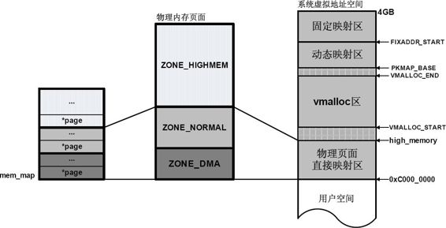

[toc]

转自：https://zhuanlan.zhihu.com/p/68501351



在32位系统中，内核地址空间是指虚拟地址3GB~4GB的部分。大家应该都知道，C语言中的指针近似于地址的概念，所以我们可以通过打印指针的值来查看它做代表的地址。在用户应用程序中，如果你打印一个指针，则结果应该是在0~3GB范围内，不管是CPU，还是编译器，链接器，看到的都是虚拟地址。而在内核程序（比如一个驱动模块）中打印一个指针，结果会是在3~4GB的范围内。

## **内核镜像**

在3GB~(3GB+896MB)这段**直接/线性映射**区域，包含了内核初始化页表swapper_pg_dir，内核镜像等。内核也是由一个elf文件（比如vmlinux）加载启动的，加载后也有text段，data段，bss段等。


可通过cat /proc/iomem命令查看kernel的text段，data段和bss段的内存分布。这里给出的地址范围都是小于0xC0000000的，所以可以判断这是物理地址。


## **内存分配**

> **kmalloc和vmalloc**

在虚拟内存空间的normal memory区域，内核使用**kmalloc()**来分配内存，kmalloc()返回的也是虚拟地址，但是分到的内存在物理地址上是连续的（因为是直接映射，在虚拟地址上自然也是连续的）。

在VMALLOC_START和VMALLOC_END之间的区域为**vmolloc area**，它和normal memory中有8MB的间隔。这部分间隔不作任何地址映射，相当于一个空洞，主要用做安全保护，防止不正确的越界内存访问，因为此处没有进行任何形式的映射，如果进入到空洞地带，将会触发处理器产生一个异常。


在vmolloc area中使用**vmalloc()**分配内存，具体的分配过程是：

1. 根据要分配的内存大小，调用get_vm_area( )，获取vmlist_lock锁以扫描vmlist链表，在vmolloc area中找到一块大小满足要求的空闲内存；
2. 调用__vmalloc_area_pages() --> alloc_page()，通过内核的buddy系统获得相应大小的物理页面，关于物理页面的分配请参考[这篇文章](https://zhuanlan.zhihu.com/p/68473428)；
3. vmalloc area中的地址映射不再是简单的3GB偏移，因此需要调用map_vm_area()，建立虚拟地址和物理页面的映射关系，并添加到内核页表中。


同kmalloc()相比，vmalloc()分配的内存只能保证在虚拟地址上连续，不能保证在物理地址上连续。在物理地址上连续有什么好处呢？

- 可以更好的根据空间局部性原理利用cache，增加数据访问的速度。
- 由于kmalloc()基于的是直接映射，其虚拟地址和物理地址之间是一个固定的偏移，因此可以利用既有的内核页表，而不需要为新的地址增加新的page table entries，因此其分配速度也比vmalloc()更快。
- 因为物理地址不连续，通过vmalloc()获得的每个page需要单独映射，而TLB资源很有限，因此这将比直接映射造成更严重的TLB thrashing问题。

有连续的物理内存和简单的直接映射关系谁不想要啊，可是如果系统运行久了，内存碎片就多起来，想要找到一块物理上连续的大块内存就越来越困难，这时就只能靠vmalloc()出马了。因为有一些应用场景是需要物理上连续的内存的（比如硬件设备），那是不是如果是没有这个要求的，就用vmalloc()就好了，把宝贵的normal area的地址资源留给那些真正需要的同志呢？

这种做法也有问题，如果大家都谦让着不用kmalloc()，那可能normal area就不能被充分利用起来。**公平和效率**始终是需要兼顾和平衡的，在内核的实际应用中，如果不是分配大块内存，还是推荐使用更高效的kmalloc()。

> **vmalloc区域**

还记得[上篇文章](https://zhuanlan.zhihu.com/p/68398179)举的那个房间和钥匙的例子么，用户空间的进程通过malloc()分配内存时，获得的只是虚拟地址的使用权，要等到真正往这块内存写数据了，才会获得对应的物理页面，而且是用多少给多少，而不是要多少给多少。内核空间自己的vmalloc()就不一样了，申请的物理内存**立刻满足**，房间钥匙一起给，在上级单位干活就是不一样啊。

分配到的每个内存区域（以下称vmalloc区域）都用一个**vm_struct**结构体表示，对这个名字有没有一点眼熟？跟[进程地址空间](https://zhuanlan.zhihu.com/p/67936075)里的vm_area_struct很像是吧，事实上，它们不光是名字相似，组织方式也有类似的地方，vm_struct也是通过一个叫vmlist的单项链表串起来的。

同样都是为了描述一段内存区域，包括这段区域的地址，大小，属性等，那这里可以直接用vm_area_struct吗？可以倒是可以，但是vmalloc区域相对要简单一些，用vm_area_struct来表达就显得复杂了，所以单独有了一个vm_struct，来看下这个数据结构的定义：

```c
 struct vm_struct {
         struct vm_struct * next;
         void * addr;
         unsigned long size;
         unsigned long flags;
	 struct page **pages;
         unsigned int nr_pages;
	 phys_addr_t phys_addr;
	 const void *caller;
 };
```

其中，"**next**"指向vmlist链表中的下一个节点。"**addr**"和"**size**"分别定义了这个vmalloc区域的虚拟起始地址和大小，"**nr_pages**"是指含有多少个page，它其实跟size表达的是同样的东西，只不过一个以页的长度为单位，一个以字节的长度为单位。

有意思的是，每个vmalloc区域都会附加上一个额外的page，目的么，也是为了越界内存访问检测，这种page被称作**guard page**。所以，每个vmalloc区域的size，除了本身需要的内存，还要多加上一个page的大小。

你看，又是8MB的空洞间隔，又是那么多的guard page，多浪费空间啊……其实没关系的啦，因为这里都是虚拟地址空间，并没有多占用实际的物理内存。guard page也并不是强制的，可通过VM_NO_GUARD宏选择。

因为通过vmalloc()分配获得的各个物理页面是不连续的，每个物理页面用struct page描述，一个vm_struct对应的所有物理页面的struct page就构成了一个数组，"**pages**"就是指向这个数组的指针。

vm_struct不光用于vmalloc()，它还可以用于vmap()和ioremap()，"**flags**"可以表示的属性很多，其中有3个就是分别对应vmalloc, vmap和ioremap的VM_ALLOC, VM_MAP和VM_IOREMAP。

vmap()用于已经分配了物理页面，只需要建立映射的情况。ioremap()与vmap()类似，但它是用于I/O设备的内存映射的，依赖于特定的体系结构，"**phys_addr**"就是对应设备的起始物理地址。

"**caller**"指向调用者，通常为__builtin_return_address(0)，__builtin_return_address(level)是利用GCC的编译特性来获得当前函数或者调用函数的返回地址。

那vm_struct这个控制结构本身又是存在什么地方的呢？它不是和它要管理的vmalloc区域一起放在vmalloc area的（没有和群众打成一片啊），而是放在normal area的（有自己单独的办公室），也就是说，vm_struct结构体占用的内存是通过kmalloc()分配的（享受干部待遇）。

## **内存释放**

和malloc()与free()的配对（只有malloc没有free就会造成内存泄露）一样，释放vmalloc()分配的内存就用**vfree()**，对应着vmalloc()的创建过程，vfree()就是一步一步反过来的，具体过程包括调用remove_vm_area()释放vmalloc area中的虚拟地址空间，然后调用unmap_vm_area()解除和物理地址的映射关系，最后调用deallocate_pages()释放对应的物理页面。

别忘了vm_struct这个管理人员，它要管的区域都不存在了，它自身也就没什么存在的必要的，用kfree()把它占的内存也释放掉吧。


如果想暂时保留分配到的物理页面，只释放一个vmalloc区域的虚拟地址空间也是可以的，就用vummap()来解除映射，重新要用的时候再vmap()回来，当然，这时新映射的vmalloc区域有可能就不是原来映射的那个了。

## **新版内核的vmalloc**

前面为了演示的需要，采用的是内核2.4版本的数据结构和API（因为相对简单很多）。事实上，当vmalloc区域的数量变多之后，遍历vmlist链表查找会面临进程地址空间中vm_area_struct曾经也遇到的问题，就是效率太低。

vm_area_struct采用了加入红黑树来共同管理的方法，从内核2.6的某个版本（我暂时还不知道具体是哪个版本）开始，vmalloc区域也开始使用**红黑树**（每个节点用**vmap_area**结构体表示），而且查找的时候也首先从一个缓存（free_vmap_cache，对应进程地址空间中的mmap_cache）中找。反正，两者在管理机制上是越来越像了。现在较新的Linux内核中的vmalloc实现是这样的：


一个重要的变化是伴随NUMA系统引入的node的概念。__get_vm_area_node()主要用于分配vmap_area和vm_struct*。*__vmalloc_area_node()主要用于分配物理页面和创建页表映射。


## **特殊映射**

在靠近虚拟地址空间的顶部，有一个PKMap和一个固定映射（fix-mapped）的特殊区域，它们和vmalloc area中有一个8KB的间隔，作用么，还是越界防护。


这里固定映射是指虚拟地址是固定的，而被映射的物理地址并不固定。采用固定虚拟地址的好处是它相当于一个指针常量（常量的值在编译时确定），指向物理地址，如果虚拟地址不固定，则相当于一个指针变量。指针常量相比指针变量的好处是可以减少一次内存访问，因为指针变量需要通过内存访问才可以获得指针本身的值。关于fixmap的详细介绍，请参考[这篇文章](https://link.zhihu.com/?target=http%3A//www.wowotech.net/memory_management/fixmap.html)。

关于PKMap Region的介绍，请参考[这篇文章](https://zhuanlan.zhihu.com/p/69329911)。


**参考：**

[https://users.nccs.gov/~fwang2/linux/lk_addressing.txt](https://link.zhihu.com/?target=https%3A//users.nccs.gov/~fwang2/linux/lk_addressing.txt)

[http://lzz5235.github.io/2015/05/26/vmalloc.html](https://link.zhihu.com/?target=http%3A//lzz5235.github.io/2015/05/26/vmalloc.html)

[http://jake.dothome.co.kr/vmalloc/](https://link.zhihu.com/?target=http%3A//jake.dothome.co.kr/vmalloc/)


