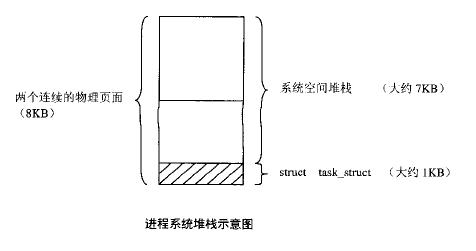
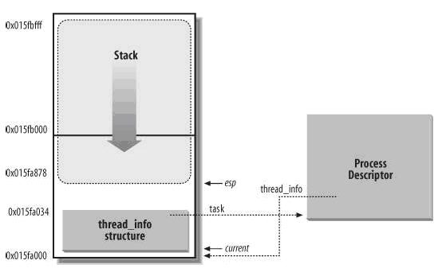

[toc]

转自：https://blog.csdn.net/dxdxsmy/article/details/7401074


Linux内核 2.4和2.6的进程内核堆栈和task描述符存储不太一样，这儿总结一下。

在内核2.4中堆栈是这么定义的：

```cpp
union task_union {
        struct task_struct task;
        unsigned long stack[INIT_TASK_SIZE/sizeof(long)];
};
```


而INIT_TASK_SIZE只能是8K。


内核为每个进程分配一个task_struct结构时，实际上分配两个连续的物理页面(8192字节)，如图所示。底部用作task_struct结构(大小约为1K字节)，结构的上面用作内核堆栈(大小约为7K字节)。访问进程自身的task_struct结构，使用宏操作current, 在2.4中定义如下：


```cpp
#define current get_current()
static inline struct task_struct * get_current(void)
{
      struct task_struct *current;
      __asm__("andl %%esp,%0; ":"=r" (current) : "" (~8191UL));
      return current;
}
```

 

 ~8191UL表示最低13位为0, 其余位全为1。 %esp指向内核堆栈中，当屏蔽掉%esp的最低13后，就得到这个”两个连续的物理页面”的开头，而这个开头正好是task_struct的开始，从而得到了指向task_struct的指针。


**在内核2.6中堆栈这么定义：**

 

```cpp
union thread_union {
      struct thread_info thread_info;
      unsigned long stack[THREAD_SIZE/sizeof(long)];
};
```


根据内核的配置，THREAD_SIZE既可以是4K字节(1个页面)也可以是8K字节(2个页面)。thread_info是52个字节长。

下图是当设为8KB时候的内核堆栈：Thread_info在这个内存区的开始处，内核堆栈从末端向下增长。进程描述符不是在这个内存区中，而分别通过task与thread_info指针使thread_info与进程描述符互联。所以获得当前进程描述符的current定义如下:



```cpp
#define current get_current()
static inline struct task_struct * get_current(void)
{
      return current_thread_info()->task;
}
static inline struct thread_info *current_thread_info(void)
{
       struct thread_info *ti;
       __asm__("andl %%esp,%0; ":"=r" (ti) : "" (~(THREAD_SIZE - 1)));
       return ti;
}
```


 

  根据THREAD_SIZE大小，分别屏蔽掉内核栈的12-bit LSB(4K)或13-bit LSB(8K)，从而获得内核栈的起始位置。

```cpp
struct thread_info {
      struct task_struct    *task;       /* main task structure */
      struct exec_domain    *exec_domain; /* execution domain */
      unsigned long           flags;       /* low level flags */
      unsigned long           status;       /* thread-synchronous flags */
      ... ..
}
```


参考：

1. http://hi.baidu.com/zqfazqq/blog/item/12db349980343b0b6f068c5d.html

2. Linux内核源代码情景分析(上册, Page267)

3. 深入理解Linux内核(第3版, Page90, Page164)


