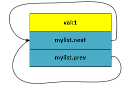
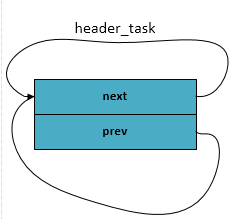
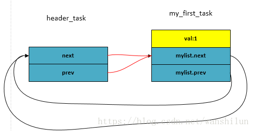

[toc]

转自：https://blog.csdn.net/wanshilun/article/details/79747710

# Linux内核中经典链表 list_head 常见使用方法解析

做内核驱动开发经常会使用linux内核最经典的双向链表 list_head， 以及它的拓展接口(或者宏定义)： list_add , list_add_tail, list_del , list_entry ,list_for_each , list_for_each_entry ...... 

每次看到这些接口，感觉都很像，今天专门研究了一下内核，对它们做一些总结，希望为后续开发提供方便。

首先找到list_head 结构体定义，kernel/inclue/linux/types.h 如下： 

```c
struct list_head {
	struct list_head *next, *prev;
};
```

然后就开始围绕这个结构开始构建链表，然后插入、删除节点 ，遍历整个链表等等，其实内核已经提供好了现成的接口，接下来就让我们进入 kernel/include/linux/list.h中：

**一. 创建链表**

  内核提供了下面的这些接口来初始化链表：

```c
#define LIST_HEAD_INIT(name) { &(name), &(name) }
 
#define LIST_HEAD(name) \
	struct list_head name = LIST_HEAD_INIT(name)
 
static inline void INIT_LIST_HEAD(struct list_head *list)
{
	WRITE_ONCE(list->next, list);
	list->prev = list;
}
```

如： 可以通过 LIST_HEAD(mylist) 进行初始化一个链表，mylist的prev 和 next 指针都是指向自己。

```c
struct list_head mylist = {&mylist,  &mylist} ;   
```

但是如果只是利用mylist这样的结构体实现链表就没有什么实际意义了，因为正常的链表都是为了遍历结构体中的其它有意义的字段而创建的，而我们mylist中只有 prev和next指针，却没有实际有意义的字段数据，所以毫无意义。

综上，我们可以创建一个宿主结构，然后在此结构中再嵌套mylist字段，宿主结构又有其它的字段（进程描述符 task_struct，页面管理的page结构，等就是采用这种方法创建链表的）。为简便理解，定义如下：

```c
struct  my_task_list {
    int val ;
    struct list_head mylist;
}
```

创建第一个节点

```c
struct my_task_list first_task = 
{ .val = 1,
  .mylist = LIST_HEAD_INIT(first_task.mylist)
};
```

这样mylist 就prev 和 next指针分别指向mylist自己了，如下图：



**二. 添加节点**

内核已经提供了添加节点的接口了

**1. list_add** 

  如下所示。 根据注释可知，是在链表头head后方插入一个新节点new。

  并且还说了一句：这个接口利用实现堆栈 （why？ 稍后再做分析）

```c
/**
 * list_add - add a new entry
 * @new: new entry to be added
 * @head: list head to add it after
 *
 * Insert a new entry after the specified head.
 * This is good for implementing stacks.
 */
static inline void list_add(struct list_head *new, struct list_head *head)
{
	__list_add(new, head, head->next);
}
```

list_add再调用__list_add接口

```c

/*
 * Insert a new entry between two known consecutive entries.
 *
 * This is only for internal list manipulation where we know
 * the prev/next entries already!
 */
static inline void __list_add(struct list_head *new,
			      struct list_head *prev,
			      struct list_head *next)
{
	if (!__list_add_valid(new, prev, next))
		return;
 
	next->prev = new;
	new->next = next;
	new->prev = prev;
	WRITE_ONCE(prev->next, new);
}
```

其实就是在head 链表头后和链表头后第一个节点之间插入一个新节点。然后这个新的节点就变成了链表头后的第一个节点了。

依然用上面的my_task_list结构体举例子

首先我们创建一个链表头  header_task 

```c
LIST_HEAD(header_task);
```



然后再创建实际的第一个节点

```c
struct my_task_list my_first_task = 
{ .val = 1,
  .mylist = LIST_HEAD_INIT(my_first_task.mylist)
};
```

接着把这个节点插入到header_task之后

```c
list_add(&my_first_task.mylist,  &header_task);
```



然后在创建第二个节点，同样把它插入到header_task之后

```c
struct my_task_list my_second_task = 
{ .val = 2,
  .mylist = LIST_HEAD_INIT(my_second_task.mylist)
};
```

其实还可以用另外一个接口 INIT_LIST_HEAD 进行初始化（参数为指针变量）, 如下：

```c
struct my_task_list my_second_task;
my_second_task.val = 2;
INIT_LIST_HEAD(&my_second_task.mylist);
```

```c
list_add(&my_second_task.mylist, &header_task)
```


> 以此类推，每次插入一个新节点，都是紧靠着header节点，而之前插入的节点依次排序靠后，那最后一个节点则是第一次插入header后的那个节点。最终可得出：先来的节点靠后，而后来的节点靠前，“先进后出，后进先出”。所以此种结构类似于 stack“堆栈”， 而 header_task就类似于内核stack中的栈顶指针esp， 它都是紧靠着最后push到栈的元素。


***\*四. 链表遍历\****

   内核是同过下面这个宏定义来完成对list_head链表进行遍历的，如下 :

```c
/**
 * list_for_each	-	iterate over a list
 * @pos:	the &struct list_head to use as a loop cursor.
 * @head:	the head for your list.
 */
#define list_for_each(pos, head) \
	for (pos = (head)->next; pos != (head); pos = pos->next)
```

上面这种方式是从前向后遍历的，同样也可以使用下面的宏反向遍历：

```c
/**
 * list_for_each_prev	-	iterate over a list backwards
 * @pos:	the &struct list_head to use as a loop cursor.
 * @head:	the head for your list.
 */
#define list_for_each_prev(pos, head) \
	for (pos = (head)->prev; pos != (head); pos = pos->prev)
```

而且，list.h 中也提供了list_replace( 节点替换) list_move(节点移位) ，翻转，查找等接口，这里就不在一一分析了。

***\*五. 宿主结构\****

**1.找出宿主结构 list_entry(ptr, type, member)**

  上面的所有操作都是基于list_head这个链表进行的，涉及的结构体也都是:

```c
struct list_head {
	struct list_head *next, *prev;
};
```

其实，正如文章一开始所说，我们真正更关心的是包含list_head这个结构体字段的宿主结构体，因为只有定位到了宿主结构体的起始地址，我们才能对对宿主结构体中的其它有意义的字段进行操作。

```c
struct  my_task_list {
    int val ;
    struct list_head mylist;
}
```

 ***\*那我们如何根据mylist这个字段的地址而找到宿主结构my_task_list的位置呢？？？\****

   做linux驱动开发的同学是不是想到了LDD3这本书中经常使用的一个非常经典的宏定义呢！那就是：

```c
container_of(ptr, type, member)
```

没错就是它，在LDD3这本书中的第三章字符设备驱动，以及第十四章驱动设备模型中多次提到，所以我觉得这个宏应该是内核最经典的宏之一。 那list.h中使用什么接口实现的这个转换功能呢？

```c
/**
 * list_entry - get the struct for this entry
 * @ptr:	the &struct list_head pointer.
 * @type:	the type of the struct this is embedded in.
 * @member:	the name of the list_head within the struct.
 */
#define list_entry(ptr, type, member) \
	container_of(ptr, type, member)
```

list.h中提供了list_entry宏来实现对应地址的转换，但最终还是调用了container_of宏，所以container_of宏的伟大之处不言而喻。 那接下来让我们揭开她的面纱：
    此宏在内核代码 kernel/include/linux/kernel.h中定义（此处kernel版本为3.10；新版本4.13之后此宏定义改变，但实现思想保持一致）

```c
/** 
 * container_of - cast a member of a structure out to the containing structure 
 * @ptr:    the pointer to the member. 
 * @type:   the type of the container struct this is embedded in. 
 * @member: the name of the member within the struct. 
 * 
 */  
#define container_of(ptr, type, member) ({          \  
    const typeof( ((type *)0)->member ) *__mptr = (ptr); \  
    (type *)( (char *)__mptr - offsetof(type,member) );}) 
```

而offsetof定义在 kernel/include/linux/stddef.h ，如下：

```c
#define offsetof(TYPE, MEMBER) ((size_t) &((TYPE *)0)->MEMBER)
```

看下container_of宏的注释：

（1）根据结构体重的一个成员变量地址导出包含这个成员变量mem的struct地址。

（2）参数解释：

    ptr  ： 成员变量mem的地址    
    
    type： 包含成员变量mem的宿主结构体的类型
    
    member： 在宿主结构中的mem成员变量的名称
    
    如果用我们之前定义的结构体struct my_task_list举例
```c
struct  my_task_list {
    int val ;
    struct list_head mylist;
}

struct my_task_list first_task = 
{ .val = 1,
  .mylist = LIST_HEAD_INIT(first_task.mylist)
};

	ptr   ：    &first_task.mylist
    type  ：  struct my_task_list
    member :  mylist
```

而container_of宏的功能就是根据 first_task.mylist字段的地址得出first_task结构的其实地址。

把上面offsetof的宏定义代入container_of宏中，可得到下面定义：

````c
#define container_of(ptr, type, member) ({          \  
    const typeof( ((type *)0)->member ) *__mptr = (ptr); \  
    (type *)( (char *)__mptr - ((size_t) &((type *)0)->member) );}) 
````

再把宏中对应的参数替换成实参：

```c
const typeof( ((struct my_task_list *)0)->mylist ) *__mptr = (&first_task.mylist); \  
    (struct my_task_list *)( (char *)__mptr - ((size_t) &((struct my_task_list *)0)->mylist) );})
```

typeof 是 GNU对C新增的一个扩展关键字，用于获取一个对象的类型 ，比如这里((struct my_task_list *)0)->mylist 是把0地址强制转换成struct my_task_list 指针类型，然后取出mylist元素。 然后再对mylist元素做typeof操作，其实就是获取 my_task_list结构中mylist字段的数据类型struct list_head，所以这行语句最后转化为：

```c
const struct list_head *__mptr  = (&first_task.mylist);
```

第二条语句中在用 __mptr这个指针 减去 mylist字段在 my_task_list中的偏移（把0地址强制转换成struct my_task_list指针类型，然后取出mylist的地址，此时mylist的地址也是相对于0地址的偏移，所以就是mylist字段相对于宿主结构类型struct my_task_list的偏移） 正好就是宿主结构的起始地址。C语言的灵活性得到了很好的展示！！！


**2. 宿主结构的遍历**

​    我们可以根据结构体中成员变量的地址找到宿主结构的地址， 并且我们可以对成员变量所建立的链表进行遍历，那我们是不是也可以通过某种方法对宿主结构进行遍历呢？  

​    答案肯定是可以的，内核在list.h中提供了下面的宏：

```c
/**
 * list_for_each_entry	-	iterate over list of given type
 * @pos:	the type * to use as a loop cursor.
 * @head:	the head for your list.
 * @member:	the name of the list_head within the struct.
 */
#define list_for_each_entry(pos, head, member)				\
	for (pos = list_first_entry(head, typeof(*pos), member);	\
	     &pos->member != (head);					\
	     pos = list_next_entry(pos, member))
```

其中，list_first_entry 和 list_next_entry宏都定义在list.h中，分别代表：获取第一个真正的宿主结构的地址； 获取下一个宿主结构的地址。它们的实现都是利用list_entry宏。

```c

/**
 * list_first_entry - get the first element from a list
 * @ptr:	the list head to take the element from.
 * @type:	the type of the struct this is embedded in.
 * @member:	the name of the list_head within the struct.
 *
 * Note, that list is expected to be not empty.
 */
#define list_first_entry(ptr, type, member) \
	list_entry((ptr)->next, type, member)
 
/**
 * list_next_entry - get the next element in list
 * @pos:	the type * to cursor
 * @member:	the name of the list_head within the struct.
 */
#define list_next_entry(pos, member) \
	list_entry((pos)->member.next, typeof(*(pos)), member)
```

最终实现了宿主结构的遍历

```c
#define list_for_each_entry(pos, head, member)				\
	for (pos = list_first_entry(head, typeof(*pos), member);	\
	     &pos->member != (head);					\
	     pos = list_next_entry(pos, member))
```

首先pos定位到第一个宿主结构地址，然后循环获取下一个宿主结构地址，如果查到宿主结构中的member成员变量（宿主结构中struct list_head定义的字段）地址为head，则退出，从而实现了宿主结构的遍历。如果要循环对宿主结构中的其它成员变量进行操作，这个遍历操作就显得特别有意义了。
        我们用上面的 my_task_list结构举个例子：

```c
struct my_task_list *pos_ptr = NULL ; 
list_for_each_entry (pos_ptr, & header_task, mylist ) 
    { 
         printk ("val =  %d\n" , pos_ptr->val); 
    }
```


