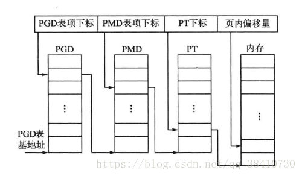
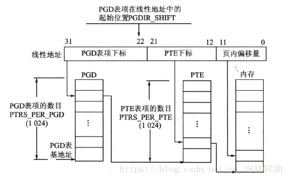

[toc]


转自：https://blog.csdn.net/qq_38410730/article/details/81036768?utm_medium=distribute.pc_relevant.none-task-blog-BlogCommendFromMachineLearnPai2-2.edu_weight&depth_1-utm_source=distribute.pc_relevant.none-task-blog-BlogCommendFromMachineLearnPai2-2.edu_weight

# Linux的页表结构

为了通用，Linux系统使用了三级页表结构：页目录、中间页目录和页表。

* PGD为顶级页表，是一个pgd_t数据类型（定义在文件linux/include/page.h中）的数组，每个数组元素指向一个中间页目录；
* PMD为二级页表，是一个pmd_t数据结构的数组，每个数组元素指向一个页表；
* PTE则是页表，是一个pte_t数据类型的数组，每个元素中含有物理地址。



为了应用上的灵活，Linux使用一系列的宏来掩盖各种平台的细节。用户可以在配置文件config中根据自己的需要对页表进行配置，以决定是使用三级页表还是使用二级页表。

在系统编译时，会根据配置文件config中的配置，把目录include/asm符号连接到具体CPU专用的文件目录中。例如，对于i386CPU，该目录符号会连接到include/asm-i386，并在文件pgable-2level-defs.h中定义了二级页表的基本结构，如下图：



其中还定义了：

```c
#define PGDIR_SHIFT 22                        //PGD在线性地址中的起始地址为bit22
#define PTRS_PER_PGD 1024                     //PGD共有1024个表项
#define PTRS_PER_PTE 1024                     //PTE共有1024个表项
#endif
```


#define PTRS_PER_PGD 1024                     //PGD共有1024个表项
#define PTRS_PER_PTE 1024                     //PTE共有1024个表项
在文件include/asm-i386/pgtable.h中定义了页目录和页表项的数据结构，如下：

```c
typedof struct { unsigned long pte_low; } pte_t;                    //页表中的物理地址，页框码
typedof struct { unsigned long pgd; } pgd_t;                        //指向一个页表
typedof struct { unsigned long pgprot; } pgprot_t;                  //页表中的各个状态信息和访问权限
```


从定义可知，它们都是只有一个长整型类型（32位）的结构体。

> 注意：如上文的“页的保护”部分，页框码代表物理地址，只需要高20位就够了（因为页框的长度为4KB，因此页内偏移12位）。而后12位可以存放各个状态信息和访问权限。但是Linux并没有这样做，反而重新定义了一个结构体来存放，通过“或”运算来将两者结合。


