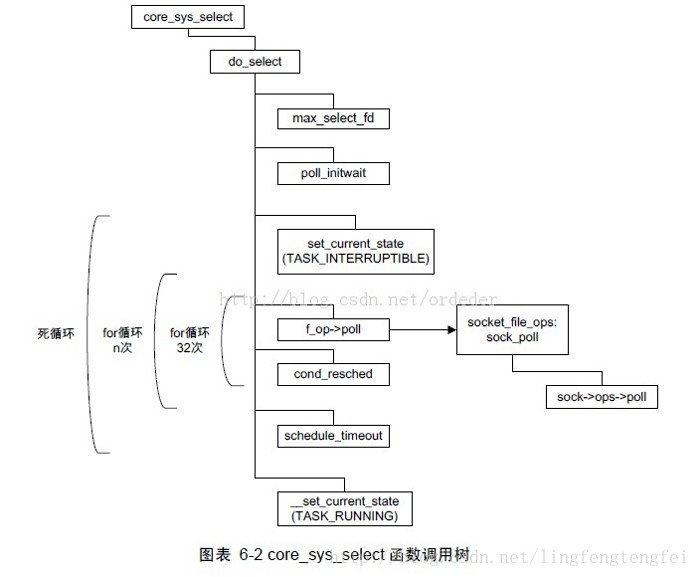

[toc]

转自：https://www.cnblogs.com/alantu2018/p/8612722.html

# select参数详解

```c
int select(int maxfdp,fd_set *readfds,fd_set *writefds,fd_set *errorfds,struct timeval *timeout);

/**
readfds: 读fd set,监视这些文件描述符的读变化的
writefds: 写fd set,监视这些文件描述符的写变化的


struct timeval* timeout：是select的超时时间，这个参数至关重要，它可以使select处于三种状态：
第一，若将NULL以形参传入，即不传入时间结构，就是将select置于阻塞状态，一定等到监视文件描述符集合中某个文件描述符发生变化为止；
第二，若将时间值设为0秒0微秒，就变成一个纯粹的非阻塞函数，不管文件描述符是否有变化，都立刻返回继续执行，文件无变化返回0，有变化返回一个正值；
第三，timeout的值大于0，这就是等待的超时时间，即select在timeout时间内阻塞，超时时间之内有事件到来就返回了，否则在超时后不管怎样一定返回，返回值同上述。


select 返回值：
负值：select错误
正值：某些文件可读写或出错
0：等待超时，没有可读写或错误的文件

**/
```


# 相关函数

```c
/**fd_set集合可以通过一些宏由人为来操作，比如：**/
FD_ZERO(fd_set *);		//清空集合
FD_SET(int, fd_set *);	//将一个给定的文件描述符加入集合之中
FD_CLR(int, fd_set*); 	//将一个给定的文件描述符从集合中删除
FD_ISSET(int ,fd_set* ); //检查集合中指定的文件描述符是否可以读写
    
```


# 使用示例


```c
main()  
{  
    int sock;  
    FILE *fp;  
    struct fd_set fds;  
    struct timeval timeout={3,0}; //select等待3秒，3秒轮询，要非阻塞就置0  
    char buffer[256]={0}; //256字节的接收缓冲区  
    /* 假定已经建立UDP连接，具体过程不写，简单，当然TCP也同理，主机ip和port都已经给定，要写的文件已经打开 
    sock=socket(...); 
    bind(...); 
    fp=fopen(...); */  
    while(1)  
   {  
        FD_ZERO(&fds); //每次循环都要清空集合，否则不能检测描述符变化  
        FD_SET(sock,&fds); //添加描述符  
        FD_SET(fp,&fds); //同上  
        maxfdp=sock>fp?sock+1:fp+1;    //描述符最大值加1  
        switch(select(maxfdp,&fds,&fds,NULL,&timeout))   //select使用  
        {  
            case -1: exit(-1);break; //select错误，退出程序  
            case 0:break; //再次轮询  
            default:  
                  if(FD_ISSET(sock,&fds)) //测试sock是否可读，即是否网络上有数据  
                  {  
                        recvfrom(sock,buffer,256,.....);//接受网络数据  
                        if(FD_ISSET(fp,&fds)) //测试文件是否可写  
                            fwrite(fp,buffer...);//写入文件  
                         buffer清空;  
                   }// end if break;  
          }// end switch  
     }//end while  
}//end main   
```


# select系统调用代码走读



# 内核轮询的逻辑

1. 循环遍历传入的fdset，对传入的fd=1的调用fd对应的poll函数（poll：轮询），poll返回的结果是：读是否准备好，或者写是否准备好
2. poll的逻辑，其实就是将当前进程加入fd等待资源的wait队列中，这样如果等待的资源可用了，那么就会唤醒队列中的进程
