[toc]

转自：https://blog.csdn.net/lukuen/article/details/6935068

https://www.jeanleo.com/2018/09/07/[linux内存源码分析]slub分配算法（1）/

http://www.wowotech.net/memory_management/426.html

https://time.geekbang.org/column/article/96623


首先鸟瞰全局，由下图进行入手分析slub内存分配算法的管理框架：


内核管理页面使用了2个算法：伙伴算法和slub算法，伙伴算法以页为单位管理内存，但在大多数情况下，程序需要的并不是一整页，而是几个、几十个字节的小内存。于是需要另外一套系统来完成对小内存的管理，这就是slub系统。slub系统运行在伙伴系统之上，为内核提供小内存管理的功能。

slub把内存分组管理，每个组分别包含2^3、2^4、...2^11个字节，在4K页大小的默认情况下，另外还有两个特殊的组，分别是96B和192B，共11组。之所以这样分配是因为如果申请2^12B大小的内存，就可以使用伙伴系统提供的接口直接申请一个完整的页面即可。
    
slub就相当于零售商，它向伙伴系统“批发”内存，然后在零售出去。一下是整个slub系统的框图：


一切的一切源于kmalloc_caches[12]这个数组，该数组的定义如下：

```c
struct kmem_cache kmalloc_caches[PAGE_SHIFT] __cacheline_aligned;
```

**每个数组元素对应一种大小的内存**，可以把一个kmem_cache结构体看做是一个特定大小内存的零售商，整个slub系统中共有12个这样的零售商，**每个“零售商”只“零售”特定大小的内存**，例如：有的“零售商”只"零售"8Byte大小的内存，有的只”零售“16Byte大小的内存。

每个零售商(kmem_cache)有两个“部门”，一个是“仓库”：kmem_cache_node，一个“营业厅”：kmem_cache_cpu。**“营业厅”里只保留一个slab**，只有在营业厅(kmem_cache_cpu)中没有空闲内存的情况下才会从仓库中换出其他的slab。
所谓slab就是零售商(kmem_cache)批发的连续的整页内存，零售商把**这些整页**的内存分成许多小内存，然后分别“零售”出去，**一个slab可能包含多个连续的内存页。slab的大小和零售商有关**。

相关数据结构：

**物理页按照对象(object)大小组织成单向链表**，对象大小时候objsize指定的。例如16字节的对象大小，每个object就是16字节，每个object包含指向下一个object的指针，该指针的位置是每个object的起始地址+offset。每个object示意图如下：

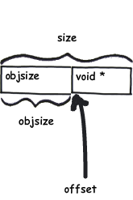

> void*指向的是下一个空闲的object的首地址，这样object就连成了一个单链表。

# 申请内存

向slub系统申请内存块(object)时：slub系统把内存块当成object看待

1. slub系统刚刚创建出来，这是第一次申请。
   此时slub系统刚建立起来，营业厅(kmem_cache_cpu)和仓库(kmem_cache_node)中没有任何可用的slab可以使用，如下图中1所示：

   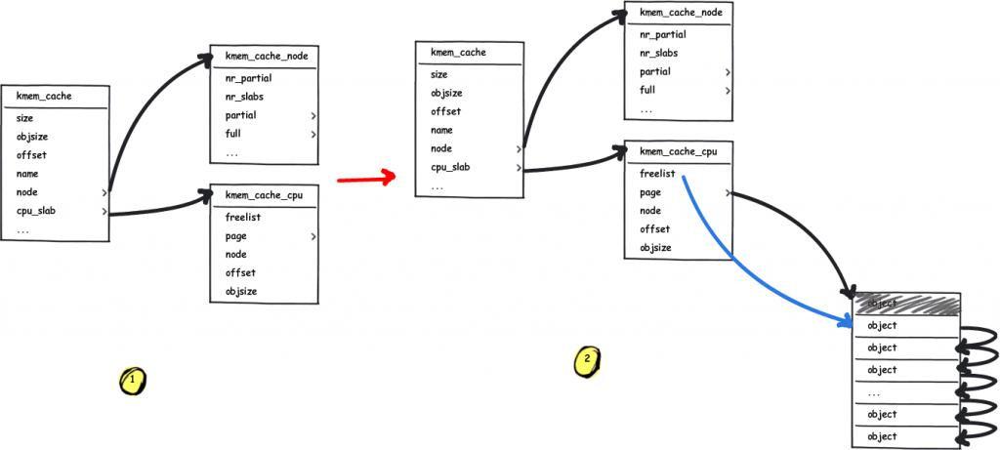

   因此只能向伙伴系统申请空闲的内存页，并把这些页面分成很多个object，取出其中的一个object标志为已被占用，并返回给用户，其余的object标志为空闲并放在kmem_cache_cpu中保存。kmem_cache_cpu的freelist变量中保存着下一个空闲object的地址。上图2表示申请一个新的slab，并把第一个空闲的object返回给用户，freelist指向下一个空闲的object。

2. slub的kmem_cache_cpu中保存的slab上有空闲的object可以使用。
   这种情况是最简单的一种，直接把kmem_cache_cpu中保存的一个空闲object返回给用户，并把freelist指向下一个空闲的object。

   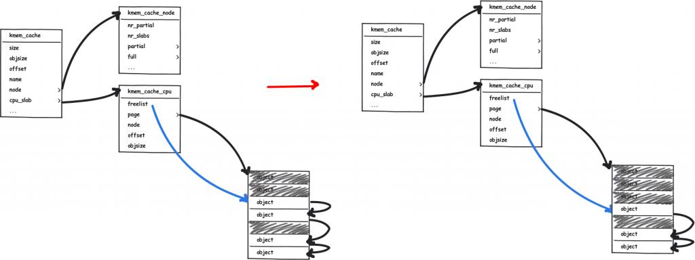

3. slub已经连续申请了很多页，现在kmem_cache_cpu中已经没有空闲的object了，但kmem_cache_node的partial中有空闲的object 。所以从kmem_cache_node的partial变量中获取有空闲object的slab，并把一个空闲的object返回给用户。

   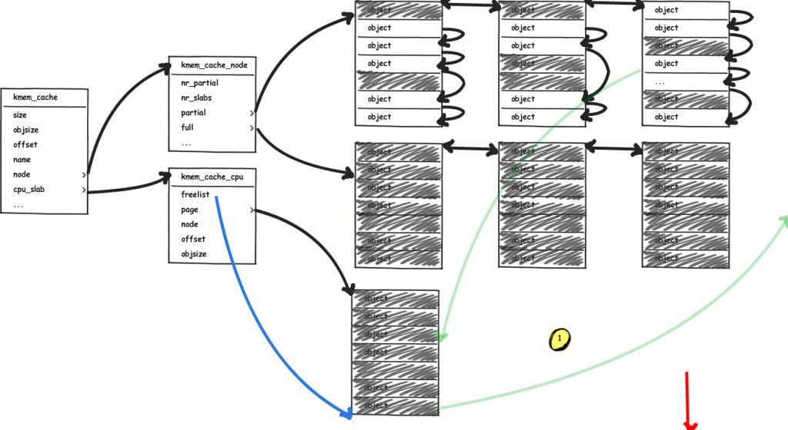

   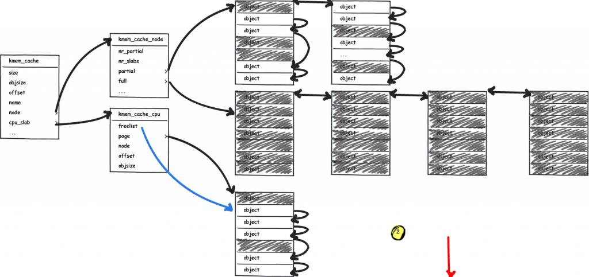

   上图中，kmem_cache_cpu中已经都被占用的slab放到仓库中，kmem_cache_node中有两个双链表，partial和full，分别盛放不满的slab(slab中有空闲的object)和全满的slab(slab中没有空闲的object)。然后从partial中挑出一个不满的slab放到kmem_cache_cpu中。

   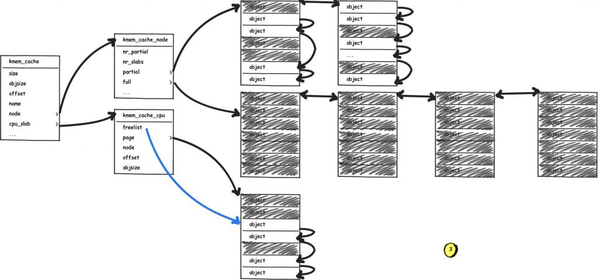

   上图中，kmem_cache_cpu中中找出空闲的object返回给用户。

4. slub已经连续申请了很多页，现在kmem_cache_cpu中保存的物理页上已经没有空闲的object可以使用了，而此时kmem_cache_node中没有空闲的页面了，只能向内存管理器(伙伴算法)申请slab。并把该slab初始化，返回第一个空闲的object。
	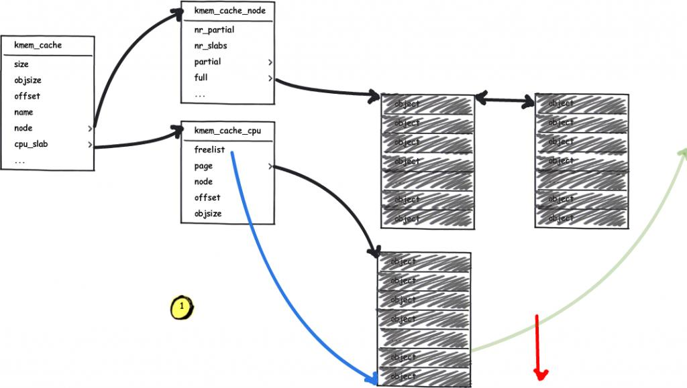
	
	上图表示，kmem_cache_node中没有空闲的object可以使用，所以只能重新申请一个slab
	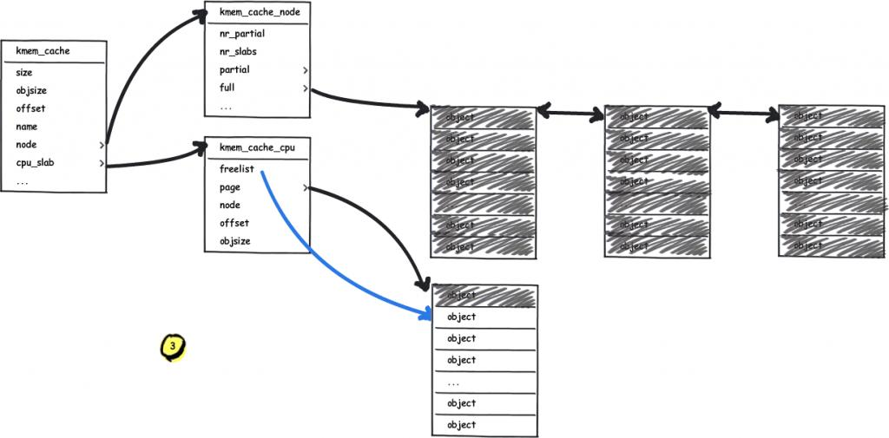
  
  把新申请的slab中的一个空闲object返回给用户使用，freelist指向下一个空闲object。

# 释放内存

向slub系统释放内存块(object)时，如果kmem_cache_cpu中缓存的slab就是该object所在的slab，则把该object放在空闲链表中即可，如果kmem_cache_cpu中缓存的slab不是该object所在的slab，然后把该object释放到该object所在的slab中。在释放object的时候可以分为一下三种情况：

1. object在释放之前slab是full状态的时候（slab中的object都是被占用的），释放该object后，这是该slab就是半满（partail）的状态了，这时需要把该slab添加到kmem_cache_node中的partial链表中。

   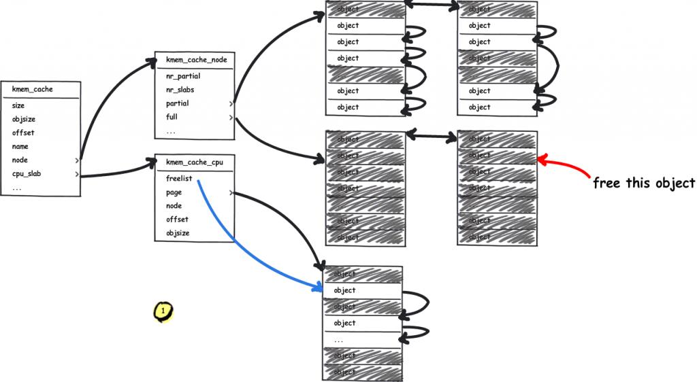

   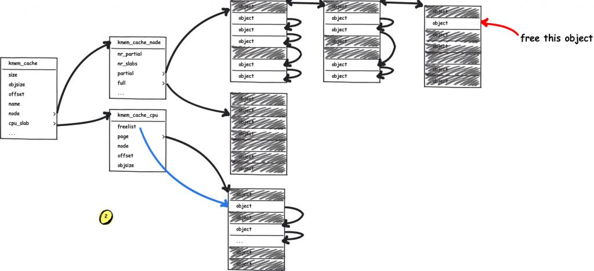

2. slab是partial状态时（slab中既有object被占用，又有空闲的），直接把该object加入到该slab的空闲队列中即可。

   

   

3. 该object在释放后，slab中的object全部是空闲的，还需要把该slab释放掉。

   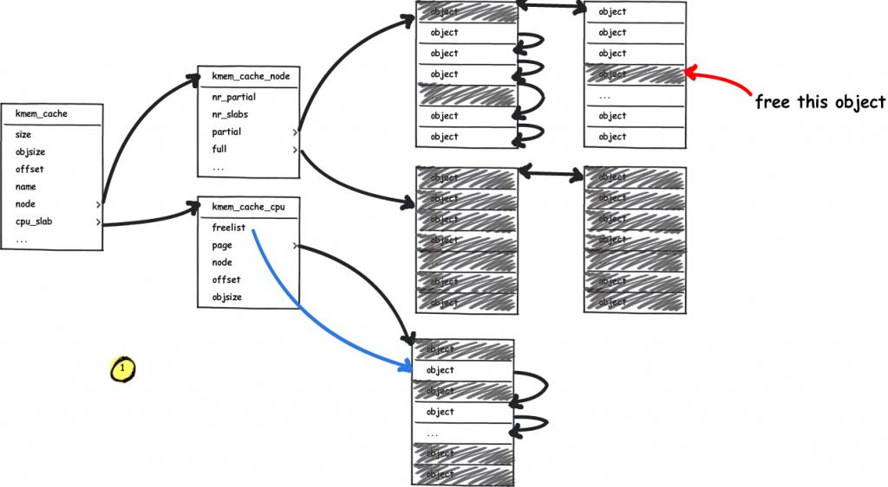

   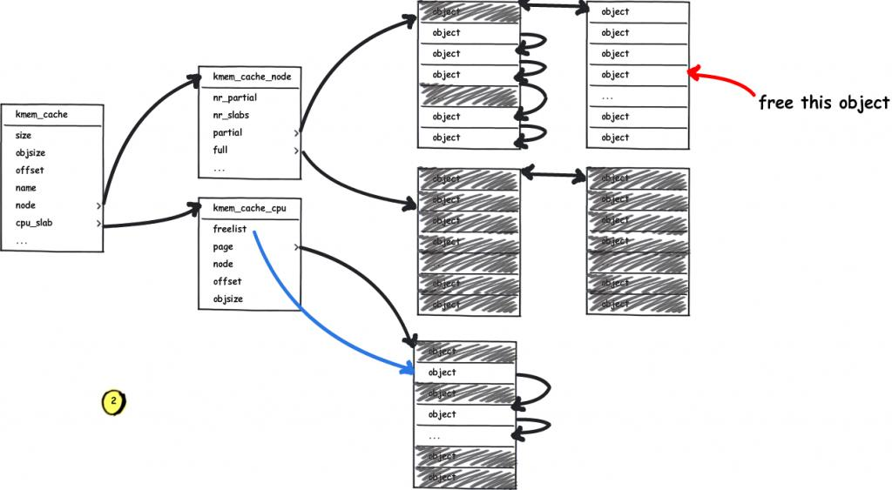

   这一步产生一个完全空闲的slab，需要把这个slab释放掉

   

以上是slub算法的主要原理。