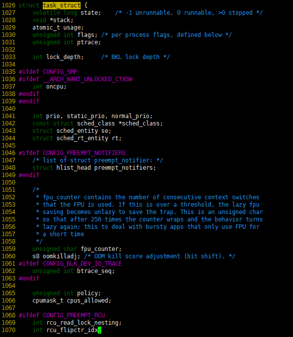
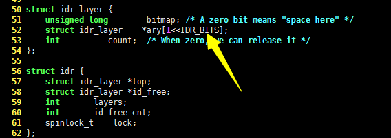
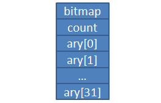
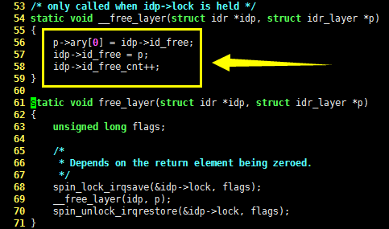
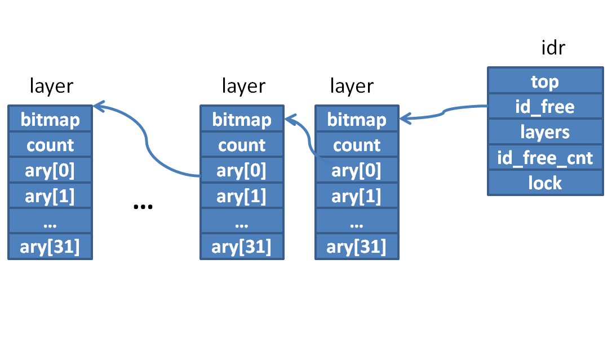
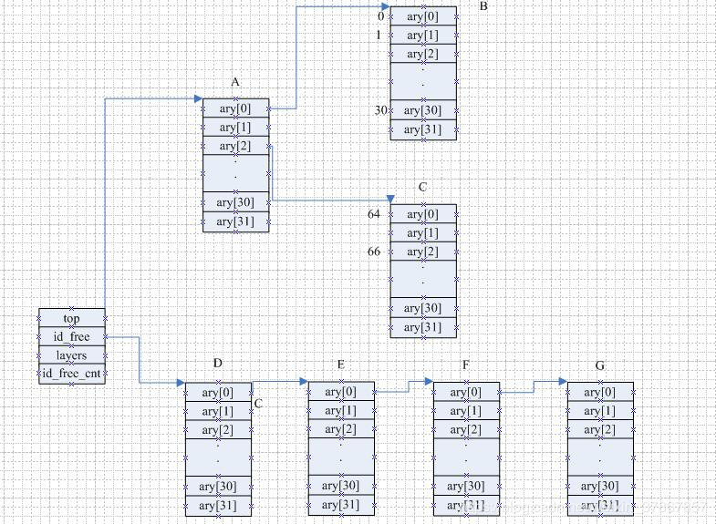
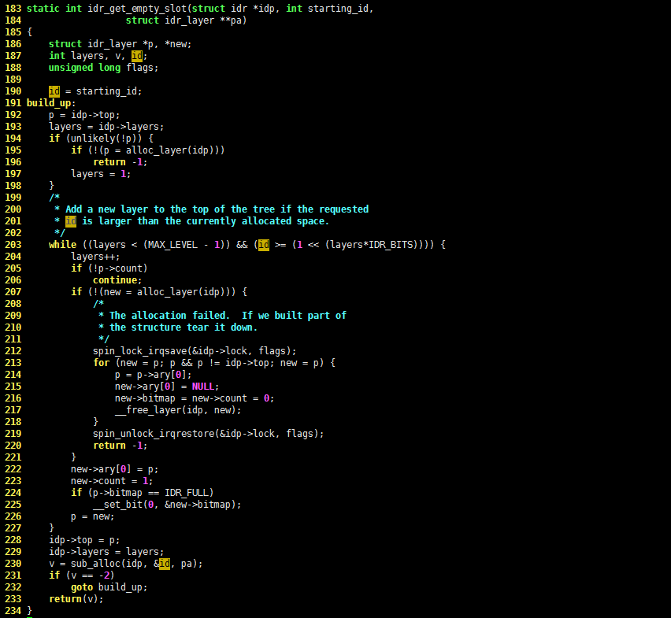
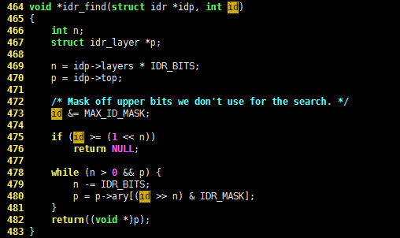

[toc]

# linux内核IDR机制详解

转自：https://blog.popkx.com/linux-learning-20-mapping-idr-mechanism-in-kernel/

## 先来说说映射适合用于解决什么问题

linux 系统中的许多资源都用整数 ID 标识，例如进程 PID，文件描述符 ID 等等。使用一个整数标识资源的确非常简洁，但是一个整数能够记录表达的信息太有限了，所以整数 ID 的背后常常都有一个结构体与之对应，例如每个进程 ID 都对应着一个巨大的 task_struct 结构体记录着进程的资源。



那么，整数 ID 该如何与结构体对应起来呢？这个问题可以简化为如何将两个整数对应起来。因为只要能根据整数 ID 找到结构体的地址就可以了，而结构体的地址也是一个整数。

要解决这个问题，首先就需要选择一个数据结构。如果使用数组进行索引，一旦 ID 很大，那数组也必须得很大，这样会占据大量的内存空间，所以数组显然是不合适的。而如果使用链表进行索引，则又会有查找效率问题，毕竟链表只能线性遍历查找。

映射就非常适合解决这样的问题。

## 什么是映射？

映射其实就是将要保存的数值（例如结构体指针）与另一个数关联起来，所谓的“另一个数”常常被称作“键值”。映射一般至少要支持三个模块：
\* add(key, value)，增加映射
\* remove(key)，删除映射
\* value = lookup(key)，根据键查找数值

这么看来，“哈希表”就是一种映射，不过也不是所有映射都需要通过“哈希表”才能实现，映射也可以通过自平衡二叉树（之后的文章会介绍二叉树）实现。

> 虽然“键值映射”是一个非常宽泛的概念，但是大多情况下都默认是借助自平衡二叉树实现的。

## linux 内核是怎样设计和实现“映射”的？

linux 内核实现映射的目标很简单：就是将指针与一个唯一标识数（UID）对应起来。为此，linux 内核不仅实现了映射的三个标准模块外，还提供了自动产生 UID 的模块。这么看来，内核实现的映射更像是一种“定制化”的，而不是通用的映射。

先来看看 linux 内核中用于实现映射的数据结构，请看如下C语言代码：

```c
-    50 struct idr_layer {    
|    51     unsigned long        bitmap; /* A zero bit means "space here" */
|    52     struct idr_layer    *ary[1<<IDR_BITS];
|    53     int          count;  /* When zero, we can release it */
|    54 };
     55 
-    56 struct idr {          
|    57     struct idr_layer *top;
|    58     struct idr_layer *id_free;
|    59     int       layers; 
|    60     int       id_free_cnt;
|    61     spinlock_t    lock;
|    62 }; 
```


idr_layer 结构很像一个链表，IDR_BITS 和平台相关，在 BITS_PER_LONG == 32 的平台上，IDR_BITS 等于 5，在 BITS_PER_LONG == 64 的平台上，IDR_BITS 等于 6。

> 也就是说，1<<IDR_BITS 等于 32 或者 64。以下以 IDR_BITS 等于 5 为例行文。

这么看来，idr_layer 结构体可用下图表示：



## 初始化一个 idr（映射）

初始化一个 idr 非常简单，调用 idr_init() 函数即可，它的C语言代码如下，请看：

```c
void idr_init(struct idr *idp)
{       
     memset(idp, 0, sizeof(struct idr));
     spin_lock_init(&idp->lock);
} 
```

idr_init() 函数只是将 idr 清零，并初始化锁而已，所以在调用 idr_init() 函数之前，需要静态定义或者动态分配一个 idr，例如：

```c
struct idr myidr;
idr_init(myidr);
```

## 分配一个新的 UID

建立好一个新的 idr 后，就可以分配新的 UID 了。这一步 linux 内核是通过 idr_pre_get() 和 idr_get_new() 两个函数完成的。idr_pre_get() 函数的C语言代码如下：

```c
    105 int idr_pre_get(struct idr *idp, gfp_t gfp_mask)
-   106 {               
|-  107     while (idp->id_free_cnt < IDR_FREE_MAX) {
||  108         struct idr_layer *new;
||  109         new = kmem_cache_alloc(idr_layer_cache, gfp_mask);
||  110         if (new == NULL)
||  111             return (0);
||  112         free_layer(idp, new);
||  113     }
|   114     return 1;
|   115 }
```


idr_pre_get() 函数的核心就是 free_layer() 函数。这里可以看出，即使是 linux 内核的源代码，命名也有可能是不太合适的。 free_layer() 函数并不是如字面意思“释放 idr”，而是将新分配的 new 连接到 idr 的 id_free 成员上，请看：

```c
     61 static void free_layer(struct idr *idp, struct idr_layer *p)
-    62 {       
|    63     unsigned long flags;
|    64         
|    65     /*      
|    66      * Depends on the return element being zeroed.
|    67      */
|    68     spin_lock_irqsave(&idp->lock, flags);
|    69     __free_layer(idp, p);
|    70     spin_unlock_irqrestore(&idp->lock, flags);
|    71 } 
```



idr_pre_get() 函数执行完毕后，得到的数据结构如下图：






idr_pre_get() 就是实际执行获取 UID 的函数了，它的C语言代码如下，请看：

```c
    306 int idr_get_new(struct idr *idp, void *ptr, int *id)
-   307 {       
|   308     int rv;
|   309         
|   310     rv = idr_get_new_above_int(idp, ptr, 0);
|   311     /*
|   312      * This is a cheap hack until the IDR code can be fixed to
|   313      * return proper error values.
|   314      */
|-  315     if (rv < 0) {
||  316         if (rv == -1)
||  317             return -EAGAIN;
||  318         else /* Will be -3 */
||  319             return -ENOSPC;
||  320     }
|   321     *id = rv;
|   322     return 0;
|   323 }
```

核心是 idr_get_new_above_int() 函数，继续跟踪：

```c
    236 static int idr_get_new_above_int(struct idr *idp, void *ptr, int starting_id)
-   237 {   
|   238     struct idr_layer *pa[MAX_LEVEL];
|   239     int id; 
|   240         
|   241     id = idr_get_empty_slot(idp, starting_id, pa);
|-  242     if (id >= 0) {
||  243         /*
||  244          * Successfully found an empty slot.  Install the user
||  245          * pointer and mark the slot full.
||  246          */
||  247         pa[0]->ary[id & IDR_MASK] = (struct idr_layer *)ptr;
||  248         pa[0]->count++;
||  249         idr_mark_full(pa, id);
||  250     }
|   251     
|   252     return id;
|   253 }
```

发现实际负责申请 UID 的动作由 idr_get_empty_slot() 函数完成，它的C语言代码如下：



到这里就非常清楚了， int idr_get_new(struct idr* idp, void* ptr, int* id) 函数执行成功后，将获得一个新的 UID，它会被映射到 ptr，并通过指针参数 id 返回。

## 通过 UID 查找指针地址

根据 UID 查找其对应的指针地址就简单许多了，只需调用 idr_find() 函数即可，它的 C语言代码如下：

```c
    464 void *idr_find(struct idr *idp, int id)
-   465 {       
|   466     int n;
|   467     struct idr_layer *p; 
|   468             
|   469     n = idp->layers * IDR_BITS;
|   470     p = idp->top;
|   471     
|   472     /* Mask off upper bits we don't use for the search. */
|   473     id &= MAX_ID_MASK; 
|   474     
|   475     if (id >= (1 << n))
|   476         return NULL;
|   477 
|-  478     while (n > 0 && p) {
||  479         n -= IDR_BITS;
||  480         p = p->ary[(id >> n) & IDR_MASK];
||  481     }
|   482     return((void *)p);
|   483 }
```




可以看出 idr_find() 函数执行成功后，会返回 id 关联的指针地址，如果执行失败，则会返回 NULL。从这里也可以看出，应尽量避免将空指针 NULL 与 UID 映射，否则调用 idr_find() 函数时将无法区分是成功还是失败。

到这里，我们就对 linux 内核中的映射有所了解了，其他相关代码的分析（例如删除一个UID映射 idr_remove()函数）也是类似的，这里就不再赘述了。（实际上，linux 内核关于 idr 的设计与实现还是有一定的复杂度的，这里仅仅只是粗略的先留个大体印象，更详细的讨论以后再介绍了。）


参考：

https://www.cnblogs.com/linhaostudy/p/10535455.html

https://blog.popkx.com/linux-learning-20-mapping-idr-mechanism-in-kernel/