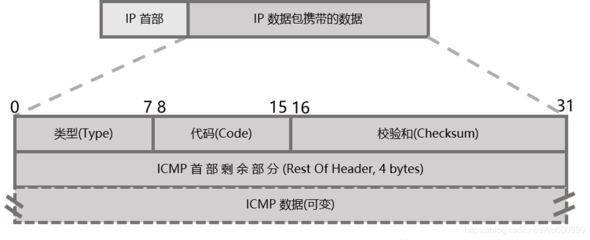
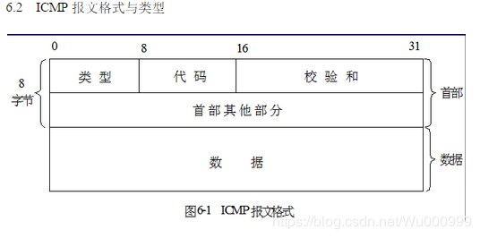
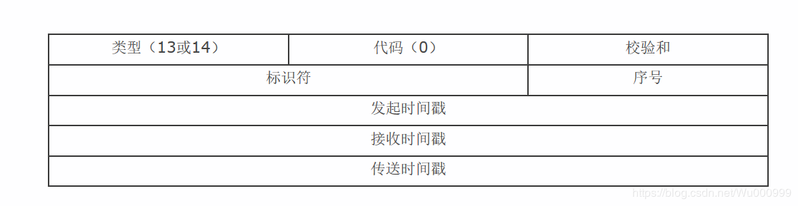
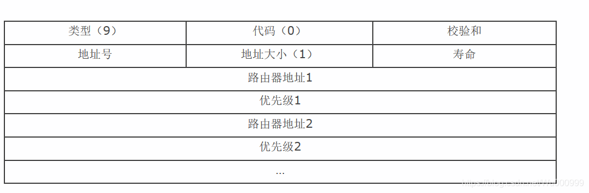

[toc]

# ICMP (Internet Control Message Protocol）

网络控制报文协议

用于在IP主机、路由器之间传递控制消息。控制消息是指网络通不通、主机是否可达、路由是否可用等网络本身的消息。这些控制消息虽然并不传输用户数据，但是对于用户数据的传递起着重要的作用。

ICMP允许主机或路由报告差错情况和提供有关异常情况。ICMP是因特网的标准协议，但ICMP不是高层协议，而是IP层的协议。通常ICMP报文被IP层或更高层协议（TCP或UDP）使用。一些ICMP报文把差错报文返回给用户进程。

ICMP报文作为IP层数据报的数据，加上数据报的首部，组成数据报发送出去。

**ICMP报文的种类有两种，即ICMP差错报告报文和ICMP询问报文。**

ICMP虽然和IP协议是同一层的协议，但是ICMP是在IP数据报的内部被传输的，紧跟着IP报文的首部（如果IP首部有可选部分，则紧跟着可选部分）






# 常见的报文格式

1. 显请求和应答报文格式：通常用来判断目的主机是否可以通过网络访问到。

   

2. 时间戳请求与应答

   网络上的主机一般是独立的，每台机器都有自己的当前时间。时间戳请求与应答用来查询目的主机系统当前的时间。返回值是自午夜开始到现在的毫秒数，通过这个数值来协调时间的统一。事实上因为延时，这个值是不准确的，通常采取多次测量求平均值的办法。

   

3. 路由器通告

   当主机自举以后必须至少知道本地网络上的一个路由器的地址才能够向其它网络发送报文。ICMP支持路由发现方案（Router Discovery），允许主机发现一个路由器地址。

   

4. 地址掩码请求与应答：主机可以通过向路由器发送一个地址掩码请求，并且接收发回的地址掩码应答报文来获得本地网络所使用的子网掩码。可以直接发送请求，但如果不知道路由器的地址，也可以采用广播的方式来发送报文

   


# icmp.h

```c
//include/linux/icmp.h  
60 
 61 struct icmphdr {
 62   unsigned char     type;
 63   unsigned char     code;
 64   unsigned short    checksum;
 65   union {
 66     struct {
 67         unsigned short  id;
 68         unsigned short  sequence;
 69     } echo;
 70     unsigned long gateway;
 71   } un;
 72 };
 73 
```


