[toc]

# ISO/OSI的网络模型架构

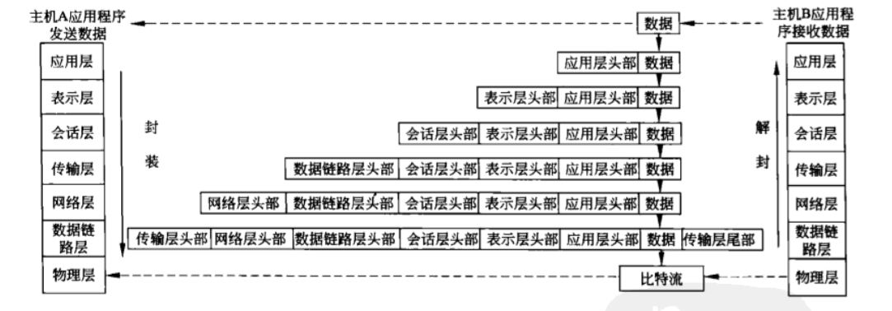

# TCP/IP参考模型的层次结果

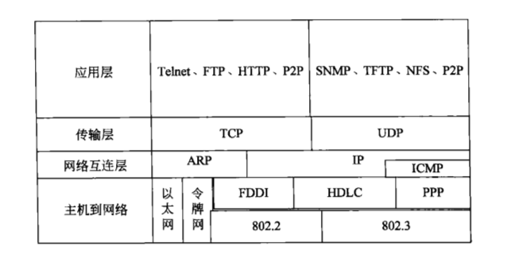

 

# 以太网头部结构

　　以太网属于数据链路层， 属于最基本的协议结构

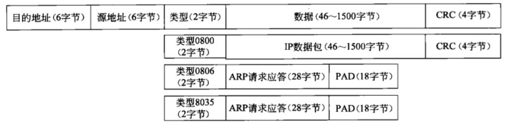

 

# IP协议

　　IP协议为TCP， UDP， ICMP提供最基本的数据传输通路

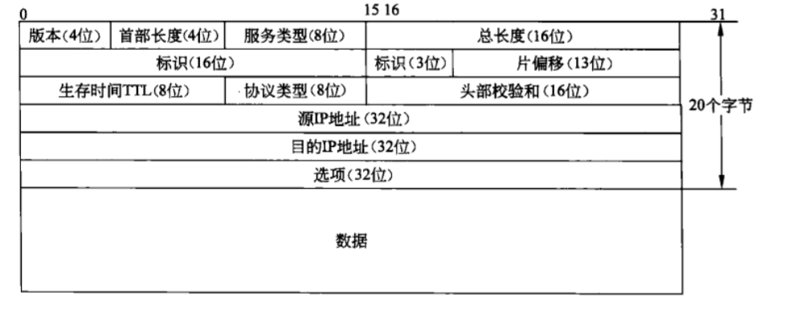

 

# ICMP协议

　　ICMP协议用于传递差错信息， 时间， 回显， 网络信息等报文数据， ICMP在IP报文中的位置为：

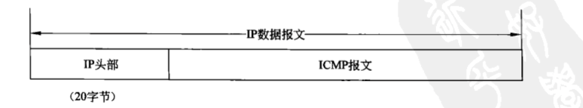

　　通过ICMP协议， 判断局域网的某台机器是否在线的文章： 

　　linux：C语言通过ICMP局域网内部主机是否存活：http://www.cnblogs.com/diligenceday/p/6274749.html

# TCP协议

　　TCP数据在IP报文中的位置为：

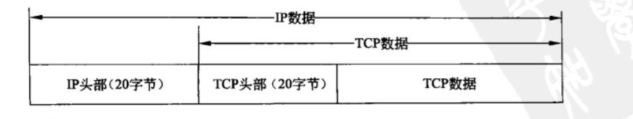

　　TCP报文包含头部和数据：

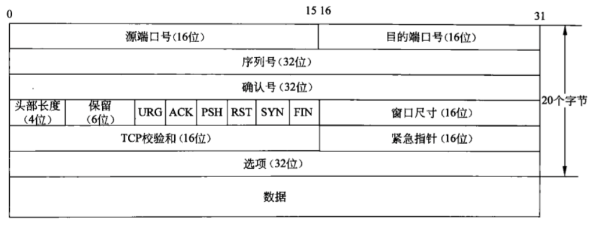

　　TCP三次握手

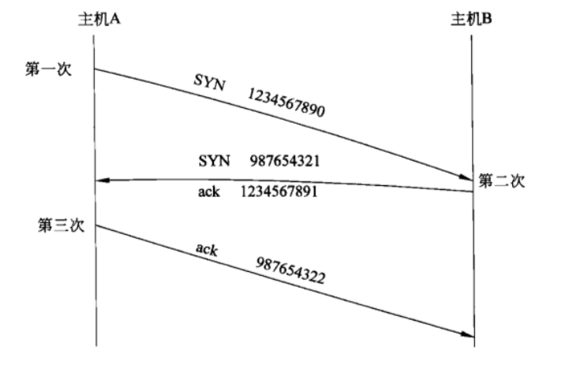

　　释放连接的四次握手

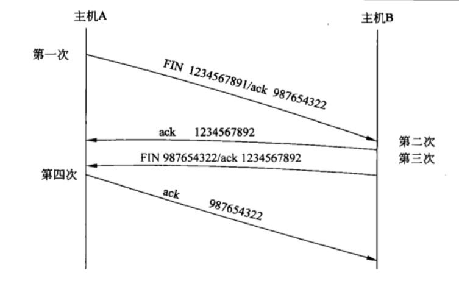

　　TCP数据传输过程

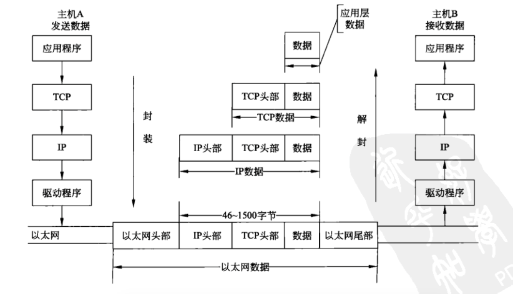

 

# UDP协议

　　UDP数据在IP数据中的位置

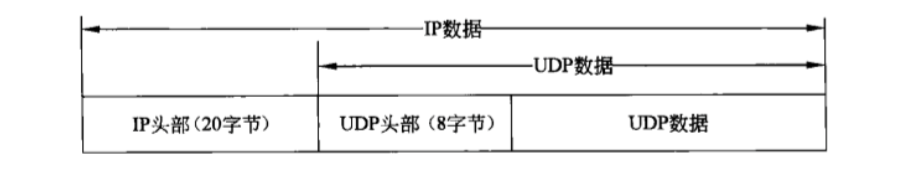

　　UDP的报文结构

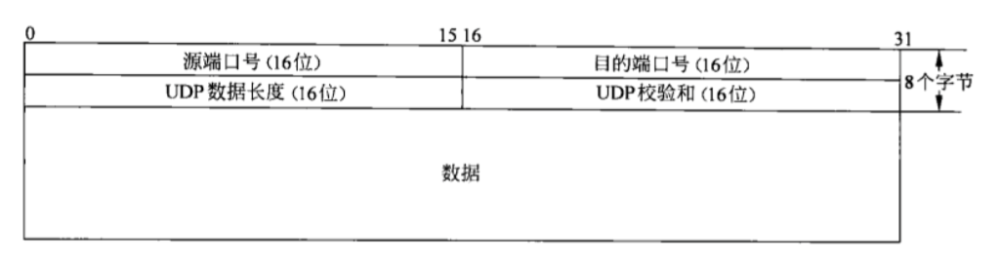

　　linux：C++的socket编程：http://www.cnblogs.com/diligenceday/p/6241021.html

　　C++：C语言实现HTTP的GET和POST请求：http://www.cnblogs.com/diligenceday/p/6255788.html

 

# ARP协议

　　地址解析协议ARP的数据分段格式

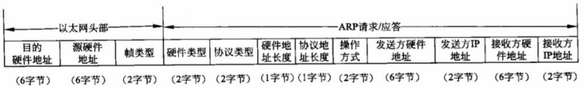

　　Mac和Linux系统的：Arp欺骗源码：http://www.cnblogs.com/diligenceday/p/6246786.html

# IP/ICMP/TCP/UDP/ARP各种P的关系图

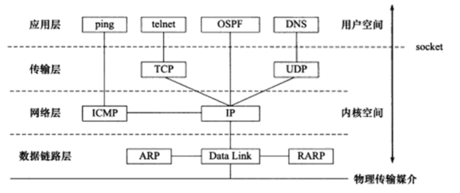