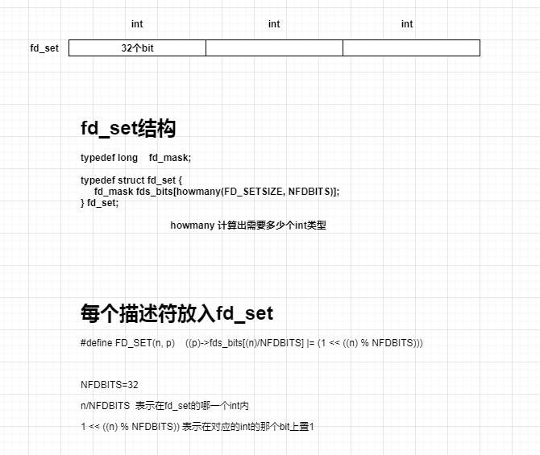

[toc]


# 典型的select程序实例

select系统调用时用来让我们的程序监视多个文件句柄的状态变化的。程序会停在select这里等待，直到被监视的文件句柄有一个或多个发生了状态改变。关于文件句柄，其实就是一个整数，通过socket函数的声明就明白了：

```c
int socket(int domain, int type, int protocol);
```

我们最熟悉的句柄是0、1、2三个，0是标准输入，1是标准输出，2是标准错误输出。0、1、2是整数表示的，对应的FILE *结构的表示就是stdin、stdout、stderr。继续上面的select，就是用来监视某个或某些句柄的状态变化的。select函数原型如下：

```c
int select (int nfds, fd_set *readfds, fd_set *writefds, fd_set *exceptfds, struct timeval *timeout);
```


函数的最后一个参数timeout是一个超时时间值。其类型是struct timeval *，即一个struct timeval结构的变量的指针，所以我们在程序里要声明一个struct timeval tv;然后把变量tv的地址&tv传递给select函数。struct timeval结构如下：

```c
struct timeval
{
    long tv_sec; //seconds
    long tv_usec; //microseconds
}；
```

第2、3、4三个参数是一样的类型;fd_set *,即我们在程序里要申请几个fd_set类型的变量，比如rdfds，wtfds，exfds，然后把这个变量的地址&rdfds,&wtfds,&exfds传递给select函数。这三个参数都是一个句柄的集合，第一个rdfds是用来保存这样的句柄的:当句柄的状态变成可读时系统就告诉select函数返回，同理第二个函数是指向有句柄状态变成可写时系统就会告诉select函数返回，同理第三个参数exfds是特殊情况，即句柄上有特殊情况发生时系统会告诉select函数返回。特殊情况比如对方通过一个socket句柄发来了紧急数据。如果我们程序里只想检测某个socket是否有数据可读，我们可以这样：

```c
fd_set rdfds;
struct timeval tv;
int ret;

FD_ZERO(&rdfds);
FD_SET(socket, &rdfds);

tv.tv_sec = 1;
tv.tv_uses = 500;

ret = select (socket + 1, %rdfds, NULL, NULL, &tv);

if(ret < 0) 
    perror (“select”);
else if (ret = = 0) 
    printf(“time out”);
else {
    printf(“ret = %d/n”,ret);
    if(FD_ISSET(socket, &rdfds)){
  		/* 读取socket句柄里的数据 */
		recv( );
	}
}
```


注意select函数的第一个参数，是所有加入集合的句柄值的最大那个那个值还要加1.比如我们创建了3个句柄;

```c
int sa, sb, sc;

sa = socket(……);
connect (sa,….);

 

sb = socket(….);
connect (sb,…);

sc = socket(….);
connect(sc,…);


FD_SET(sa, &rdfds);
FD_SET(sb, &rdfds);
FD_SET(sc, &rdfds);

```


 

在使用select函数之前，一定要找到3个句柄中的最大值是哪个，我们一般定义一个变量来保存最大值，取得最大socket值如下：

```c
int maxfd = 0;

if(sa > maxfd) maxfd = sa;
if(sb > maxfd) maxfd = sb;
if(sc > maxfd) maxfd = sc;

```


然后调用select函数：

```c
ret = select (maxfd+1, &rdfds, NULL, NULL,&tv);
```


 

同样的道理，如果我们是检测用户是否按了键盘进行输入，我们就应该把标准输入0这个句柄放到select里来检测，如下：

```c
FD_ZERO(&rdfds);
FD_SET(0, &rdfds);

tv.tv_sec = 1;
tv.tv_usec = 0;

ret = select (1, &rdfds,NULL,NULL,&tv);

if(ret < 0)
    perror(“select”);
else if (ret = = 0) 
    printf (“time out/n”);
else{
    scanf(“%s”,buf);
}

```


# fdset数据结构



```c
115 #ifndef _POSIX_SOURCE     
116 #define NBBY    8       /* number of bits in a byte */
117    
118 /* 
119  * Select uses bit masks of file descriptors in longs.  These macros
120  * manipulate such bit fields (the filesystem macros use chars).
121  * FD_SETSIZE may be defined by the user, but the default here should
122  * be enough for most uses.
123  */
124 #ifndef FD_SETSIZE        
125 #define FD_SETSIZE  256   
126 #endif
127    
128 typedef long    fd_mask;  
129 #define NFDBITS (sizeof(fd_mask) * NBBY)    /* bits per mask */
130    
131 #ifndef howmany           
132 #define howmany(x, y)   (((x)+((y)-1))/(y))
133 #endif
134    
135 typedef struct fd_set {   
136     fd_mask fds_bits[howmany(FD_SETSIZE, NFDBITS)];
137 } fd_set;                 
//例如想要把stdin, stdout, stderr   
139 #define FD_SET(n, p)    ((p)->fds_bits[(n)/NFDBITS] |= (1 << ((n) % NFDBITS)))
140 #define FD_CLR(n, p)    ((p)->fds_bits[(n)/NFDBITS] &= ~(1 << ((n) % NFDBITS)))
141 #define FD_ISSET(n, p)  ((p)->fds_bits[(n)/NFDBITS] & (1 << ((n) % NFDBITS)))
142 #define FD_COPY(f, t)   bcopy(f, t, sizeof(*(f)))
143 #define FD_ZERO(p)  bzero(p, sizeof(*(p)))
```


参考：https://www.cnblogs.com/sky-heaven/p/7205491.html

