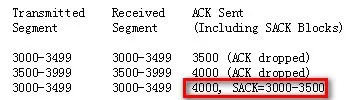
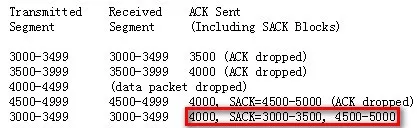
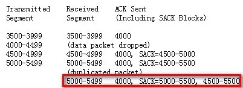
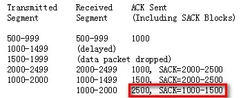
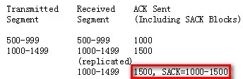
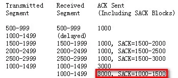
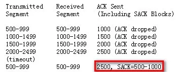
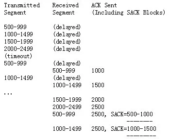

[toc]

转自：https://mp.weixin.qq.com/s?__biz=MzA3Nzk2NTY1MA==&mid=2649163997&idx=1&sn=cb8ba4869baadd4452d03bf28f812a95&chksm=875a58e0b02dd1f6a8658cb50d6c1f912f619ba5e1f9b1ff9afcb36dafb1157265f505930d08&scene=178&cur_album_id=1325436211703627777#rd

在《[【技术】TCP 的那些事 | SACK](http://mp.weixin.qq.com/s?__biz=MzA3Nzk2NTY1MA==&mid=2649163979&idx=1&sn=873ff2aac8cdfb06967168b298414209&chksm=875a58f6b02dd1e015e16a3bdf5accd38c865ad3d17154e34c69db6dbb85e27719936fa85c44&scene=21#wechat_redirect) 》讲解了SACK，在SACK中描述的数据段是接收端收到的数据，发送端根据接收端返回的SACK信息就可以知道哪些数据丢了，进而进行重传。RFC2883对SACK进行了扩展，称为D-SACK：使得扩展后的SACK具有通知发送端哪些数据被重复接收了。

引入D-SACK的目的是使TCP进行更好的流控，具体来说有以下几个好处：

1. 让发送方知道，是发送的包丢了，还是返回的ACK包丢了；

2. 网络上是否出现了包失序；

3. 数据包是否被网络上的路由器复制并转发了

4. 是不是自己的timeout太小了，导致重传

通过D-SACK这种方法，发送方可以更仔细判断出当前网络的传输情况，可以发现数据段被网络复制、错误重传、ACK丢失引起的重传、重传超时等异常的网络状。

D-SACK使用了SACK的第一个段来做标志，**如何判断D-SACK**：

1. 如果SACK的第一个段的范围被ACK所覆盖，那么就是D-SACK

2. 如果SACK的第一个段的范围被SACK的第二个段覆盖，那么就是D-SACK

D-SACK的规则如下：

> 1. 第一个block将包含重复收到的报文段的序号
>
> 2. 跟在D-SACK之后的SACK将按照SACK的方式工作
>
> 3. 如果有多个被重复接收的报文段，则D-SACK只包含其中第一个

**使用例子**

case1: Reporting a duplicate segment.

**由于ACK 4000大于[3000,3500]，因此[4000, SACK=3000-3500]是D-SACK**。发送端首先向接收端发送了3000-3499,3500-3999报文，接收端都收到了，但是接收端返回的ACK 3500及4000都丢失，导致发送端重传了3000-3499报文。接收端收到发送端重新发送的3000-3499报文，通过[4000，SACK=3000-3500]告知发送端，发送端就知道第一次的3000-3499报文接收端是收到了，由于当前ACK到了4000，那么4000之前的数据也都收到了。

case2: Reporting an out-of-order segment and a duplicate segment.

[4000, SACK=4500-5000]不满足D-SACK的条件，其是普通的SACK。而**[4000, SACK=3000-3500, 4500-5000]是D-SACK**，含义是：4000前的数据已收到，3000-3500的数据重复收到，4000-4499的包丢失，4500-5000的包收到。

case3:Reporting a duplicate of an out-of-order segment.

[4000, SACK=4500-5000]及[4000, SACK=4500-5500]都是普通的SACK，**[4000, SACK=5000-5500, 4500-5500]是D-SACK**（第二判断方法），含义是：4000前的包收到，5000-5499包重复收到，4500-5500的包都收到，4000-4499的包丢失。

case4: Reporting a single duplicate subsegment.

**发送端以500字节****大小**发送报文500-999、1000-1499、1500-1999、2000-2499的报文，而**1000-1499因为网络延迟而没有及时到达接收端**，1500-1999丢失了。接收端通过[1000, SACK=2000-2500]告知发送端1000前的报文及2000-2499报文已经收到，**1000-1999的报文没有收到**。

**发送端随后以1000字节大小重传**数据1000-1999，而**接收端又收到了1000-1499的报文**，于是接收端通过[1500, SACK=2000-2500]先告知发送端1500前的报文及2000-2499的报文都收到，而**1500-1999的报文没有收到**，此时接收端又收到了发送端的1000-2000报文，于是通过D-SACK[2500, SACK=1000-1500]告知发送端2500前的报文全部收到，1000-1500的报文重复收到。

**D-SACK可以判断出网络包是否被复制了**：

**D-SACK可以判断因为乱序导致的错误重传：**

***\*D-SACK可以判断ACK丢失导致的超时重传：\****

***\*D-SACK可以判断过早超时重传（RTO太小）：\****

参考资料

1. RFC 2883

2. https://coolshell.cn/articles/11564.html

3. https://www.cnblogs.com/superpig0501/p/3983464.html

