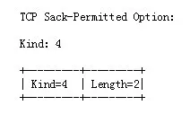
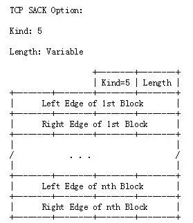
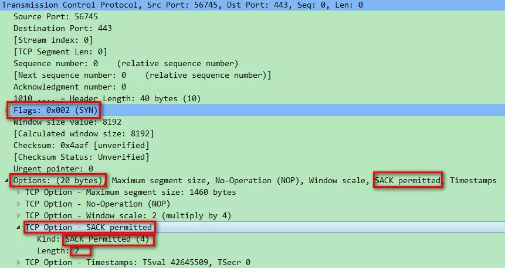
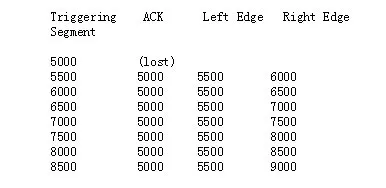
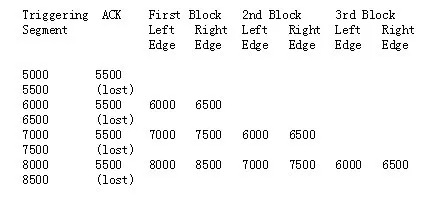
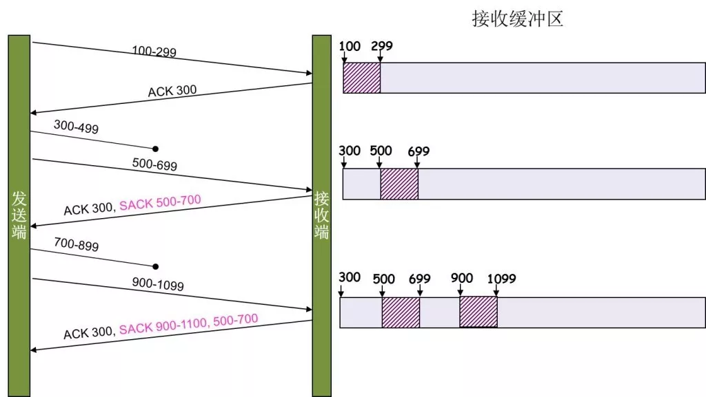
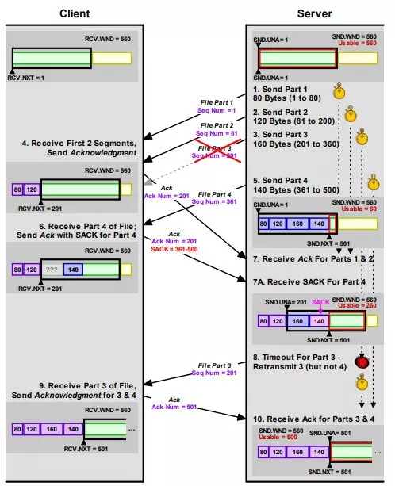

[toc]

转自：https://mp.weixin.qq.com/s?__biz=MzA3Nzk2NTY1MA==&mid=2649163979&idx=1&sn=873ff2aac8cdfb06967168b298414209&chksm=875a58f6b02dd1e015e16a3bdf5accd38c865ad3d17154e34c69db6dbb85e27719936fa85c44&scene=21#wechat_redirect

在文章《[TCP 的那些事 | 快速重传](http://mp.weixin.qq.com/s?__biz=MzA3Nzk2NTY1MA==&mid=2649163951&idx=1&sn=bce5553aba4f2d78512bfd0f5180575e&chksm=875a5892b02dd184bf13c5d0864eabad658209165bbff1ca19b97635bab31115ba043b156881&scene=21#wechat_redirect)》中介绍了基本的重传知识及快速重传，本文讲解相比快速重传更有效的另一种重传方式：SACK（Selective Acknowledgment）。

SACK需要在TCP头里加一个SACK的东西，ACK还是快速重传（Fast Retransmit）的ACK，SACK则是汇报收到的数据碎版。SACK信息在《[TCP 的那些事 | TCP报文格式解析](http://mp.weixin.qq.com/s?__biz=MzA3Nzk2NTY1MA==&mid=2649163946&idx=1&sn=f8c0c661b4a6c4a971c2bd1d4cd331e8&chksm=875a5897b02dd1815d0aca59aa0c4a8671fc3ff8c013756d9c2fe4214ca86a531a64a4204f47&scene=21#wechat_redirect)》中的图1中的Options选项中，具体有两种格式：

1. SACK-Permitted Option：如图1所示

2. SACK Option Format：如图2所示

图1 SACK-Permitted Option

图2 SACK Option Format

格式1表示只在建立连接时会有，在SYN及SYN ACK包中出现，告知对方是否支持SACK，在Wireshark抓包中的形式如图3示：

图3 Wireshark 抓包SACK 选项

格式2在数据传输过程中的Ack中出现，用于告知本次具体的重传数据信息，在Wireshark中的抓包形式如图4所示：

图4 Wireshark 抓包SACK 信息

如图2及图4所示的Left Edge及Right，其含义如下：

1. Left Edge：本区块的第一个序号

2. Right Edge：本区块的最后序号的下一个序号

在[Left Edge, Right Edge)区间的Ack 序号表示本次确认的序号，如果SACK的数量大于1，那么每个都是本次确认的序号，而小于Left Edge及大于Right Edge的序号表示没有接受到。

由于TCP options最大的长度是40字节，那么其所表示的SACK的数量最多是4（4*8+2 = 34），同时由于SACK有些时候会和时间戳（占10字节）一起用，因此，此种情况下最多只有3个SACK。

当发送端收到接收端返回的SACK后，就知道哪些报文时接收端已经收到的，进而将接收端没有收到的报文进行重传。注意：SACK协议需要通信双方都支持（通过三次握手明确）。

SACK的使用规则：

> SACK的发送端（报文的接收端）：
>
> 1. 第一个Block需要指出是哪一个Segment触发SACK Option
>
> 2. 尽可能多的把所有的Block填满
>
> 3. SACK 要报告最近接收的不连续的数据块
>
> 
>
> SACK的接收端（报文的发送端）：
>
> 1. 数据没有被确认前，都会保持在滑动窗口内
>
> 2. 每一个数据包都有一个SACKed的标志，对于已经标示的Segment，重新发送的时候会忽略
>
> 3. 如果SACK丢失，超时重传之后，重置所有数据包SACKed 标志

在[RFC2018]中，讲述了SACK的具体应用例子，背景：假设发送端发送了8个报文，每个报文500字节，left window edge是5000。

case1: 前4个报文收到了，后4个报文没有收到：接收端直接回复普通的Ack 7000给发送端，没有涉及SACK

case 2: 第一个报文丢了，而后面7个报文都接收到：只要接收到后7个报文中的一个，接收者就会回复一个ACK 5000给发送端，该确认包含SACK选项：

我们看到，从Ack 5000到第一个Left Edge之间的报文丢失了，于是发送端就回复第一个报文。

case3: 2、4、6、8号报文丢失：3、5、7号报文触发SACK：

SACK工作原理如图7所示：

图7 SACK原理图

（图片来源网络）

图8展示了当Client收到1号，2号包，4号包，而没有收到3号包时，通过SACK告诉Server的过程

图8 基于SACK的重传

这里还需要注意一个问题——接收方Reneging，所谓Reneging的意思就是接收方有权把已经报给发送端SACK里的数据给丢了。接收方这么做可能会有些极端情况，比如要把内存给别的更重要的东西。所以，发送方也不能完全依赖SACK，还是要依赖ACK，并维护Time-Out，如果后续的ACK没有增长，那么还是要把SACK的东西重传，另外，接收端这边永远不能把SACK的包标记为Ack。

在Wireshark中，可以通过如下命令查看SACK相关信息：

1. tcp.options.sack.count

2. tcp.options.sack_le 

3. tcp.options.sack_re

推荐阅读：IBM的《TCP 选择性应答的性能权衡》：

https://www.ibm.com/developerworks/cn/linux/l-tcp-sack/

参考资料

\1. RFC2018

\2. https://coolshell.cn/articles/11564.html

\3. https://blog.csdn.net/wdscq1234/article/details/52503315

\4. 《The TCP/IP Guide》