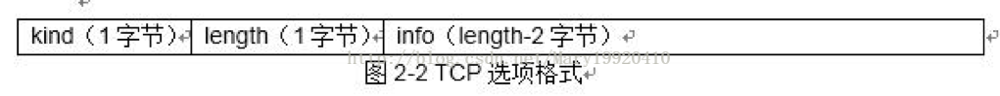

[toc]

转自：https://blog.csdn.net/Mary19920410/article/details/77255967

在TCP可选项字段中为TCP预留有时间戳功能。

# 1、TCP可选项格式：

关于TCP可选项字段的详细内容可以查看我的另一篇博客：[浅析TCP头部可选项](http://blog.csdn.net/mary19920410/article/details/72857764)

时间戳选项占10个字节= kind(1字节) ＋ length(1字节) + info (8字节)，其中kind=8，length=10，info由timestamp和timestamp echo两个值组成，各4个字节的长度。

# 2、TCP时间戳字段存放的内容注解

发送方在发送报文段时把当前时钟的时间值放入时间戳字段，接收方在确认该报文段时把时间戳字段值复制到时间戳回送回答字段。因此，发送方在收到确认报文后，可以准确计算出RTT。

下面我们以一个例子理解timestamp和timestamp echo字段中存放的内容：假设a主机和b主机之间通信，a主机向b主机发送一个报文段，那么：

1）timestamp字段中存放的内容：a主机向b主机发送报文s1，在s1报文中timestamp存储的是a主机发送s1时的内核时刻ta1。

2）timestamp echo字段中存放的内容：b主机收到s1报文并向a主机发送含有确认ack的报文s2，在s2报文中，timestamp为b主机此时的内核时刻tb，而timestamp echo字段为从s1报文中解析出的ta1.

这些时刻具体的作用，我们继续向下看，将结合TCP时间戳选项的功能进行说明。

# 3、TCP时间戳选项的功能

1）计算往返时延RTT：

当a主机接收到b主机发送过来的确认ack报文s2时，a主机此时内核时刻为ta2.

a主机从s2报文的timestamp echo选项中可以解析出该确认ack确认的报文的发送时刻为ta1.

那么：RTT＝接收ack报文的时刻－发送报文的时刻＝ta2 －ta1.

ta2和ta1都来自a主机的内核，所以不需要在tcp连接的两端进行任何时钟同步的操作。

2）防止回绕的序号：

我们知道TCP报文的序列号只有32位，而没增加2^32个序列号后就会重复使用原来用过的序列号。假设我们有一条高速网络，通信的主机双方有足够大的带宽涌来快速的传输数据。例如1Gb/s的速率发送报文，则不到35秒报文的序号就会重复。这样对TCP传输带来混乱的情况。而采用时间戳选项，可以很容易的分辨出相同序列号的数据报，哪个是最近发送，哪个是以前发送的。