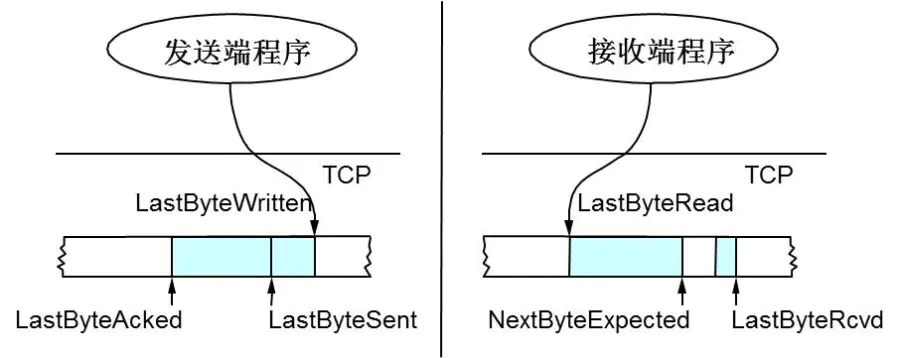
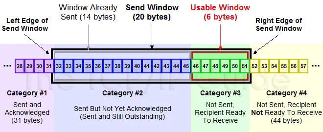
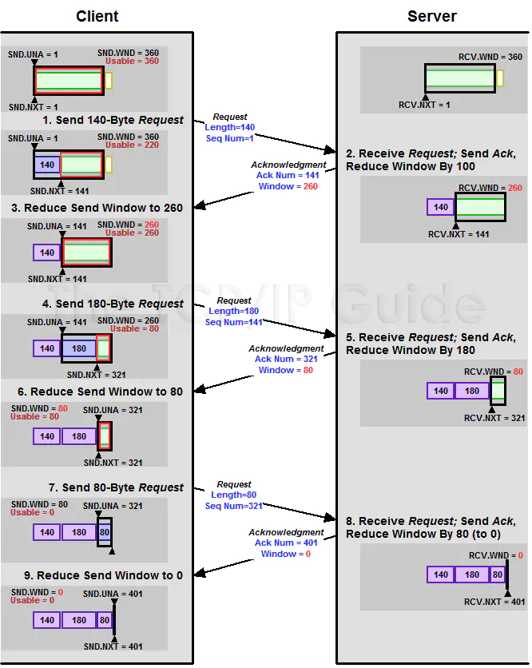
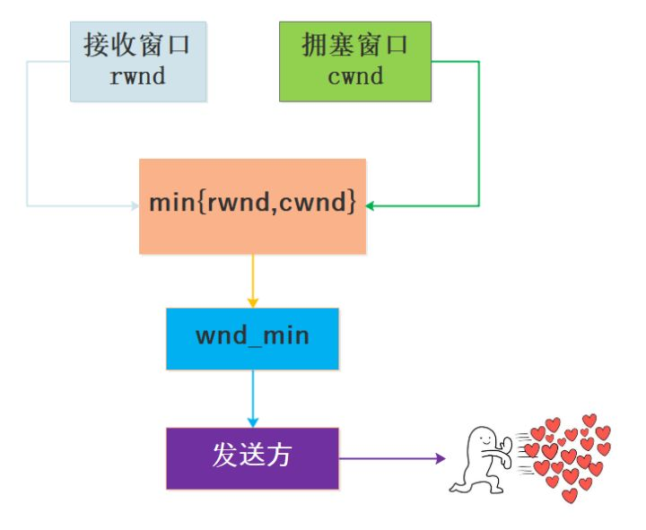

[toc]

# TCP重传机制

**TCP协议通过重传机制保证所有的segment都可以到达对端，通过滑动窗口允许一定程度的乱序和丢包**（滑动窗口还具有流量控制等作用，暂不讨论）。注意，此处重传机制特指数据传输阶段，握手、挥手阶段的传输机制与此不同。

TCP是面向字节流的，*Seq与Ack的增长均以字节为单位*。在最朴素的实现中，为了减少网络传输，*接收端只回复最后一个连续包的Ack*，并相应移动窗口。比如，发送端发送1,2,3,4,5一共五份数据（假设一份数据一个字节），接收端快速收到了Seq 1, Seq 2，于是回Ack 3，并移动窗口；然后收到了Seq 4，由于在此之前未收到过Seq 3（乱序），如果仍在窗口内，则只填充窗口，但不发送Ack 5，否则丢弃Seq 3（与丢包的效果相似）；假设在窗口内，则等以后收到Seq 3时，发现Seq 4及以前的数据包都收到了，则回Ack 5，并移动窗口。

## 超时重传机制

*当发送方发现等待Seq 3的Ack（即Ack 4）**超时**后，会认为Seq 3发送“失败”，重传Seq 3*。一旦接收方收到Seq 3，会立即回Ack 4。

> 发送方无法区分是Seq 3丢包、接收方故障、还是Ack 4丢包，本文统一表述为Seq发送“失败”。

这种方式有些问题：假设目前已收到了Seq 4；由于未收到Seq 3，导致发送方重传Seq 3，在收到重传的Seq 3之前，包括新收到的Seq 5和刚才收到的Seq 4都不能回复Ack，很容易引发发送方重传Seq 4、Seq5。接收方之前已经将Seq 4、Seq 5保存到窗口中，此时重传Seq 4、Seq 5明显造成浪费。

也就是说，超时重传机制面临“**重传一个还是重传所有**”的问题，即：

- 重传一个：仅重传timeout的包（即Seq 3），后续包等超时后再重传。节省资源，但效率略低。
- 重传所有：每次都重传timeout包及之后所有的数据（即Seq 3、4、5）。效率更高（如果带宽未打满），但浪费资源。

可知，两种方法都属于`超时重传机制`，各有利弊，但二者都需要等待timeout，是**基于时间驱动**的，性能与timeout的长度密切相关。如果timeout很长（普遍情况），则两种方法的性能都会受到较大影响。

## 快速重传机制

最理想的方案是：在超时之前，通过某种机制要求发送方尽快重传timeout的包（即Seq 3），如`快速重传机制`（Fast Retransmit）。这种方案浪费资源（浪费多少取决于“重传一个还是重传所有”，见下），但效率非常高（因为不需要等待timeout了）。

快速重传机制不基于时间驱动，而`基于数据驱动`：**如果包没有连续到达，就Ack最后那个可能被丢了的包；如果发送方连续收到3次相同的Ack，就重传对应的Seq**。

比如：假设发送方仍然发送1,2,3,4,5共5份数据；接收方先收到Seq 1，回Ack 2；然后Seq 2因网络原因丢失了，正常收到Seq 3，继续回Ack 2；后面Seq 4和Seq 5都到了，最后一个可能被丢了的包还是Seq 2，继续回Ack 2；现在，发送方已经连续收到4次（大于等于3次）相同的Ack（即Ack 2），知道最大序号的未收到包是Seq 2，于是重传Seq 2，并清空Ack 2的计数器；最后，接收方收到了Seq 2，查看窗口发现Seq 3、4、5都收到了，回Ack 6。示意图如下：

快速重传解决了timeout的问题，但依然面临“重传一个还是重传所有”的问题。对于上面的示例来说，是只重传Seq 2呢还是重传Seq 2、3、4、5呢？

**如果只使用快速重传，则必须重传所有**：因为发送方并不清楚上述连续的4次Ack 2是因为哪些Seq传回来的。假设发送方发出了Seq 1到Seq 20供20份数据，只有Seq 1、6、10、20到达了接收方，触发重传Ack 2；然后发送方重传Seq 2，接收方收到，回复Ack 3；接下来，发送方与接收方都不会再发送任何数据，两端陷入等待。因此，发送方只能选择“重传所有”，这也是某些TCP协议的实际实现，对于带宽未满时重传效率的提升非常明显。

一个更完美的设计是：将超时重传与快速重传结合起来，*触发快速重传时，只重传局部的一小段Seq（局部性原理，甚至只重传一个Seq），其他Seq超时后重传*。

# 理解TCP/IP传输层拥塞控制算法

## 流量控制及滑动窗口

TCP头里有一个字段叫Window（或Advertised Window），*用于接收方通知发送方自己还有多少缓冲区可以接收数据*。**发送方根据接收方的处理能力来发送数据，不会导致接收方处理不过来，是谓流量控制**。

观察TCP协议的发送缓冲区和接收缓冲区：

假设位置序号从左向右增长（常见的读、写缓冲区设计），解释一下：

- 发送方：LastByteAcked指向收到的连续最大Ack的位置；LastByteSent指向已发送的最后一个字节的位置；LastByteWritten指向上层应用已写完的最后一个字节的位置。
- 接收方：LastByteRead指向上层应用已读完的最后一个字节的位置；**NextByteExpected指向收到的连续最大Seq的位置**；LastByteRcvd指向已收到的最后一个字节的位置。可以看到**NextByteExpected与LastByteRcvd中间有些Seq还没有到达**，对应空白区。

据此在接收方计算`AdvertisedWindow`，在发送方计算`EffectiveWindow`：

- 接收方在Ack中记录自己的`AdvertisedWindow = MaxRcvBuffer – (LastByteRcvd - LastByteRead)`，随Ack回复到发送方。
- 发送方根据Ack中的AdvertisedWindow值，需保证`LastByteSent - LastByteAcked ≤ AdvertisedWindow`，则窗口内剩余可发送的数据大小`EffectiveWindow = AdvertisedWindow - (LastByteSent - LastByteAcked)`，以保证接收方可以处理。

### 示例1

以下是一个发送缓冲区的滑动窗口：

上图分为4个部分：

- `#1`是已发送已确认的数据，即LastByteAcked之前的区域。
- `#2`是已发送未确认的数据，即LastByteAcked与LastByteSent之间的区域，大小不超过AdvertisedWindow。
- `#3`是窗口内未发送的数据，即LastByteSent与窗口右界之间的区域，大小等于EffectiveWindow（可能为0）。
- `#4`是窗口外未发送的数据，即窗口右界与LastByteWritten之间的区域。

其中，`#2 + #3`组成了滑动窗口，总大小不超过AdvertisedWindow，二者比例受到接收方的处理速度与网络情况的影响（如果丢包严重或处理速度慢于发送速度，则`#2:#3`会越来越大）。

### 示例2

以下是一个AdvertisedWindow的调整过程，EffectiveWindow随之变化：

## 拥塞控制

为什么要进行拥塞控制？假设网络已经出现拥塞，如果不处理拥塞，那么延时增加，出现更多丢包，触发发送方重传数据，加剧拥塞情况，继续恶性循环直至网络瘫痪。可知，拥塞控制与流量控制的适应场景和目的均不同。

**拥塞发生前，可避免流量过快增长拖垮网络；拥塞发生时，唯一的选择就是降低流量**。主要使用4种算法完成拥塞控制：

1. 慢启动
2. 拥塞避免
3. 拥塞发生
4. 快速恢复

算法1、2适用于拥塞发生前，算法3适用于拥塞发生时，算法4适用于拥塞解决后（相当于拥塞发生前）。

### rwnd与cwnd

在正式介绍上述算法之前，先补充下`rwnd`（Receiver Window，接收者窗口）与`cwnd`（Congestion Window，拥塞窗口）的概念：

- rwnd是用于流量控制的窗口大小，即上述流量控制中的AdvertisedWindow，主要取决于接收方的处理速度，由接收方通知发送方被动调整（详细逻辑见上）。
- cwnd是用于拥塞处理的窗口大小，取决于网络状况，由发送方探查网络主动调整。

介绍流量控制时，我们没有考虑cwnd，认为发送方的滑动窗口最大即为rwnd。实际上，*需要同时考虑流量控制与拥塞处理，则发送方窗口的大小不超过`min{rwnd, cwnd}`*。下述4种拥塞控制算法只涉及对cwnd的调整，同介绍流量控制时一样，暂且不考虑rwnd，假定滑动窗口最大为cwnd；但读者应明确rwnd、cwnd与发送方窗口大小的关系。

### 4种拥塞控制算法

转自：

https://mp.weixin.qq.com/s?__biz=MzI1MzYzMTI2Ng==&mid=2247484387&idx=1&sn=6ddcf24e16e1e363ff696bed6b8184a8&scene=21#wechat_redirect

https://monkeysayhi.github.io/2018/03/07/浅谈TCP（1）：状态机与重传机制/

