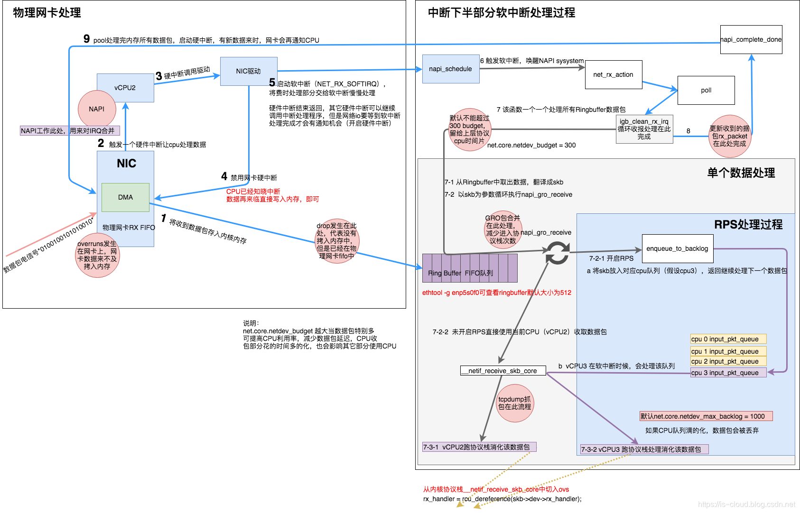
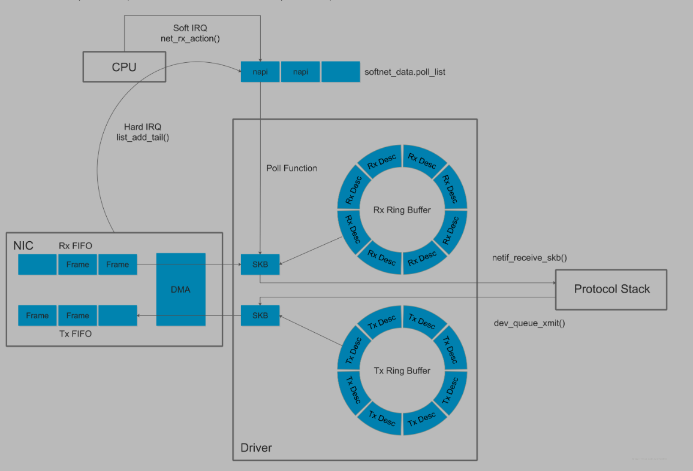
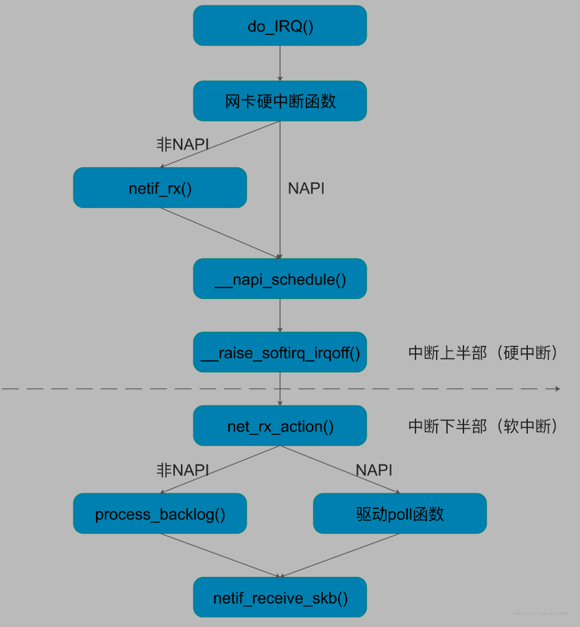
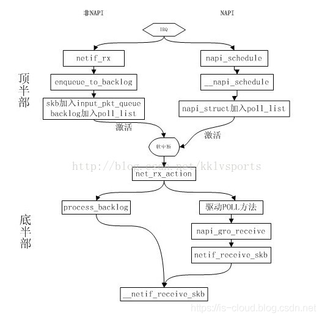
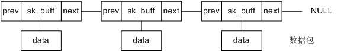
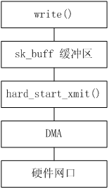
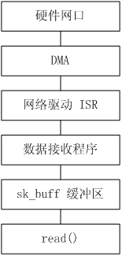
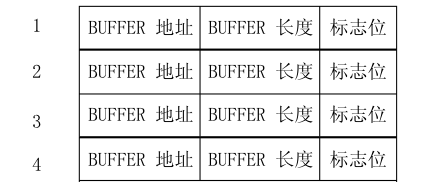

[toc]

# 网卡适配器收发数据帧流程

转自 JmilkFan 范桂飓：https://www.cnblogs.com/jmilkfan-fanguiju/p/12789806.html

# 网卡的工作原理

Linux 操作系统的功能可以概括为进程管理、内存管理、文件系统管理、设备管理和计算机网络等几部分。所有的操作系统执行最终都可以映射到对物理设备的操作。除去对 CPU、内存等处理机设备的操作之外，操作系统对其他外部设备的操作都通过专门的驱动程序完成。操作系统的每种外设在内核中都必须有对应的设备驱动程序对其进行处理。所以分析网卡的工作原理即是分析网卡的驱动程序。

网络是独立的一个模块。为了屏蔽物理网络设备的多样性，Linux 内核协议栈实现中，对底层物理设备进行了抽象并定义了一个统一的概念，称之为 Socket 接口。所有对网络硬件的访问都是通过接口完成的，接口提供了一个抽象而统一的操作集合来处理基本数据报文的发送和接收。一个网络接口就被看作是一个发送和接收数据包的实体。

对于每个网络接口，都用一个 net_device 的数据结构来表示。net_device 中有很多提供系统访问和协议层调用的设备方法，包括提供设备初始化和往系统注册用的 init 函数，打开和关闭网络设备的 open 和 stop 函数，处理数据包发送的函数 hard_start_xmit，以及中断处理函数。

所有被发送和接收的数据报文都用 sk_buff 结构表示。要发送数据时，内核网络协议栈将根据系统路由表选择相应的网络接口进行数据传输；当接收数据包时，通过驱动程序注册的中断服务程序进行数据的接口处理。

# 网卡与网卡适配器

我们知道计算机的输入输出系统由外部硬件设备（e.g. 网卡）及其与主机之间的控制部件（Controller）所构成，其中控制部件常被称为设备控制器、设备适配器、设备驱动或 I/O 接口，主要负责控制并实现主机与外设之间的数据传输。

首先明确一下术语，在本文中，网卡指物理网络设备卡、网卡适配器指网卡设备控制器，即安装在操作系统上的网络设备驱动。

网络设备驱动在 Linux 内核中是以内核模块的形式存在的。所以对于网卡驱动的初始化，同样需要提供一个内核模块初始化函数来完成的，初始化网络设备的硬件寄存器、配置 DMA 以及初始化相关内核变量等。

设备初始化函数在内核模块被加载时调用，包括：

1. 初始化 PHY 模块，包括设置双工/半双工运行模式、设备运行速率和自协商模式等。
2. 初始化 MAC 模块，包括设置设备接口模式等。
3. 初始化 DMA 模块，包括建立 BD（Buffer descriptor）表、设置 BD 属性以及给 BD 分配缓存等。

# 网卡的组成

网卡工作在物理层和数据链路层，主要由 PHY/MAC 芯片、Tx/Rx FIFO、DMA 等组成，其中网线通过变压器接 PHY 芯片、PHY 芯片通过 MII 接 MAC 芯片、MAC 芯片接 PCI 总线。

- **PHY 芯片主要负责**：CSMA/CD、模数转换、编解码、串并转换。

- MAC 芯片主要负责

  ：

  - 比特流和数据帧的转换（7 字节的前导码 Preamble 和 1 字节的帧首定界符 SFD）
  - CRC 校验
  - Packet Filtering（L2 Filtering、VLAN Filtering、Manageability/Host Filtering）

- **Tx/Rx FIFO**：Tx 表示发送（Transport），Rx 是接收（Receive）。

- **DMA（Direct Memory Access）**：直接存储器存取 I/O 模块。

# CPU 与网卡的协同

以往，从网卡的 I/O 区域，包括 I/O 寄存器或 I/O 内存中读取数据，这都要 CPU 亲自去读，然后把数据放到 RAM 中，也就占用了 CPU 的运算资源。直到出现了 DMA 技术，其基本思想是外设和 RAM 之间开辟直接的数据传输通路。一般情况下，总线所有的工作周期（总线周期）都用于 CPU 执行程序。DMA 控制就是当外设完成数据 I/O 的准备工作之后，会占用总线的一个工作周期，和 RAM 直接交换数据。这个周期之后，CPU 又继续控制总线执行原程序。如此反复的，直到整个数据块的数据全部传输完毕，从而解放了 CPU。

1. 首先，内核在 RAM 中为收发数据建立一个环形的缓冲队列，通常叫 DMA 环形缓冲区，又叫 BD（Buffer descriptor）表。
2. 内核将这个缓冲区通过 DMA 映射，把这个队列交给网卡；
3. 网卡收到数据，就直接放进这个环形缓冲区，也就是直接放进 RAM 了；
4. 然后，网卡驱动向系统产生一个中断，内核收到这个中断，就取消 DMA 映射，这样，内核就直接从主内存中读取数据；

# 网络设配器的收包流程



1. 网卡驱动申请 Rx descriptor ring，本质是一致性 DMA 内存，保存了若干的 descriptor。将 Rx descriptor ring 的总线地址写入网卡寄存器 RDBA。

2. 网卡驱动为每个 descriptor 分配 skb_buff 数据缓存区，本质上是在内存中分配的一片缓冲区用来接收数据帧。将数据缓存区的总线地址保存到 descriptor。

3. 网卡接收到高低电信号。

4. PHY 芯片首先进行数模转换，即将电信号转换为比特流。

5. MAC 芯片再将比特流转换为数据帧（Frame）。

6. 网卡驱动将数据帧写入 Rx FIFO。

7. 网卡驱动找到 Rx descriptor ring 中下一个将要使用的 descriptor。

8. 网卡驱动使用 DMA 通过 PCI 总线将 Rx FIFO 中的数据包复制到 descriptor 保存的总线地址指向的数据缓存区中。其实就是复制到 skb_buff 中。

9. 因为是 DMA 写入，所以内核并没有监控数据帧的写入情况。所以在复制完后，需要由网卡驱动启动硬中断通知 CPU 数据缓存区中已经有新的数据帧了。每一个硬件中断会对应一个中断号，CPU 执行硬下述中断函数。实际上，硬中断的中断处理程序，最终是通过调用网卡驱动程序来完成的。硬中断触发的驱动程序首先会暂时禁用网卡硬中断，意思是告诉网卡再来新的数据就先不要触发硬中断了，只需要把数据帧通过 DMA 拷入主存即可。

   - NAPI（以 e1000 网卡为例）：`e1000_intr() -> __napi_schedule() -> __raise_softirq_irqoff(NET_RX_SOFTIRQ)`
   - 非 NAPI（以 dm9000 网卡为例）：`dm9000_interrupt() -> dm9000_rx() -> netif_rx() -> napi_schedule() -> __napi_schedule() -> __raise_softirq_irqoff(NET_RX_SOFTIRQ)`

10. 硬中断后继续启动软中断，启用软中断目的是将数据帧的后续处理流程交给软中断处理程序异步的慢慢处理。此时网卡驱动就退出硬件中断了，其他外设可以继续调用操作系统的硬件中断。但网络 I/O 相关的硬中断，需要等到软中断处理完成并再次开启硬中断后，才能被再次触发。ksoftirqd 执行软中断函数

     

    ```
    net_rx_action()
    ```

    - NAPI（以 e1000 网卡为例），触发 `napi()` 系统调用，`napi()` 逐一消耗 Rx Ring Buffer 指向的 skb_buff 中的数据包：`net_rx_action() -> e1000_clean() -> e1000_clean_rx_irq() -> e1000_receive_skb() -> netif_receive_skb()`
    - 非 NAPI（以 dm9000 网卡为例）：`net_rx_action() -> process_backlog() -> netif_receive_skb()`

11. 网卡驱动通过 `netif_receive_skb()` 将 sk_buff 上送到协议栈。

12. 重新开启网络 I/O 硬件中断，有新的数据帧到来时可以继续触发网络 I/O 硬件中断，继续通知 CPU 来消耗数据帧。



## 传统方式和 NAPI 方式

值得注意的是，传统收包是每个报文都触发中断，如果中断太频繁，CPU 就总是处理中断，其他任务无法得到调度，于是 NAPI（New API）收包方式出现了，其思路是采用「中断+轮询」的方式收包以提高吞吐。NAPI 收包需要网卡驱动支持，例如 Intel e1000 系列网卡。下图为传统方式和 NAPI 方式收包流程差异：





## 中断方式与轮询方式

Linux 内核在接收数据时有两种方式可供选择，一种是中断方式，另外一种是轮询方式。

从本质上来讲，中断，是一种电信号，当设备有某种事件发生的时候，它就会产生中断，通过总线把电信号发送给中断控制器，如果中断的线是激活的，中断控制器就把电信号发送给处理器的某个特定引脚。处理器于是立即停止自己正在做的事，跳到内存中内核设置的中断处理程序的入口点，进行中断处理。

使用中断方式，首先在使用该驱动之前，需要将该中断对应的中断类型号和中断处理程序注册进去。网卡驱动在初始化时会将具体的 xx_open 函数挂接在驱动的 open 接口上。网卡的中断一般会分为两种，一种是发送中断，另一种是接收中断。Linux 内核需要分别对这两种中断类型号进行注册。对于中断方式来说，由于每收到一个包都会产生一个中断，而处理器会迅速跳到中断服务程序中去处理收包，因此中断接收方式的实时性高，但如果遇到数据包流量很大的情况时，过多的中断会增加系统的负荷。
\- 发送中断处理程序（xx_isr_tx）的工作主要是监控数据发送状态、更新数据发送统计等。
\- 接收中断处理程序（xx_isr_rx）的工作主要是接收数据并传递给协议层、监控数据接收状态、更新数据接收统计等。

如果采用轮询方式，就不需要使能网卡的中断状态，也不需要注册中断处理程序。操作系统会专门开启一个任务去定时检查 BD 表，如果发现当前指针指向的 BD 非空闲，则将该 BD 对应的数据取出来，并恢复 BD 的空闲状态。由于是采用任务定时检查的原理，从而轮询接收方式的实时性较差，但它没有中断那种系统上下文切换的开销，因此轮询方式在处理大流量数据包时会显得更加高效。

# 网络设配器的发包过程

**NOTE**：发包过程只作为简单介绍。

1. 网卡驱动创建 Tx descriptor ring，将 Tx descriptor ring 的总线地址写入网卡寄存器 TDBA。
2. 协议栈通过 `dev_queue_xmit()` 将 sk_buffer 下送到网卡驱动。
3. 网卡驱动将 sk_buff 放入 Tx descriptor ring，更新网卡寄存器 TDT。
4. DMA 感知到 TDT 的改变后，找到 Tx descriptor ring 中下一个将要使用的 descriptor。
5. DMA 通过 PCI 总线将 descriptor 的数据缓存区复制到 Tx FIFO。
6. 复制完后，通过 MAC 芯片将数据包发送出去。
7. 发送完后，网卡更新网卡寄存器 TDH，启动硬中断通知 CPU 释放数据缓存区中的数据包。

# sk_buff（Socket Buffer）

Linux 内核中，用 sk_buff（skb）来描述一个缓存，所谓分配缓存空间，就是建立一定数量的 sk_buff。sk_buff 是 Linux 内核网络协议栈实现中最重要的结构体，它是网络数据报文在内核中的表现形式。用户态应用程序（应用层）可以通过系统调用接口访问 BSD Socket 层，传递给 Socket 的数据首先会保存在 sk_buff 对应的缓冲区中，sk_buff 的结构定义在 include/linux/skbuff.h 文件中。它保存数据报文的结构为一个双向链表，如下所示：



当数据被储存到了 sk_buff 缓存区中，网卡驱动的发送函数 hard_start_xmit 也随之被调用，流程图如下所示：



1. 首先创建一个 Socket，然后调用 write() 之类的写函数通过 Socket 访问网卡驱动，同时将数据保存在 sk_buff 缓冲区。
2. Socket 调用发送函数 hard_start_xmit。hard_start_xmit 函数在初始化过程中会被挂接成类似于 xx_tx 的某个具体的发送函数，xx_tx 主要实现如下步骤：
   - 从 Tx BD 表中取出一个空闲的 BD。
   - 根据 sk_buff 中保存的数据修改 BD 的属性，一个是数据长度，另一个是数据报文缓存指针。值得注意的是，数据报文缓存指针对应的必须是物理地址，这是因为 DMA 在获取 BD 中对应的数据时只能识别物理地址。
   - 修改该 BD 的状态为就绪态，DMA 模块将自动发送处于就绪态 BD 中所对应的数据。
   - 移动发送 BD 表的指针指向下一个 BD。
3. DMA 开始将处于就绪态 BD 缓存内的数据发送至网络，当发送完成后自动恢复该 BD 为空闲态。

当网卡接收到数据时，DMA 会自动将数据保存起来并通知 CPU 处理，CPU 通过中断或轮询的方式发现有数据接收进来后，再将数据保存到 sk_buff 缓冲区中，并通过 Socket 接口读出来。流程图如下所示：



1. 网卡接收到数据后，DMA 搜索 Rx BD 表，取出空闲的 BD，并将数据自动保存到该 BD 的缓存中，修改 BD 为就绪态，并同时触发中断（该步骤可选）。
2. 处理器可以通过中断或者轮询的方式检查接收 BD 表的状态，无论采用哪种方式，它们都需要实现以下步骤。
   - 从接收 BD 表中取出一个空闲的 BD。
   - 如果当前 BD 为就绪态，检查当前 BD 的数据状态，更新数据接收统计。
   - 从 BD 中取出数据保存在 sk_buff 的缓冲区中。
   - 更新 BD 的状态为空闲态。
   - 移动接收 BD 表的指针指向下一个 BD。
3. 用户调用 read 之类的读函数，从 sk_buff 缓冲区中读出数据，同时释放该缓冲区。

# DMA 与 Buffer descriptor

网卡驱动会在 RAM 中建立并为例两个环形队列，称为 BD（Buffer descriptor）表，一个收（Rx）、一个发（Tx），每一个表项称为 descriptor（描述符）。descriptor 所存放的内容是由 CPU 决定的，一般会存放 descriptor 所指代的 Data buffer（实际的数据存储空间）的指针、数据长度以及一些标志位。



Rx/Tx 的 BD 表首地址分别存放于 CPU 的寄存器中，这样 CPU 就可以通过 BD 表项中的指针，索引到实际 Data buffer 的数据存储空间。每使用一次 DMA 传输数据，DB 表项就会下移一个。所以，DMA 并不是直接操作 Data Buffer 的，而是通过 descriptor 索引真实数据再执行传输。

Linux 内核通过调用 `dma_map_single(struct device *dev,void *buffer,size_t size,enum dma_data_direction direction)` 来建立 DMA 映射关系。

- `struct device *dev`：描述一个设备；
- `buffer`：把哪个地址映射给设备，也就是某一个skb。要映射全部，做一个双向链表的循环即可；
- `size`：缓存大小；
- `direction`：映射方向，即谁传给谁。一般来说，是双向映射，数据得以在设备和内存之间双向流动；

对于 PCI 设备而言，通过函数 pci_map_single 把 buffer 交给设备，设备可以直接从里边读/取数据。

# 参考文档

https://blog.csdn.net/zhangtaoym/article/details/75948505
https://blog.csdn.net/jiangganwu/article/details/83037139
https://blog.csdn.net/kklvsports/article/details/74452953
https://wenku.baidu.com/view/1d8f60bc1a37f111f1855bed.html
https://blog.csdn.net/sdulibh/article/details/46843011
https://blog.csdn.net/YuZhiHui_No1/article/details/38666589
https://blog.csdn.net/YuZhiHui_No1/column/info/linux-skb