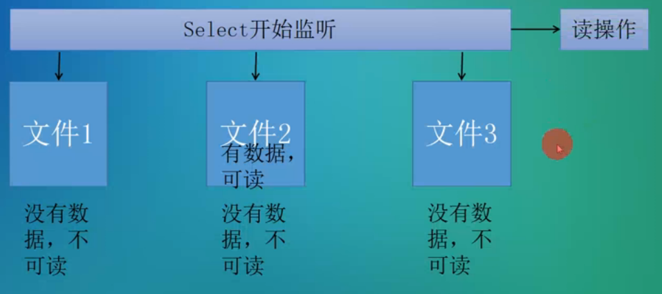

[toc]

select系统调用：用来让我们的程序监听多个文件状态的变化，程序会停在select这里等待，直到被监视的文件有某一个或多个发生了状态变化



```c
struct file_operations {
	......
	int (*open) (struct inode *, struct file *);
	ssize_t (*read) (struct file *, char __user *, size_t, loff_t *);
	ssize_t (*write) (struct file *, const char __user *, size_t, loff_t *);
	int (*release) (struct inode *, struct file *);
	unsigned int (*poll) (struct file *, struct poll_table_struct *);
	......
};

//struct   poll_table_struct：轮序控制，由内核定义并初始化


//在需要阻塞的时候调用poll_wait接口(和wait_event原理类似):
poll_wait(struct file * filp, wait_queue_head_t * wait_address, poll_table *p)
//filp: struct  file结构体指针，在poll接口中会由内核传入
//wait_address：等待队列头，自定义
//p：poll控制指针，由内核传入

//在需要唤醒进行时调用wake_up

```


