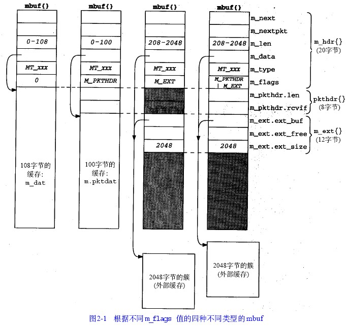
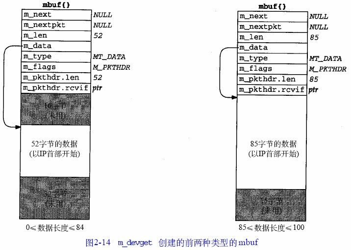
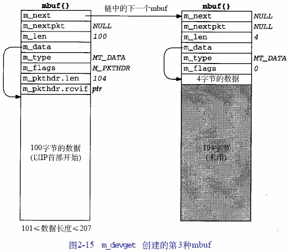
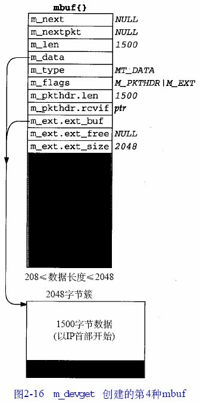

[toc]

BSD-4.4 四种不同类型的mbuf(摘自TCP/IP卷2)

自：http://blog.chinaunix.net/uid-24172143-id-334201.html

四种不同类型的mbuf

图2-1显示了我们要遇到的四种不同类型的mbuf，它们依据在成员m_flags中填写的不同标志M_PKTHDR和M_EXT而不同。

在图2-1中，结构**m_hdr**中有六个成员，它的总长是20字节。当我们查看此结构的C语言定义时，会看见前四个成员每个占用4字节而后两个成员每个占用2字节。

第一类mbuf如果m_flags等于0，mbuf只包含数据。在mbuf中有108字节的数据空间(m_dat数组)。

指针m_data指向这108字节缓存中的任意位置。

成员m_len指示了从m_data开始的数据的字节数。

第二类mbuf的m_flags值是M_PKTHDR，它指示这是一个分组首部，描述一个分组数据的第一个mbuf。数据仍然保存在这个mbuf中，但是由于分组首部占用了8字节，只有100字节的数据可存储在这个mbuf中(在m_pktdat数组中)。

成员m_pkthdr.len的值是这个分组的mbuf链表中所有数据的总长度：即所有通过m_next指针链接的mbuf的m_len值的和，

对于输出分组没有使用成员m_pkthdr.rcvif，但对于接收的分组，它包含一个指向接收接口**ifnet**结构的指针。

第三类mbuf不包含分组首部(没有设置K_PKTHDR)，但包含超过208字节的数据，这时用到一个叫“簇”的外部缓存(设置M_EXT)。在此mbuf中仍然为分组首部结构分配了空间，但没有用。

在图2-1中，我们用阴影显示出来。Net/3分配一个大小为1024或2048字节的簇，而不是使用多个mbuf来保存数据(第一个带有100字节数据，其余的每个带有108字节数据)。

在这个mbuf中，指针m_data指向这个簇中的某个位置。

第四类mbuf包含一个分组首部，并包含超过208字节的数据。同时设置了标志M_PKTHDR和M_EXT。

对于图2-1，我们还有另外几点需要说明：

•mbuf结构的大小总是128字节。这意味着图2-1右边两个mbuf在结构m_ext后面的未用空间为88字节(128-20-8-12)。

•既然有些协议(例如UDP)允许零长记录，当然就可以有m_len为0的数据缓存。

•在每个mbuf中的成员m_data指向相应缓存的开始(mbuf缓存本身或一个簇)。这个指针能指向相应缓存的任意位置，不一定是起始。

设备驱动程序调用函数m_devget来创建的mbuf链表

当接收到一个以太网帧时，设备驱动程序调用**函数****m_devget**来创建一个mbuf链表，并把设备中的帧复制到这个链表中。根据所接收的帧的长度(不包括以太网首部)，可能导致4种不同的mbuf链表。

1 ) 图2-14左边的mbuf用于数据的长度在0~84字节之间的情况。

2 ) 图2-14右边的mbuf用于数据的长度在85~100字节之间的情况。

3 ) 图2-15所示的是m_devget创建的第3种mbuf。当数据在101~207字节之间时，要求有两个mbuf。

4 ) 图2-16所示的是m_devget创建的第四种mbuf。如果数据超过或等于208字节(MINCLBYTES)，要用一个或多个簇。

1) 图2-14左边的mbuf用于数据的长度在0~84字节之间的情况。

在这个图中，我们假定有52字节的数据：一个20字节的IP首部和一个32字节的TCP首部(标准的20字节的TCP首部加上12字节的TCP选项)，但不包括TCP数据。既然m_devget返回的mbuf数据从IP首部开始，m_len的实际最小值是28：20字节的IP首部，8字节的UDP首部和一个0长度的UDP数据报。

m_devget在这个mbuf的开始保留了16字节未用。虽然14字节的以太网首部不存放在这里，还是分配了一个14字节的用于输出的以太网首部，这是同一个mbuf，用于输出。

我们会遇到两个函数：icmp_reflect和tcp_respond，它们通过把接收到的mbuf作为输出mbuf来产生一个应答。在这两种情况中，接收的数据报应该少于84字节，因此很容易在前面保留16字节的空间，这样在建立输出数据报时可以节省时间。分配16字节而不是14字节的原因是为了在mbuf中用长字对准方式存储IP首部。

2) 如果数据在85~100字节之间，就仍然存放在一个分组首部mbuf中，但在开始没有16字节的空间。数据存储在数组m_pktdat的开始，并且任何未用的空间放在这个数组的后面。例如在图2-14的右边的mbuf显示的就是这个例子，假设有85字节数据。

3) 图2-15所示的是m_devget创建的第3种mbuf。当数据在101~207字节之间时，要求有两个mbuf。前100字节存放在第一个mbuf中(有分组首部的mbuf)，而剩下的存放在第二个mbuf中。在此例中，我们显示的是一个104字节的数据报。在第一个mbuf的开始没有保留16字节的空间。

4) 图2-16所示的是m_devget创建的第四种mbuf。如果数据超过或等于208字节(MINCLBYTES)，要用一个或多个簇。图中的例子假设了一个1500字节的以太网帧。如果使用1024字节的簇，本例子需要两个mbuf，每个mbuf都有标志M_EXT，和指向一个簇的指针。