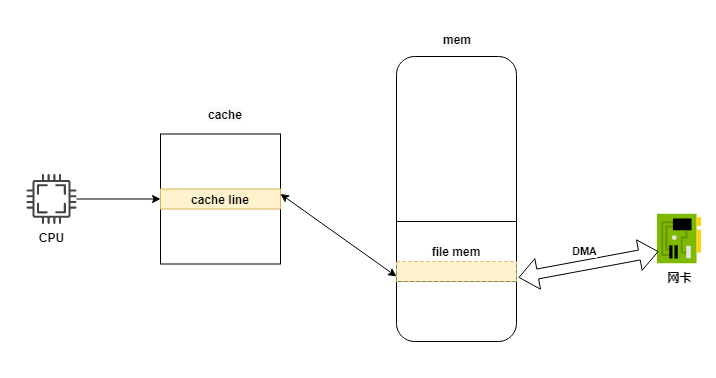
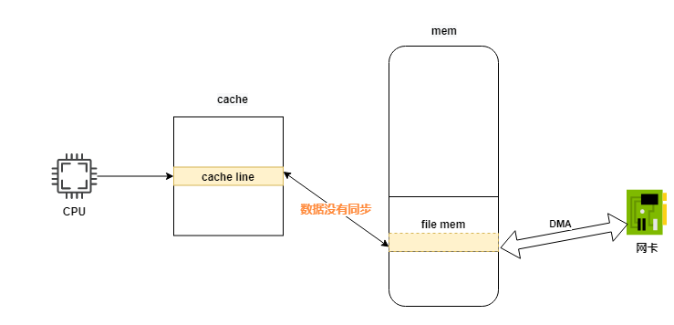
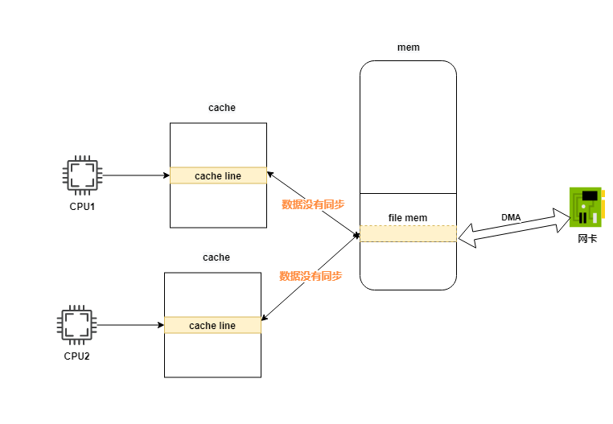
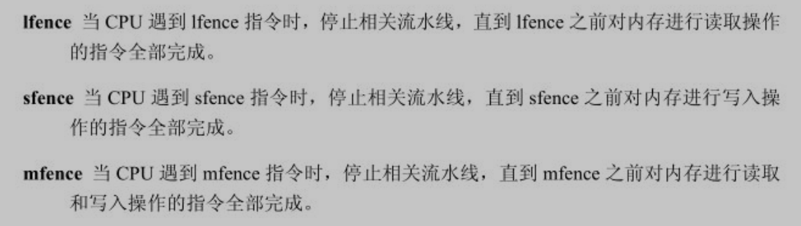

[toc]

# 内存屏障

由于编译器的优化和缓存的作用，导致对内存的写入操作不能及时的反映出来，也就是说**当完成内存的写入操作之后，读取出来的有可能是旧的内容**，这个就是**内存屏障（Memory Barrier）**


```c
int flag = 0;

void wait()
{
    while(flag == 0)
    {
        sleep(1000);
    }
    //...
}

void wakeup()
{
    flag = 1;
}
```

经过优化可能的代码如下

```c
void wait()
{
    movl flag, %edx;
    while(%edx == 0)
    {
        sleep(1000);
    }
    //...
}
```

假设一个线程因为flag=0进入睡眠，而此时另一个线程调用了wakeup把flag设置为1（此时内存中的flag=1了），但是当第一个线程醒来再次进入while判断的时候，还是用的%edx判断，这就是因为内存和寄存器直接的数据不同同步导致的不一致问题，我们可以使用volatile来避免这种情况

```c
volatile int flag = 0;
// 使用了volatile可以避免编译器的优化，编译器就不会把某个寄存器分配给flag，而是每一次对flag的访问都是通过内存访问来进行的
```

在某些情况下，由于涉及的变量比较多，如果把每个都声明为volatile是比较繁琐的，因此内核使用另外一种方式来避免编译器优化引起的副作用

```c
 17 /* Optimization barrier */
 18 
 19 /* The "volatile" is due to gcc bugs */
 20 #define barrier() __asm__ __volatile__("": : :"memory")

 // 这条汇编指令部分、输出部分、输入部分都为空，唯独损坏部分为“memory”,他告诉gcc内存已经被修改了，当gcc遇到这条指令时，gcc会插入必要的指令刷新内存和他对应的寄存器
```


barrier的使用如下

```c
 2874 /*
 2875  * context_switch - switch to the new MM and the new
 2876  * thread's register state.
 2877  */
 2878 static inline void
 2879 context_switch(struct rq *rq, struct task_struct *prev,
 2880            struct task_struct *next)
 2881 {
 2882     struct mm_struct *mm, *oldmm;
 2883 
 2884     prepare_task_switch(rq, prev, next);
 2885     trace_sched_switch(rq, prev, next);
 2886     mm = next->mm;
 2887     oldmm = prev->active_mm;
 
     // .........

 2915 
 2916     /* Here we just switch the register state and the stack. */
 2917     switch_to(prev, next, prev);
 2918 
 2919     barrier(); // 这里
 2920     /*
 2921      * this_rq must be evaluated again because prev may have moved
 2922      * CPUs since it called schedule(), thus the 'rq' on its stack
 2923      * frame will be invalid.
 2924      */
 2925     finish_task_switch(this_rq(), prev);
 2926 }
```


在内核中context_switch()负责从当前进程切换到另外一个进程环境中，但是由于当前进程需要修改某些数据结构，**这些修改需要及时的反映到另一个进程中**，这个插入barrier()，是为了在切换到另外一个进程的时候，这个进程的对应的内存变量和对应的寄存器是最新的

# 缓存引起的内存屏障

如下图是网络收发包的过程





* CPU接收数据的过程
  1. 网卡通过DMA将数据写入mem中
  2. 发送中断通知CPU
  3. CPU先从cache中读取数据
  4. cache中的数据和mem中的数据不一致导致错误（error）
* CPU发送网络数据的过程
  1. CPU先将数据写入cache
  2. 通知网卡数据准备好
  3. 网卡从内存中取数据发送出去
  4. 此时发送的数据不是CPU准备的数据（error）





x86的解决方法：x86是通过硬件的方式（总线检测技术 Bus Watching），使用一个专门的硬件模块来实现

当外部的设备对内存进行写入操作时，该模块判断这个区域是否位于CPU的缓存中，如果是则使缓存失效；当外部设备读取内存时，如果这个内存区域在缓存中，并且缓存已经被CPU修改，就把缓存内容写到内存中

而然在多CPU系统中，由于各个CPU内部都有独立的缓存，缓存和内存是一对多的关系，如下图




因此对某些关键的数据结构进行修改时，如果其他的CPU有可能对这些数据进行访问，需要一种机制来保证内存的一致性，Linux内核把这个机制称为“内存屏障”，当CPU对关键数据结构进行修改时，为了保证这个修改立即反映到其他CPU，因此需要调用smp_wmb()，他立即把修改过的缓存写到内存中，当其他的CPU访问某个关键数据结构的时候，由于这个数据结构可能已经位于该CPU的缓存中，但是内存可能被其他CPU修改过了，因此需要调用smp_rmb()使缓存失效，这样就能确保访问到最新的内容

```c
425 #ifdef CONFIG_SMP
    426 #define smp_mb()    mb()
    428 # define smp_rmb()  rmb()
    433 # define smp_wmb()  wmb()
439 #else
    440 #define smp_mb()    barrier()
    441 #define smp_rmb()   barrier()
    442 #define smp_wmb()   barrier()
445 #endif
```

```c
357 #ifdef CONFIG_X86_32
358 /*
359  * Some non-Intel clones support out of order store. wmb() ceases to be a
360  * nop for these.
361  */
// 使用lock指令使缓存失效， esp+0 对esp没有影响
362 #define mb() alternative("lock; addl $0,0(%%esp)", "mfence", X86_FEATURE_XMM2)
363 #define rmb() alternative("lock; addl $0,0(%%esp)", "lfence", X86_FEATURE_XMM2)
364 #define wmb() alternative("lock; addl $0,0(%%esp)", "sfence", X86_FEATURE_XMM)
365 #else
366 #define mb()    asm volatile("mfence":::"memory")
367 #define rmb()   asm volatile("lfence":::"memory")
368 #define wmb()   asm volatile("sfence" ::: "memory")
369 #endif
```


可以使缓存失效的命令有：带有lock前缀的指令；cpuid， iret等

# 乱序引起的内存屏障

为了追求更高的系统性能，超标量已经成为处理器的主流技术，超标量的本质是一个CPU拥有多条独立的流水线，他拥有多个取址，译码，运算等部件，因此可以在不同的流水线上执行多条指令，取消乱序的方式如下




参考：

[独辟蹊径品内核](https://book.douban.com/subject/3894413/)

