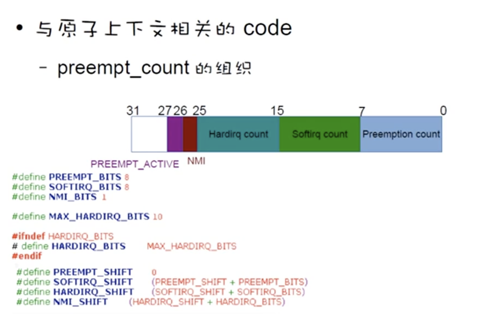

[toc]


* 原子上下文：当前的操作不能被切换出CPU的状态，也即不可睡眠的状态

* 原子上下文包括：

  * 在处理IRQ的时候
  * 在处理softirq的时候
  * 在抢占被禁用的时候

* 与原子上下文相关的code

  每个进程（包括线程）都维护着一个preempt_count

  ```c
  #define preempt_count() (current_thread_info()->preempt_count)
  
  //当count不为0的时候，就不能被切换出去
  ```

  

  

* 检查是否是原子环境

  ```c
  #define in_atomic() ((preempt_count() & ~PREEMPT_ACTIVE) != 0)
  ```

  