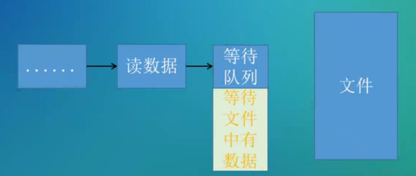

[toc]


等待队列用于等待某个特定的条件发生，然后执行队列中的任务

1.  等待队列中有一个或多个任务，以队列的形式组织
2. 不同于工作队列，等待队列并没有内核线程的支持




```c
struct __wait_queue {
	unsigned int		flags;		//标志
	void			*private;	//私有数据，可自定义
	wait_queue_func_t	func;		//处理函数，等待的条件满足时执行的处理
	struct list_head	task_list;	//插入到等待队列头后面，和等待队列中的元素形成队列
};

struct __wait_queue_head {
	spinlock_t		lock;
	struct list_head	task_list;	//等待队列头
}

typedef int (*wait_queue_func_t)(wait_queue_t *wait, unsigned mode, int flags, void *key)
```


