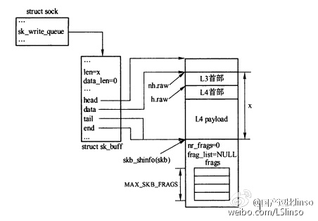
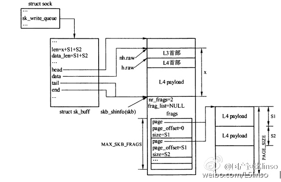

[toc]

# skb_shared_info结构


```c
133 struct skb_shared_info {
134     atomic_t    dataref;
135     unsigned short  nr_frags;   /* 重要 */
136     unsigned short  gso_size;
137     /* Warning: this field is not always filled in (UFO)! */
138     unsigned short  gso_segs;
139     unsigned short  gso_type;
140     __be32          ip6_frag_id;
141     struct sk_buff  *frag_list;  /* 重要 */
142     skb_frag_t  frags[MAX_SKB_FRAGS]; /* 重要 */
143 };
```


保存了数据块的附加信息，主要提供了零拷贝，聚合分散IO，GSO等支持。

# 聚合分散I/O数据支持

* 为什么需要聚合分散IO？

  网络中创建一个发送报文的过程包括组合多个片。报文数据必须从用户空间复制到内核空间，同时加上网络协议栈各层的首部。这个组合可能要求相当数量的数据拷贝。但是**如果发送报文的网络接口能够支持聚合分散IO，报文就无需组装成一个单块，可避免大量的拷贝**。聚合分散IO可以实现从用户空间启动零拷贝发送。

* 如何开启这个功能？

  net_device结构中的features字段设置NETIF_F_SG标识。两种类型：SG类型的和FRAGLIST

  ```c
   688 struct net_device {
   689 
  // .....
   723 
   724     /* Net device features */
   725     unsigned long       features;
   726 #define NETIF_F_SG      1   /* Scatter/gather IO. */
   727 #define NETIF_F_IP_CSUM     2   /* Can checksum TCP/UDP over IPv4. */
   728 #define NETIF_F_NO_CSUM     4   /* Does not require checksum. F.e. loopack. */
   729 #define NETIF_F_HW_CSUM     8   /* Can checksum all the packets. */
   730 #define NETIF_F_IPV6_CSUM   16  /* Can checksum TCP/UDP over IPV6 */
   731 #define NETIF_F_HIGHDMA     32  /* Can DMA to high memory. */
   732 #define NETIF_F_FRAGLIST    64  /* Scatter/gather IO. */
   733 #define NETIF_F_HW_VLAN_TX  128 /* Transmit VLAN hw acceleration */
   734 #define NETIF_F_HW_VLAN_RX  256 /* Receive VLAN hw acceleration */
  // ....
   }
  ```

  

没有启用任何聚合分散IO的SKB，存储空间全部线性化。如下图：



启用了SG类型的聚合分散IO:



**第一块数据存储在skb的data->tail之间，其他分块存储在skb_shinfo(skb)->frags中。**


参考：

https://www.weibo.com/p/1001603838748247885093


