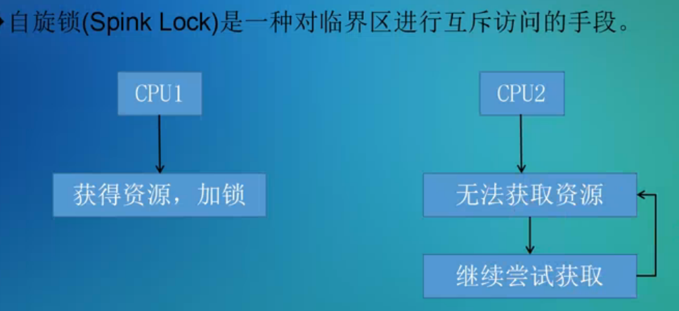
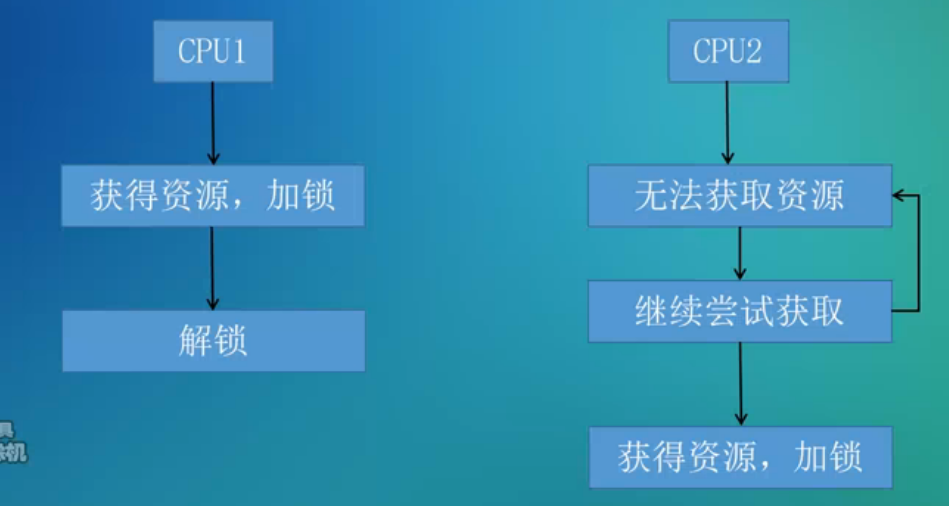
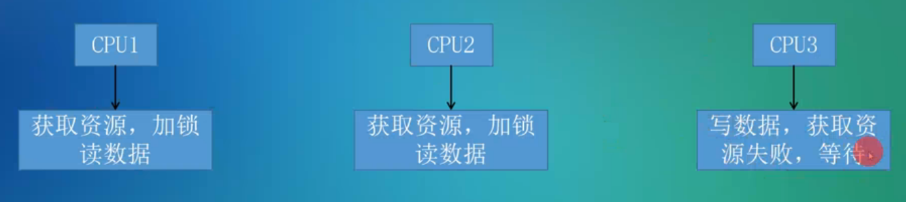
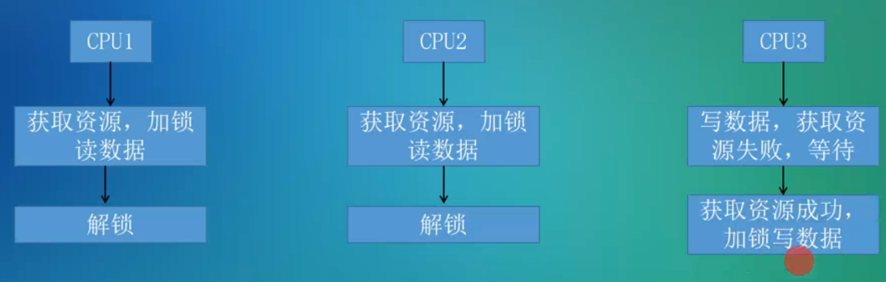
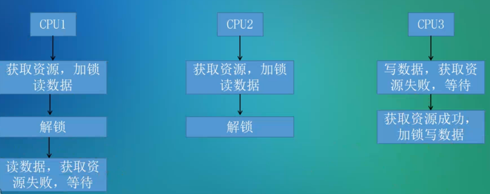
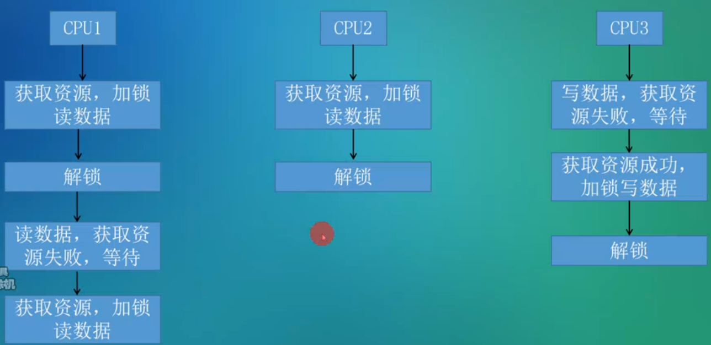

[toc]

# 自旋锁(spinlock)

* 在资源访问得不到满足的时候，一直去探测资源是否可以访问，处于忙等的状态，CPU不会切换到其他调度实体上去
* 自旋锁会自动关闭当前CPU的抢占（在忙等的过程中也是）
* 所以，在持有自旋锁后，不应该有睡眠的操作，例如再去试图获得一个会导致睡眠的锁

​	

# RCU(read copy update)

* 读者
  1. 使用rcu_read_lock()来进入读侧
  2. 使用rcu_deference()来获取指针对应的资源
  3. 使用rcu_read_unlock来退出读侧
* 写者
  1. 如果有多个写端，需要写端来自己做同步（例如使用spinlock）
  2. 使用rcu_assign_pointer()来更新指针
  3. 使用call_rcu / synchronize_rcu()来释放旧指针对应的资源

# 读写锁

