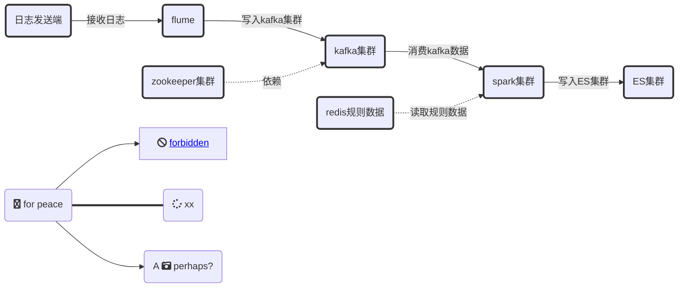
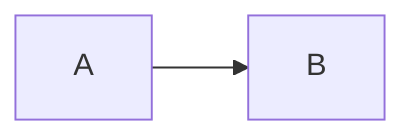
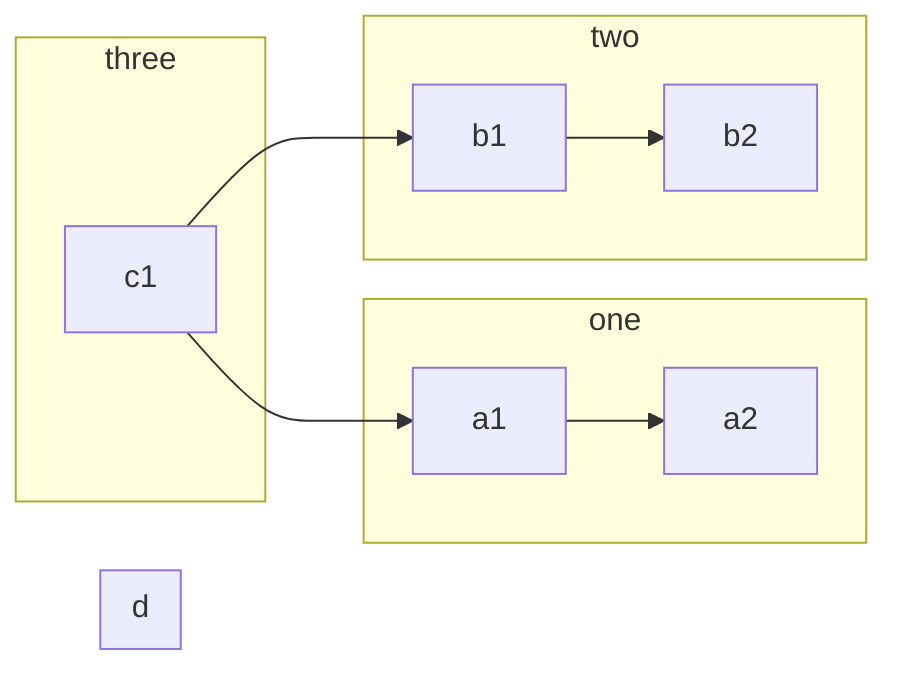

```mermaid
graph LR
	start(日志发送端)--接收日志-->comp_flume(flume)
	comp_flume(flume)--写入kafka集群-->comp_kafka(kafka集群)
	comp_kafka(kafka集群)--消费kafka数据-->comp_spark(spark集群)
	comp_spark(spark集群)--写入ES集群-->comp_es(ES集群)

	comp_redis(redis规则数据)-. 读取规则数据 .->comp_spark
	
	comp_zk(zookeeper集群)-. 依赖 .->comp_kafka
	
	
    B("fa:fa-twitter for peace")
    B-->C[fa:fa-ban <a href='http://172.16.14.31:8080/' target='_blank'>forbidden</a>]
    B===D(fa:fa-spinner xx);
    B-->E(A fa:fa-camera-retro perhaps?);
    
    
     classDef defaultStyle fill:,stroke:#333,stroke-width:3px;
     class start defaultStyle
     class comp_flume defaultStyle
     class comp_kafka defaultStyle
     class comp_spark defaultStyle
     class comp_es defaultStyle
     class comp_redis defaultStyle
     class comp_zk defaultStyle
     

     
```


```mermaid
graph LR;
    A-->B;
    click B "http://www.github.com" "This is a link"
```

* 点击添加链接（跳转到对应的组件的web页面）



```mermaid
graph LR
    c1-->b1
    subgraph one
    a1-->a2
    end
    subgraph two
    b1-->b2
    end
    subgraph d
    end
    subgraph three
    c1-->a1
    end
```


好，规划是平台组下一期的分享就是关于监控和调试相关的技术分享 


* 1.走一遍流程
* 2.通过流程，观察哪些组件没有数据，进而判断问题
```

```