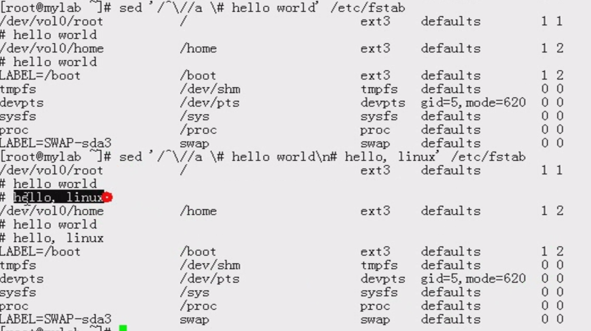

[TOC]

参见：http://man.linuxde.net/sed


sed: Stream EDitor 行编辑器，默认情况下是不编辑源文件的，仅仅对模式空间中的数据做处理


> sed会读取原文件中的一行到内存中，然后对读取到的一行做一个模式匹配，匹配成功，那么调用自身的处理命令，对文本进行处理，如果匹配不成功，那么直接丢弃，进行下一行的读取，重复上面的操作


# 1.语法


```
sed [options] 'AddressCommand'   file...

options:
-n 表示取消sed的默认输出
-i 改变文件的内容(重点)
-e 选项允许在同一行里执行多条命令
-f scriptfile file(s) :scriptfile是脚本文件； file是需要处理的文本文件
-r 表示使用扩展正则表达式


Address：
1. StartLine, EndLine //起始行到结束行； 
	1,100 从第一行到第100行; $:表示最后一行；$-1表示倒数第二行
2. /Pattern/  正则表达式
	/^root/
3. /pattern1/,/pattern2/  表示从模式1第一次匹配到的行开始，到第一次被模式2匹配到的行结束，中间所有的行
4. LineNumber 表示指定的行
5.StartLine, +N		表示从StartLine开始，向后的N行


Command：
	d: delete 删除符合条件的行
	p: print 打印符合条件的行
	a \string:在指定的行后追加新行，内容为string，字符串中间有空格，加上引号
	i \string :在指定的行前面添加新行，内容为string
	r file :
	w file:
	s/pattern/string/[修饰符] :查找并替换,前面也可以加上行号，如：1,2s/pattern/string/ 但是不加的话，默认是查询所有的行；默认只替换每行中第一次被模式匹配到的字符串
		修饰符
			g:全局替换
			i:查找时忽略大小写
			
		分隔符：可以使用@@@；###；///
		
	&：引用模式匹配到的整个串
	
	
	
	
	
```


``` shell
-r, --regexp-extended (可以使用正则，不用转义)  use extended regular expressions in the script.
```

# 实例


## 2.-d 删除不显示

``` shell
 [root@linux-study cys_test]# cat err.a
-bash: ech: command not found
dfsdfsfsd
 
[root@linux-study cys_test]# sed '/dfs*/d' err.a
-bash: ech: command not found
 
[root@linux-study cys_test]# sed '/com*/d' err.a
dfsdfsfsd
 
[root@linux-study cys_test]# cat err.a
-bash: ech: command not found
dfsdfsfsd
```

## 3.取行
``` shell
[root@linux-study cys_test]# cat sed_tst.txt
chenyansong2
chenyansong3
chenyansong4
chenyansong5
chenyansong6
 
// -n表示取消默认的输出，不然会输出2次
[root@linux-study cys_test]# sed -n '3p' sed_tst.txt
chenyansong4
 
[root@linux-study cys_test]# sed -n '1,3p' sed_tst.txt
chenyansong2
chenyansong3
chenyansong4
[root@linux-study cys_test]# 
```


下面是不取消默认的输出和取消默认输出的对比


## 4.全局查找和替换

``` shell
[root@linux-study cys_test]# cat sed_tst.txt
chenyansong2
chenyansong3
chenyansong4
chenyansong5
chenyansong6
 
 
 
// -i 表示改变文件内容，s 表示search，g表示global
[root@linux-study cys_test]# sed -i 's#song#he#g' sed_tst.txt

#使用变量替换，一定要使用双引号，不能使用单引号
sed "s/$a/$b/" filename

[root@linux-study cys_test]# cat sed_tst.txt
chenyanhe2
chenyanhe3
chenyanhe4
chenyanhe5
chenyanhe6
 
[root@linux-study cys_test]# sed -ri 's#(chen)yanhe*#\1#g' sed_tst.txt  #查找到的是chenyanhe,然后取组: (chen),替换掉查找到的内容
[root@linux-study cys_test]# cat sed_tst.txt
chen2
chen3
chen4
chen5
chen6

#替换匹配行
sed -i 's/^a.*/haha/g' tmp.txt 
 
/*
注意： s 是查找和替换，用一个字符串去替换匹配到的另一个字符串，
#是分隔符，可以使用@ /  等替换
-r 表示不用对需要转义的字符进行转义，如这里的括号等
\1 是取到的第一个分组
*/
```


## 5.增加
* a 追加文本到指定行后
* i插入文本到指定行前
* -i是修改文件内容
``` shell
[root@lamp01 chenyansong]# sed -i '2a testadd' test3.txt
[root@lamp01 chenyansong]# cat test3.txt                
aaaa
 
testadd
aa cc dd
AAA


[root@lamp01 chenyansong]# sed '2a testadd2222' test3.txt  
aaaa
 
testadd2222
testadd
aa cc dd
AAA


[root@lamp01 chenyansong]# cat test3.txt
aaaa
 
testadd
aa cc dd
AAA


[root@lamp01 chenyansong]# sed '2i testadd2222' test3.txt
aaaa
testadd2222
 
testadd
aa cc dd
AAA

[root@lamp01 chenyansong]# cat test3.txt
aaaa
 
testadd
aa cc dd
AAA


#增加一行或多行字符串
[root@localhost ruby]# cat ab
Hello!
ruby is me,welcome to my blog.
end
[root@localhost ruby] # sed '1a drink tea' ab  #第一行后增加字符串"drink tea"
Hello!
drink tea
ruby is me,welcome to my blog. 
end
[root@localhost ruby] # sed '1,3a drink tea' ab #第一行到第三行后增加字符串"drink tea"
Hello!
drink tea
ruby is me,welcome to my blog.
drink tea
end
drink tea
[root@localhost ruby] # sed '1a drink tea\nor coffee' ab   #第一行后增加多行，使用换行符\n
Hello!
drink tea
or coffee
ruby is me,welcome to my blog.
end
```


在以 / 开头的行下方加上指定的一行或者两行




### 从文件读入：r命令


file里的内容被读进来，显示在与test匹配的行后面，如果匹配多行，则file的内容将显示在所有匹配行的下面：

```
sed '/test/r file' filename
```

 


### 写入文件：w命令   

在example中所有包含test的行都被写入file里：

```
sed -n '/test/w file' example
```


### 已匹配字符串标记& 

正则表达式 \w\+ 匹配每一个单词，使用 [&] 替换它，& 对应于之前所匹配到的单词：

```
echo this is a test line | sed 's/\w\+/[&]/g'
[this] [is] [a] [test] [line]
```

所有以192.168.0.1开头的行都会被替换成它自已加localhost：

```
sed 's/^192.168.0.1/&localhost/' file
192.168.0.1localhost
```

### 子串匹配标记\1 

匹配给定样式的其中一部分：

```
echo this is digit 7 in a number | sed 's/digit \([0-9]\)/\1/'
this is 7 in a number
```

命令中 digit 7，被替换成了 7。样式匹配到的子串是 7，\(..\) 用于匹配子串，对于匹配到的第一个子串就标记为 **\1**，依此类推匹配到的第二个结果就是 **\2**，例如：

```
echo aaa BBB | sed 's/\([a-z]\+\) \([A-Z]\+\)/\2 \1/'
BBB aaa
```

love被标记为1，所有loveable会被替换成lovers，并打印出来：

```
sed -n 's/\(love\)able/\1rs/p' file
```


拿到pattern中的部分替换


### 多点编辑：e命令 

-e选项允许在同一行里执行多条命令：

```
sed -e '1,5d' -e 's/test/check/' file
```

上面sed表达式的第一条命令删除1至5行，第二条命令用check替换test。命令的执行顺序对结果有影响。如果两个命令都是替换命令，那么第一个替换命令将影响第二个替换命令的结果。

和 -e 等价的命令是 --expression：

```
sed --expression='s/test/check/' --expression='/love/d' file
```


### 匹配某一行开头，替换整行内容
```shell
sed -i '/^cloud_server_ip/c cloud_server_ip = update.skyeye.360safe.com' name.txt
#cloud_server_ip 前面的c是表示取代，关键点
```

sed 替换文件中匹配行头的一行

```shell
#首先定义一个新版本号的变量
var="version=6.1.1"
sed -i '/^version=/c'$var'' /etc/config.txt
#注意这里使用了一个变量，放在单引号中
#注意$var前面是有一个c ,表示取代
```

sed -i命令详解

```shell
function：
a ：新增， a 的后面可以接字串，而这些字串会在新的一行出现(目前的下一行)～
c ：取代， c 的后面可以接字串，这些字串可以取代 n1,n2 之间的行！
d ：删除，因为是删除啊，所以 d 后面通常不接任何咚咚；
i ：插入， i 的后面可以接字串，而这些字串会在新的一行出现(目前的上一行)；
p ：列印，亦即将某个选择的数据印出。通常 p 会与参数 sed -n 一起运行～
s ：取代，可以直接进行取代的工作哩！通常这个 s 的动作可以搭配正规表示法！例如 1,20s/old/new/g 就是啦！
```


参见：https://www.cnblogs.com/ev-zhk/p/4277023.html


### 脚本scriptfile 

sed脚本是一个sed的命令清单，启动Sed时以-f选项引导脚本文件名。Sed对于脚本中输入的命令非常挑剔，在命令的末尾不能有任何空白或文本，如果在一行中有多个命令，要用分号分隔。以#开头的行为注释行，且不能跨行。

```
sed [options] -f scriptfile file(s)
```