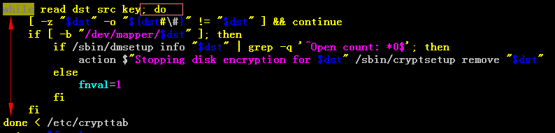

[TOC]


# 1.条件测试
```
查看帮助：man test

```
## 1.1.语法
```
test condition
#或 
[ condition ]     #注意中括号（［］）、参数之间必须有一个空格

#或
[[ condition ]]
```


## 1.2.逻辑运算符
|符号|描述|
|-|-|
|-a|逻辑与|
|-o|逻辑或|
|!|逻辑否|
|&&, \|\|||

```
#1.      测试两文件是否均可读
$[ -w result.txt –a –w scores.txt ]
$echo $?

#2.      测试两文件中其中一个是否可执行
$[ -x dream –o –x dream2 ]

#3.      判断是否可写可执行
$[ -w dream –a –x dream ]
$echo $?

#4.      判断文件是非可执行文件
$[ ! –x dream ]

#5.   [条件判断表达式1]&& [条件判断表达式2]|| [条件判断表达式3]

#6. 在[[]] 中，只能用&&、||，而在[]中只能用-a、-o
[root@MySQL ~]# [ -f /etc/rc.local && -f /etc/hosts ]&&echo 1||echo 0
-bash: [: missing `]'
0
[root@MySQL ~]# [ -f /etc/rc.local -a -f /etc/hosts ]&&echo 1||echo 0  
1
 
[root@MySQL ~]# [[ -f /etc/rc.local -a -f /etc/hosts ]]&&echo 1||echo 0    
-bash: syntax error in conditional expression
-bash: syntax error near `-a'
[root@MySQL ~]# [[ -f /etc/rc.local && -f /etc/hosts ]]&&echo 1||echo 0 
1
[root@MySQL ~]#
```

## 1.3.文件条件测试

|符号|描述|
|-|-|
|-d|目录|
|-f|普通文件（Regular file）|
|-L|符号链接|
|-b|块专用文件|
|-e|文件存在|
|-g|如果文件的set-group-id位被设置则结果为真|
|-s|文件长度大于0，非空|
|-z|文件长度=0|
|-r|Readable（文件、目录可读）|
|-w|Writable（文件、目录可写）|
|-x|Executable（文件可执行、目录可浏览）|
|-u|文件有suid位设置|
|-c|字符专用文件|
|-L|符号链接|

```

测试文件是否可写
$test –w dream
$echo $?
或者
$[ -w dream ]


#判断文件或者目录是否存在
[root@node-test conf]# [ -e /etc/hosts ] && echo 1
1
[root@node-test conf]# [ -e /home2 ] && echo 1
[root@node-test conf]# 
[root@node-test conf]# [ ! -e /home2 ] && echo 1
1
[root@node-test conf]# [ ! -e /home ] && echo 1
[root@node-test conf]# 
```


## 1.4.字符串测试
```
#5种语法格式:

test “str”
test str_operator “str”
test “str1” str_operator “str2”
[ string_operator str1 ]     
[ string string_operator string2 ]    #操作符两边有空格：[ “aaa” = “cccc” ]   不要： [ “aaa”=“cccc” ]

#string_operator有如下的形式
=    #两字符串相等,== 也是一样；记住等号两端要有空格，否则会当做变量的赋值
!=    #两字符串不等

-z    #空串 [zero]
-n    #非空串 [nozero]

```
实例
```
#1.测试环境变量是否为空
$[ -z $EDITOR ]
$echo $?

#2. 测试是否为某字符串
$[ $EDITOR = “vi” ]
$echo $?

#3.如果操作符两边没有空格的结果
[root@MySQL shell]# [ "a" = "a" ]&&echo 1||echo 0
1
[root@MySQL shell]# [ "a"="a" ]&&echo 1||echo 0  
1
[root@MySQL shell]# [ "a" = "aa" ]&&echo 1||echo 0
0
[root@MySQL shell]# [ "a"="aa" ]&&echo 1||echo 0
1
 
```


## 1.5.数值测试
```
#2种格式
“number” numberic_operator “number”
# 或    
[ “number” numberic_operator “number” ]

#Numberic_operator 算术比较
-eq    #数值相等（equal）
-ne    #不等（not equal）
-gt    #A>B（greater than）
-lt    #A<B（less than）
-le   #A<=B（less、equal）
-ge    #A>=B（greater、equal）


#例子
$SOURCE=13
$DEST=15
$[ “$SOURCE” –gt “$DEST”]

```

## 1.6.比较两个文件

```
FILE1 -ef FILE2  //比较两个文件是否是同一个
              #FILE1 and FILE2 have the same device and inode numbers
FILE1 -nt FILE2 //比较两个文件的修改日期
              #FILE1 is newer (modification date) than FILE2
FILE1 -ot FILE2
              #FILE1 is older than FILE2
```


# 2.控制流

## 2.1.if

### 2.1.1语法

> 单分支结构


> 双分支结构


> 多分支结构


### 2.1.2.书写格式


### 2.1.3.example
```
# 判断字符串是否为空；注意：第一个if和【之间有空格
if [ $log_dir"x"="x" ];then
	echo "true"
fi
```


## 2.2.case

### 2.2.1.语法


### 2.2.2.书写格式


### 2.2.3.示例

```
case $1 in
[0-9])
	echo "数字"
	;;
[a-z])
	echo "小写字符"
	;;
[A-Z])
	echo "大写字符"
	;;
*)
	echo "特殊字符"
esac


===================
"scala")
				#解压，修改配置文件
				;;
#这里有一个模糊匹配			
zookeeper*)
				#解压，修改配置文件
				;;

```


```
case $1 in
"start")
	echo "正在启动...";;
"stop")
	echo "正在停止...";;
"restart")
	echo "正在重启....";;
*)
	echo "`basename $0` {start| stop| restart}"
esac

```


```Shell
#!/bin/bash

DEBUG=0
ADD=0
DEL=0

while True ;do
	if [ $# -gt 0 ];then
        case $1 in
        -v|--verbose)
            DEBUG=1
            # 将参数中的第一个参数剔除掉，这样第二个参数就变成了第一个参数
            shift
            ;;
        -h|--help)
            echo "Usage: `basename $0` --add User_List --del User_List -v|--verbose -h|--help"
            exit 0
            ;;
        --add)
            ADD=1
            ADD_USERS=$2
            shift 2
            ;;
        --del)
            DEL=1
            DEL_USERS=$2
            shift 2
            ;;
        *)
            echo "Usage: `basename $0` --add User_List --del User_List -v|--verbose -h|--help"
            exit 7
            ;;
        esac
	if
    
done


# 添加用户
if [ $ADD -eq 1 ];then
	# 用sed解决了字符串split的问题
	for user in `echo $ADD_USERS|sed 's@,@ @g'` ;do
		if id $user &>/dev/null;then
			[ $DEBUG -eq 1 ] && echo "$user exist."
		else
			useradd $user
			[ $DEBUG -eq 1 ] && echo "$user add successed."
		fi
	done
fi


# 删除用户
if [ $DEL -eq 1 ];then
	# 用sed解决了字符串split的问题
	for user in `echo $DEL_USERS|sed 's@,@ @g'` ;do
		if id $user &>/dev/null;then
			userdel $user
			[ $DEBUG -eq 1 ] && echo "$user del successed."
		else
			[ $DEBUG -eq 1 ] && echo "$user not exist."
		fi
	done
fi

```


## 2.3.while

### 2.3.1.语法


### 2.3.2.书写格式




### 2.3.3.通过while读文件的方式


```
#方式1(效率最低)
cat data.dat | while read line
do
    echo "File:${line}"
done

#方式2
while read line
do
    echo "File:${line}"
done < data.dat

#方式3(效率最高)
for line in $(cat data.dat)
do
    echo "File:${line}"
done
 
for line in `cat data.dat`
do
    echo "File:${line}"
done

```


* 输出bash=/bin/bash的前6个的用户名

```Shell
#!/bin/bash

file=/etc/passwd
let I=1

while read line;do
	#如果用户的ID<505时，不做处理,直接进入下一次循环
	[ `echo $line | awk -F: '{print $3}'` -le 505 ]&& continue
	[ `echo $line | awk -F: '{print $NF}'` == "/bin/bash" ]&& echo $line|awk '{print $1}' && let I++
	[ $I -gt 6 ] && break
	
done < $file
```


* 检查一个脚本执行之后是否有错误，有错误就使用vim打开，没有错误直接退出

```Shell
#!/bin/bash


until bash -n $1 &>/dev/null;do
	read -p "Syntax error, [Q|q] to quit, other for editing:" choice
	case $choice in
	q|Q)
		echo "something wrong, quiting."
		break
		;;
	*)
		vim + $1
		;;
	esac
done
```


* 计算100以内所有整数的和

```Shell
#!/bin/bash

declare -i I=1
declare -i SUM=0

while [ $I -le 100 ];do
	let SUM+=$I
	let I+=1
done

echo "SUM=$SUM"
```


* 提醒用于输入字符串，一直循环输入，知道用户输入quit退出循环

```Shell
#!/bin/bash

while True ;do
	read -p "please input str" str
	
	if [ "$str" == "quit" ];then
		break;
	else
		echo $str|tr 'a-z' 'A-Z'
	fi

done
```


# 3.for循环

## 3.1.语法


```shell
for (( exp1; exp2; pexp3 ));do
	//...command line
done


#计算1-100的和
declare -i sum=0
for((i=1;i<=100;i++));do
	let sum+=$i
done

#计算1-100的之间偶数的和
declare -i sum=0
for((i=1;i<=100;i+=2));do
	let sum+=$i
done

```


## 3.2.书写格式


* 生成列表的方式

```shell
# 方式1
{1..100}


# 方式2
`seq [起始数] [步进长度] 结束数`


# 方式3
`ls /etc`

```


* seq

```
chenyansongdeMacBook-Pro:shell chenyansong$ seq 10
1
2
3
4
5
6
7
8
9
10
chenyansongdeMacBook-Pro:shell chenyansong$ seq 5 10
5
6
7
8
9
10
chenyansongdeMacBook-Pro:shell chenyansong$ seq 2 2 10
2
4
6
8
10
chenyansongdeMacBook-Pro:shell chenyansong$ 


```


# 4.until循环


进入循环，条件不满足

退出循环，条件满足


* 需求：直到用户输入quit退出循环，否则一直打印用户输入的字符串，并转化为大写

  

  while的实现方式

```Shell
#!/bin/bash

read -p "please input something:" STRING

while [ $STRING != 'quit' ];do
	echo $STRING |tr 'a-z' 'A-Z'
	read -p "please input something again:" STRING
done
```

 	until的实现方式

```Shell
#!/bin/bash

read -p "please input something" STRING

until [ $STRING == 'quit' ];do
	echo $STRING |tr 'a-z' 'A-Z'
	read -p "please input something again:" STRING
done
```


​	每隔5秒钟看hadoop用户是否登录

```Shell
#!/bin/bash

who |grep "hadoop" &>/dev/null
RETVAL=$?

until [ $RETVAL -eq 0 ];do
	echo "hadoop is not login."
	sleep 5
	who |grep "hadoop" &>/dev/null
	RETVAL=$?
done

echo "hadoop is logined in"


###########另外一种简写方式###############
#!/bin/bash


#直到 who |grep "hadoop" &>/dev/null 的执行结果为0，表示执行成功了
until who |grep "hadoop" &>/dev/null;do
	echo "hadoop is not login."
	sleep 5
done

echo "hadoop is logined in"
```


# 退出break、continue、exit、return


