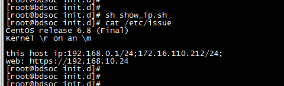

```
#/etc/motd
[root@lamp01 ~]# vim /etc/motd     
欢迎来到测试环境

#登录之后如下显示:
Last login: Sun Feb 12 09:14:18 2017 from 192.168.0.221
欢迎来到测试环境

```


开机显示本机IP地址，以及web的访问URL

```shell
[root@bdsoc init.d]# cat show_ip.sh
#!/bin/bash

cp /etc/issue_standard /etc/issue
echo -e "this host ip:\c">>/etc/issue
/sbin/ip addr | grep "inet" |grep -v "inet6" | grep -v "virbr" | grep -v "127.0.0.1" | awk '{print $2}'|tr "\n" ";" >> /etc/issue
echo "" >> /etc/issue

echo "web: https://192.168.10.24" >> /etc/issue

```

