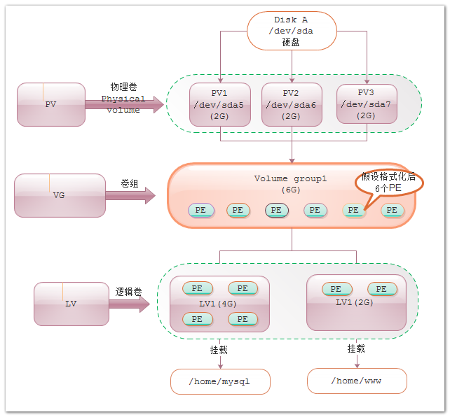

转自：http://wangying.sinaapp.com/archives/2310

[TOC]


Linux用户安装Linux操作系统时遇到的一个最常见的难以决定的问题就是如何正确地给评估各分区大小，以分配合适的硬盘空间。而遇到出现某个分区空间耗尽时，解决的方法通常是使用符号链接，或者使用调整分区大小的工具(比如PatitionMagic等)，但这都只是暂时解决办法，没有根本解决问题。因此完美的解决方法应该是在零停机前提下可以自如对文件系统的大小进行调整，可以方便实现文件系统跨越不同磁盘和分区。幸运的是Linux提供的逻辑盘卷管理(LVM，LogicalVolumeManager)机制就是一个完美的解决方案。 


## 单硬盘分区案例




### 查看磁盘详细信息

```
[root@localhost ~]# fdisk -l
Disk /dev/sda: 21.5 GB, 21474836480 bytes  #/dev/sda容量21.5G
255 heads, 63 sectors/track, 2610 cylinders #有255个磁面,63个扇区,2610个磁柱
Units = cylinders of 16065 * 512 = 8225280 bytes #每个cylinder的容量是8.225280M
Sector size (logical/physical): 512 bytes / 512 bytes
I/O size (minimum/optimal): 512 bytes / 512 bytes
Disk identifier: 0x0005ed38 #start:开始磁柱 End:结束磁柱 Blocks:容量Byte
   Device Boot      Start         End      Blocks   Id  System
/dev/sda1   *           1          64      512000   83  Linux  #500M
/dev/sda2              64        1339    10240000   83  Linux  #10G
/dev/sda3            1339        1594     2048000   82  Linux swap / Solaris #2G

[root@localhost ~]# df -alh
Filesystem      Size  Used Avail Use% Mounted on
/dev/sda2       9.7G  732M  8.5G   8% /
proc               0     0     0    - /proc
sysfs              0     0     0    - /sys
devpts             0     0     0    - /dev/pts
tmpfs           654M     0  654M   0% /dev/shm
/dev/sda1       485M   32M  428M   7% /boot
none               0     0     0    - /proc/sys/fs/binfmt_misc
```


从sda3的END磁柱可以看出，只分配了1594个磁柱，未分配2610-1594=1016个磁柱，未分配空间21.5-0.5-10-2=9G TIP:我们估算一个硬盘是否完全被划分，我们只要看 fdisk -l 输出的内容中的 cylinders（柱体） 上一个分区的End 和下一个分区的Start是不是一个连续的数字，另外要看一下每个硬盘设备的fdisk -l 的开头部份，看一下他的 cylinders（柱体）的 值


#### 检查系统卷组(vg)、逻辑卷(LV)信息

```
#简洁查看卷组详情的命令
[root@localhost ~]# vgs
  No volume groups found
#简洁查看逻辑卷详情的命令
[root@localhost ~]# lvs
  No volume groups found
```

从fdisk、df、vgs、lvs命令来看，单硬盘/dev/sda只有普通分区格式，并未进行过lvm格式化分区。 卷组或逻辑卷不存在，那就必须在接下来的步骤中创建卷组或逻辑卷。 


### 磁盘分区

从上面可以分析到，sda1，sda2，sda3都是主（primary）分区，按照硬盘分区原理，我们要想新增3个分区只能是先创建扩展（extended）分区，然后在扩展分区下新建分区


```
[root@localhost ~]# fdisk /dev/sda
Command (m for help): N  ##新建分区命令:N
Command action
   e   extended
   p   primary partition (1-4)
E  ##创建extended逻辑分区命令:E
Selected partition 4
First cylinder (1594-2610, default 1594):  ##回车用默认
Using default value 1594
Last cylinder, +cylinders or +size{K,M,G} (1594-2610, default 2610): ##创建扩展分区，增加全部剩余空间
Using default value 2610

Command (m for help): W   ##写磁盘分区,完成操作
The partition table has been altered!
[root@localhost ~]# fdisk -l
#已增加扩展分区/dev/sda4（Extended）
   Device Boot      Start         End      Blocks   Id  System
/dev/sda1   *           1          64      512000   83  Linux
Partition 1 does not end on cylinder boundary.
/dev/sda2              64        1339    10240000   83  Linux
/dev/sda3            1339        1594     2048000   82  Linux swap / Solaris
/dev/sda4            1594        2610     8163801    5  Extended
```


在扩展分区下依次增加3个分区，每个分区2G空间 

```
[root@localhost ~]# fdisk /dev/sda
Command (m for help): N ##新建分区命令:N
First cylinder (1594-2610, default 1594): #默认磁柱start分配
Using default value 1594
Last cylinder, +cylinders or +size{K,M,G} (1594-2610, default 2610): +2G   ##增加2G空间

Command (m for help): N
First cylinder (1856-2610, default 1856):
Using default value 1856
Last cylinder, +cylinders or +size{K,M,G} (1856-2610, default 2610): +2G

Command (m for help): N
First cylinder (2118-2610, default 2118):
Using default value 2118
Last cylinder, +cylinders or +size{K,M,G} (2118-2610, default 2610): +2G

Command (m for help): W #创建完成后通过W命令写入磁盘分区表
The partition table has been altered!
```


分区创建完成后，我们应该有类似如下的输出 

```
[root@localhost ~]# fdisk -l
   Device Boot      Start         End      Blocks   Id  System
/dev/sda1   *           1          64      512000   83  Linux
Partition 1 does not end on cylinder boundary.
/dev/sda2              64        1339    10240000   83  Linux
/dev/sda3            1339        1594     2048000   82  Linux swap / Solaris
/dev/sda4            1594        2610     8163801    5  Extended
/dev/sda5            1594        1855     2099232   83  Linux
/dev/sda6            1856        2117     2104483+  83  Linux
/dev/sda7            2118        2379     2104483+  83  Linux
```

上面操作创建了三个分区（/dev/sda5、/dev/sda6、/dev/sda7），对新分区一定要指定LVM的分区的格式为8e。 


```
[root@localhost home]# fdisk /dev/sda
Command (m for help): t  ##修改分区格式命令
Partition number (1-7): 5 ##修改上述操作创建的/dev/sda5
Hex code (type L to list codes): 8e  #分区格式为8e
Changed system type of partition 5 to 8e (Linux LVM)

Command (m for help): t
Partition number (1-7): 6
Hex code (type L to list codes): 8e
Changed system type of partition 6 to 8e (Linux LVM)

Command (m for help): t
Partition number (1-7): 7
Hex code (type L to list codes): 8e
Changed system type of partition 7 to 8e (Linux LVM)

Command (m for help): w
The partition table has been altered!
[root@localhost home]# partprobe #无需重启，使分区表生效
```

#### 总结操作步骤：

1. 选择n来创建新分区。
2. 选择p来创建主分区。
3. 选择我们需要创建的分区号。
4. 如果有其它可用磁盘，请按1。
5. 使用t来修改分区类型。
6. 输入8e来将分区类型修改为Linux LVM。
7. 使用p来打印创建的分区（这里我们没有使用该选项）。
8. 按w写入修改。

使用fdisk列出并检查我们创建的分区，查看新建三分区的类型

```
[root@localhost home]# fdisk -l
   Device Boot      Start         End      Blocks   Id  System
/dev/sda1   *           1          64      512000   83  Linux
Partition 1 does not end on cylinder boundary.
/dev/sda2              64        1339    10240000   83  Linux
/dev/sda3            1339        1594     2048000   82  Linux swap / Solaris
/dev/sda4            1594        2610     8163801    5  Extended
/dev/sda5            1594        1855     2099232   8e  Linux LVM #已经成为LVM
/dev/sda6            1856        2117     2104483+  8e  Linux LVM #已经成为LVM
/dev/sda7            2118        2379     2104483+  8e  Linux LVM #已经成为LVM
```

### 格式化物理卷(PV)

```
[root@localhost ~]# pvcreate /dev/sda5
[root@localhost ~]# pvcreate /dev/sda6
[root@localhost ~]# pvcreate /dev/sda7
```

使用下列命令检查物理卷的创建情况。下面截取部分输出。”/dev/sda5″物理卷。 

```
[root@localhost ~]# pvdisplay
"/dev/sda5" is a new physical volume of "2.00 GiB"
--- NEW Physical volume ---
PV Name               /dev/sda5
VG Name
PV Size               2.00 GiB
Allocatable           NO
PE Size               0
Total PE              0
Free PE               0
Allocated PE          0
PV UUID               SVoa3Z-FroA-uEd7-dXLt-933n-wx0w-eX8OX4
```

使用下列命令可以删除物理卷。 

```
# pvremove /dev/sda5
```

### 合并物理卷并格式化卷组(VG)

合并PV并组成VG，下面用两种不同的方案来展示

1. #### 方案一：三个分区合并组成VG

   创建名为’VolGroup’的卷组，合并/dev/sda5, /dev/sda6 和 /dev/sda7分区。

   ```
   #vgcreate 创建卷组
   [root@localhost ~]# vgcreate VolGroup /dev/sda5 /dev/sda6 /dev/sda7;
   
   ##验证卷组信息
   [root@localhost ~]# vgdisplay
     --- Volume group ---
     VG Name               VolGroup
     System ID
     Format                lvm2
     Metadata Areas        3
     Metadata Sequence No  1
     VG Access             read/write
     VG Status             resizable
     MAX LV                0
     Cur LV                0
     Open LV               0
     Max PV                0
     Cur PV                3
     Act PV                3
     VG Size               6.01 GiB
     PE Size               4.00 MiB
     Total PE              1538
     Alloc PE / Size       0 / 0
     Free  PE / Size       1538 / 6.01 GiB
     VG UUID               wDFSl4-KK4H-jmrH-rfam-5vAj-O5rp-AS7Jaw
   
   ##简洁命令查看vg信息
   [root@localhost ~]# vgs
     VG       #PV #LV #SN Attr   VSize VFree
     VolGroup   3   0   0 wz--n- 6.01g 6.01g
   ##删除卷组命令
   [root@localhost ~]# vgremove VolGroup
   ```

   

1. 从输出中，我们可以看见卷组的使用量/总量,以及在创建卷组过程中将总空间格式化PE单元形式。
   **很多人误认为PE是在格式化物理卷（pvcreate）过程中产生的，其真实情况是PE是在创建卷组（vgcreate）过程中产生，这点要牢记。**

2. #### 方案二：合并sda5和sda6分区组成VG,再扩展卷组VG

```
#vgcreate 创建卷组
[root@localhost ~]# vgcreate VolGroup /dev/sda5 /dev/sda6
##简洁命令查看vg信息
[root@localhost ~]# vgs
  VG       #PV #LV #SN Attr   VSize VFree
  VolGroup   2   0   0 wz--n- 4.01g 4.01g  #pv 2个
```

**扩展卷组：** 

```
#vgextend 扩展卷组
[root@localhost ~]# vgextend VolGroup /dev/sda7
[root@localhost ~]# vgs
  VG       #PV #LV #SN Attr   VSize VFree
  VolGroup   3   0   0 wz--n- 6.01g 6.01g  #pv3个 新增sda7
```

## 逻辑卷(LV)

创建名为’lvs_mysql、lvs_www’的逻辑卷。

```
##创建lvs_mysql 4G、lvs_www 2G
[root@localhost ~]# lvcreate -L 4000M -n lvs_mysql VolGroup;
[root@localhost ~]# lvcreate -L 2000M -n lvs_www VolGroup;
[root@localhost ~]# lvs  #或者用lvdisplay
LV         VG       Attr       LSize Pool Origin Data%  Meta%  Move Log Cpy%Sync Convert
home_mysql VolGroup -wi-a----- 3.91g
home_www   VolGroup -wi-a----- 1.95g
```

**Tip：每创建好一个逻辑卷，都会在 /dev 目录下出现一个以该卷组命名的文件夹，基于该卷组创建的所有的逻辑卷都是存放在这个文件夹下面。**

同时也是可以按照百分比的方式指定空间大小

```sh
       -l, --extents LogicalExtentsNumber[%{VG|PVS|FREE|ORIGIN}]
              Gives the number of logical extents to allocate for the new logical volume.  The total number of physical extents allocated will be greater than this, for
              example,  if  the  volume  is mirrored.  The number can also be expressed as a percentage of the total space in the Volume Group with the suffix %VG, as a
              percentage of the remaining free space in the Volume Group with the suffix %FREE, as a percentage of the remaining free space  for  the  specified  Physi‐
              calVolume(s)  with  the  suffix  %PVS,  or  (for a snapshot) as a percentage of the total space in the Origin Logical Volume with the suffix %ORIGIN (i.e.
              100%ORIGIN provides space for the whole origin).  When expressed as a percentage, the number is treated as an approximate upper limit for the total number
              of physical extents to be allocated (including extents used by any mirrors, for example).
		%VG
		%PVS   
		%FREE  使用剩余空间的百分比
		%ORIGIN  原始的容量的百分比
		
//vcreate -l 100%FREE -L 100G -n root volGroup
```


现在逻辑卷已经准备好了，我们可以格式化和挂载逻辑卷，就像其它ext2/3/4分区一样！

```
#格式化
[root@localhost ~]# mkdir -p /home/{mysql,www}
[root@localhost ~]# mkfs.ext4 /dev/VolGroup/lvs_mysql
[root@localhost ~]# mkfs.ext4 /dev/VolGroup/lvs_www
##挂载目录
[root@localhost ~]# mount /dev/VolGroup/lvs_mysql /home/mysql
[root@localhost ~]# mount /dev/VolGroup/lvs_www /home/www
##加入开机启动
[root@localhost ~]#echo 'mount /dev/VolGroup/lvs_mysql /home/mysql' >> /etc/rc.d/rc.local;echo 'mount /dev/VolGroup/lvs_www /home/www' >> /etc/rc.d/rc.local;
```

一旦逻辑卷挂载，我们就可以到挂载点 /home/www 上读写了。要创建和挂载其它的逻辑卷，我们重复这个过程。由于我们手动挂载目录，所以务必要将挂载命令加入开机启动项中(其实可以加入到/etc/fstab中)，防止开机后找不到挂载分区 


```
##查看分区挂载
[root@localhost home]# df -alh
Filesystem                      Size  Used Avail Use% Mounted on
/dev/sda2                       9.7G  879M  8.3G  10% /
proc                               0     0     0    - /proc
sysfs                              0     0     0    - /sys
devpts                             0     0     0    - /dev/pts
tmpfs                           654M     0  654M   0% /dev/shm
/dev/sda1                       485M   32M  428M   7% /boot
none                               0     0     0    - /proc/sys/fs/binfmt_misc
/dev/mapper/VolGroup-lvs_mysql  3.9G   72M  3.6G   2% /home/mysql  #挂载生效，4G空间
/dev/mapper/VolGroup-lvs_www    2.0G   35M  1.8G   2% /home/www    #挂载生效，2G空间
```

Tip:/dev/mapper/VolGroup-lvs_www 和 /dev/VolGroup/lvs_www都指向同一个驱动，都是软连接，依次类推其他lvm类型的挂载分区 


## 删除逻辑卷


```
# umount /home/mysql
# lvremove /dev/VolGroup/lvs_mysql
```

【注意：】对于创建物理卷、创建卷组以及创建逻辑卷我们是有严格顺序的，同样，对于删除逻辑卷、删除卷组以及删除物理卷也是有严格顺序要求的

①首先将正在使用的逻辑卷卸载掉 通过 umount 命令

②将逻辑卷先删除　　通过 lvremove 命令

③删除卷组　　通过 vgremove 命令 

④最后再来删除我们的物理卷　　通过 pvremove 命令 