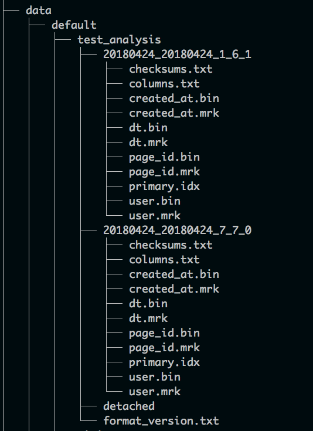

安装及配置

https://www.dazhuanlan.com/2020/03/26/5e7bb2bf85c0d/


```shell
#添加字段
ALTER TABLE visits ADD COLUMN browser String AFTER user_id

#建表
CREATE TABLE tutorial.threat_iocs
(
    `threat_id` UInt32,
    `category` String,
    `category_name` String,
    `created_time` DateTime,
    `item` String,
    `geo` String,
    `score` String
)
ENGINE = MergeTree()
ORDER BY (threat_id)


```


自定义分区

```shell
#分区的目录结构
#https://clickhouse.tech/docs/zh/engines/table-engines/mergetree-family/custom-partitioning-key/
#http://www.clickhouse.com.cn/topic/5b2ccbb49d28dfde2ddc6193
```



```
其中：
default：数据库名
test_analysis：表名
20180424_20180424_1_6_1：是一个part，每次插入数据就会生成一个part，part会不定时的merge成更大的一个part，每个part里的数据都是按照主键排序存储的
checksums.txt：校验值文件
columns.txt：列名文件，记录了表中的所有列名
column_name.mrk：每个列都有一个mrk文件
column_name.bin：每个列都有一个bin文件，里边存储了压缩后的真实数据
primary.idx：主键文件，存储了主键值

primary.idx存储的数据结构类似于一系列marks组成的数组，这里的marks就是每隔index_granularity行取的主键值，一般默认index_granularity=8192
column_name.mrk文件中也类似于primark.key，每隔 index_granularity行就会记录一次offset。
primark.idx和column_name.mrk文件做了逻辑行的映射关系
当接收到查询操作时，首先在primary.idx中选出数据的大概范围，然后在column_name.mrk中得到对应数据的offset，根据offset将bin文件中的数据加载到内存，做真正的数据过滤得到查询结果
```


应用：

https://zhuanlan.zhihu.com/p/103781296?utm_source=wechat_timeline


可视化工具

clickhouse的可视化工具DEeaver ： https://www.cnblogs.com/cbugs/p/13358246.html

jdbc入库：https://github.com/ClickHouse/clickhouse-jdbc


spring-boot的集成


跨域的问题：https://www.cnblogs.com/shaoniandream/p/10511262.html


