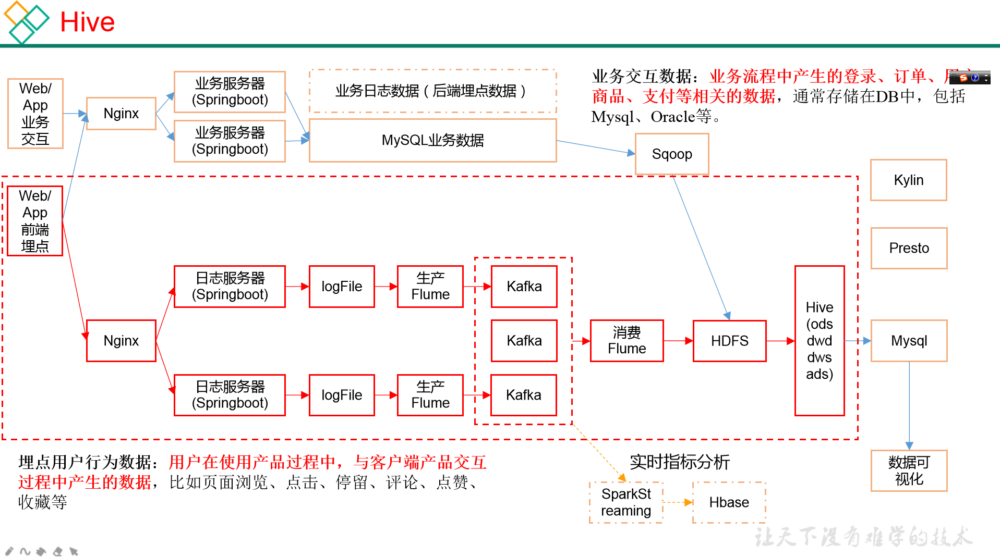

[toc]

# 项目需求

数据采集平台搭建

用户行为数据仓库的分层搭建

数据的基本处理：留存、转化率、GMV，复购率、PV，UV等报表分析（SQL）

# 思考

## 总体架构

## 1.项目技术如何选型？

   * 数据采集传输：Flume，Kafka(日志采集)， Sqoop(用于关系型数据库)，Logstash, DataX(用于关系型数据库)
   * 数据存储：MySQL（可视化），HDFS（离线数据）， HBase，Redis， MongoDB，ES
   * 数据计算：Hive， Tez（作为hive的执行引擎），Spark，Flink， Storm（实时会用到）
   * 数据查询（即席查询）：Presto，Druid，Impala， Kylin

## 2.框架版本如何选型？

   Apache 原生： 

   ​	运维麻烦（需要一个一个组件的搭建）

   ​	组件之间的兼容性需要自己去解决（一般大厂使用，技术实力雄厚，有专业的运维人员）

| 产品      | 版本     |
| --------- | -------- |
| Hadoop    | 2.7.2    |
| Flume     | 1.7.0    |
| Kafka     | 0.11.0.2 |
| Hive      | 1.2.1    |
| Sqoop     | 1.4.6    |
| MySQL     | 5.6.24   |
| Azkaban   | 2.5.0    |
| Java      | 1.8      |
| Zookeeper | 3.4.10   |
| Presto    | 0.189    |
| Hbase     | 1.3.1    |

   CDH：

   ​	商用，国内使用最多的版本，但CM不开源，但其实对中小型公司的使用来说没有影响（建议使用）

   ​	部署简单，解决了框架（组件）的兼容性，CDH 自身有一个版本号

   ​	WEB页面的某些功能是不开源的

   ​	

| 产品CDH框架版本：5.12.1 | 版本  |
| ----------------------- | ----- |
| Hadoop                  | 2.6.0 |
| Spark                   | 1.6.0 |
| Flume                   | 1.6.0 |
| Hive                    | 1.1.0 |
| Sqoop                   | 1.4.6 |
| Ooize                   | 4.1.0 |
| Zookeeper               | 3.4.5 |
| Impala                  | 2.9.0 |
| Hbase                   | 1.3.1 |

   HDP：没有CDH稳定

  

## 3.服务器使用的**物理机**还是**云主机**？

1. 机器成本考虑：

   物理机：以128G内存（内存一定要大，spark，flink），20核物理CPU，40线程，至强E5，8THDD（机械） 2TSSD（固态）硬盘（如果资金充足，那么8TSSD也是可以的），戴尔，华为，单台报价4W多，

   需要考虑托管服务器费用（没有自己的机房，第三方的公司托管，提供网络等服务，一年1W（跟提供的带宽有关）），一般物理机的寿命5年左右（可能会出现问题）

   云主机：以阿里云为例：上面的相同配置，每年5W，这样一比，还是云主机更贵，但是云主机方便，不需要提供专门的运维，服务器的使用时间也是灵活的（不一定用5年）

2. 运维成本考虑：

   物理机：需要有专业的运维人员

   云主机：很多的运维工作都可以由阿里云完成，运维相对较轻松

   综合：物理机和云主机是差不多成本，我自身是倾向于云主机

3. 如何确认集群规模（假设每台服务器8T硬盘，128G内存）

   根据一天的数据量，要保存多少天的数据，确定集群规模（需要多少台服务器，每台服务器的配置）

   假设，数仓的数据至少保存6个月，所以要确定一天的数据量

   1. 每天日活用户100w, 每人一天平均100条：100w*100=1亿 （这是一个中等偏下的规模）
   2. 每条日志（0.5-2k=1k）,每天1亿条：100000000k/1024/1024=around 100G 
   3. 6个月的数据量：6x30x100G=18T ， 那么需要3T作为存储
   4. 保存3副本：18Tx3=54T , 这个是HDFS的数据的量
   5. 预留20%-30% 的空间给kafka，ES等也是会用到的 ，54T/0.7 = 77T
   6. 所以大约需要8T*10台服务器的机器

4. 如果考虑数仓的分层

   服务器将近再扩容1-2倍，那么 77Tx2=150T ， 那么服务确定为：10-20台

## 4.集群资源规划

| 服务名称           | 子服务                | 服务器node102 | 服务器node103 | 服务器node104 |
| ------------------ | --------------------- | ------------- | ------------- | ------------- |
| HDFS               | NameNode              | √             |               |               |
|                    | DataNode              | √             | √             | √             |
|                    | SecondaryNameNode     |               |               | √             |
| Yarn               | NodeManager           | √             | √             | √             |
|                    | Resourcemanager       |               | √             |               |
| zookeeper          | zookeeper Server      | √             | √             | √             |
| Flume(采集日志）   | Flume                 | √             | √             |               |
| kafka              | kafka                 | √             | √             | √             |
| Flume（消费kafka） | kafka                 |               |               | √             |
| Hive               | hive                  | √             |               |               |
| MySQL              | MySQL                 | √             |               |               |
| Sqoop              | Sqoop                 | √             |               |               |
| Presto             | Coordinator           | √             |               |               |
|                    | Worker                |               | √             | √             |
| Azkaban            | AzkabanWebServer      | √             |               |               |
|                    | AzkabanExecutorServer | √             |               |               |
| Druid              | Druid                 | √             | √             | √             |
| 服务器总计         |                       | 13            | 8             | 9             |

----

to do list

1. dataX 使用
2. 实时：spark， flink
3. 即席查询：Impala
4. SQL调优（很重要）

