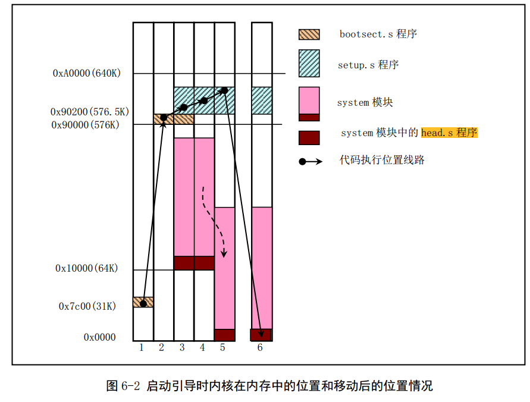
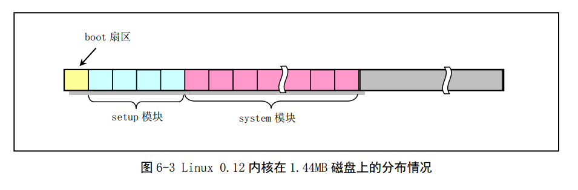
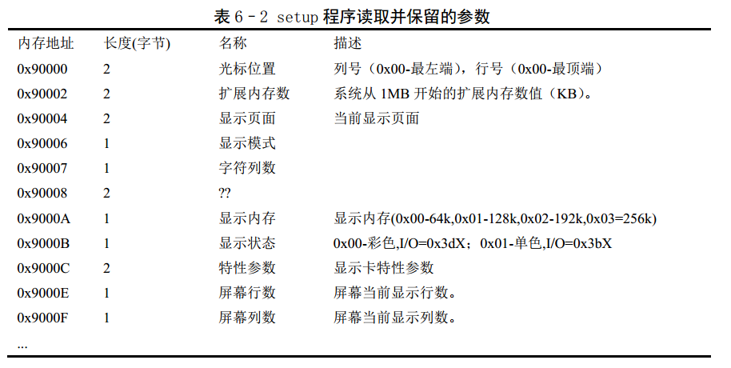
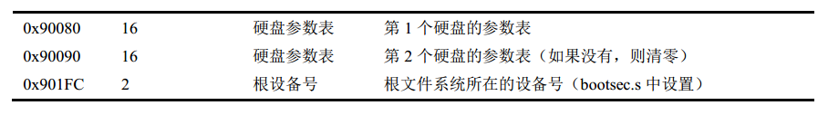

[toc]

# 总的内存示意图

如下图显示了Linux系统启动时程序或模块在内存中的位置




# bootsect

如下图是各个模块在磁盘中的位置



bootsect.S程序的功能描述

1. PC机加电后，ROM BIOS自检后，BOM BIOS会把引导扇区代码bootsect加载到内存地址0x7c00开始处，并跳到这里执行
2. bootsect将自己移动到0x90000开始处
3. 将setup模块加载到0x90200处
4. 利用BIOS中断0x13取磁盘参数表中当前引导盘的参数
5. 在屏幕上显示“Loading system...”
6. 把磁盘setup模块后面的system模块加载到内存0x10000开始处
7. 确定根文件系统的设备号，保存于root_dev中
8. 最后长跳转到setup程序开始处（0x90200）去执行setup程序


# setup

setup程序的功能描述如下：

1. 利用BIOS中断读取机器系统数据，并保存到0x90000开始的位置（覆盖掉了bootsect程序所在的地方），这些参数如下：

   

   

2. 将system模块从0x10000 - 0x8ffff整块向下移动到内存绝对地址0x00000处（当时认为内核系统模块system的长度不会超过512KB，即其末端不会超过内存地址0x90000）
3. 接下来加载中断描述符寄存器（IDTR）和全局描述符寄存器（GDTR），开启A20地址线，重新设置两个中断控制芯片8259A，将硬件中断号重新设置为0x20 - 0x2f
4. 设置CR0，进入32位保护模式
5. 跳转到system模块最前面部分的head.s程序继续运行

GDT和IDT的设置如下：

```assembly
628 ;;;;; 跟显示卡相关代码至此结束 ;;;;;;;;;;;;;;;;;;;;;;;;;;;;;;;;;;;;;;;;;;;;;;;;;;;;;;;;;;;;
629 
630 ;;;;; 全局描述符表（临时，每个描述符项长8个字节）
631 gdt:
632     .word   0,0,0,0     ! dummy ;第1个描述符，不用
633 
634     ; 在GDT表的偏移量是0x08。它是内核代码段选择符的值。
635     .word   0x07FF      ! 8Mb - limit=2047 (2048*4096=8Mb)
636     .word   0x0000      ! base address=0
637     .word   0x9A00      ! code read/exec        ; 代码段为只读，可执行
638     .word   0x00C0      ! granularity=4096, 386 ; 颗粒度4K，32位
639 
640     .word   0x07FF      ! 8Mb - limit=2047 (2048*4096=8Mb)
641     .word   0x0000      ! base address=0
642     .word   0x9200      ! data read/write       ; 数据段为可读可写
643     .word   0x00C0      ! granularity=4096, 386 ; 颗粒度4K，32位
644 
645 ; 加载中断描述符表寄存器指令lidt要求的6字节操作数。
646 ; 注：CPU要求在进入保护模式之前需设置idt表，因此这里先设置一个长度为0的空表。
647 idt_48:
648     .word   0           ! idt limit=0   ; idt的限长
649     .word   0,0         ! idt base=0L   ; idt表在线性地址空间中的32位基地址
650 
651 ; 加载全局描述符表寄存器指令lgdt要求的6字节操作数。
652 gdt_48:
```


