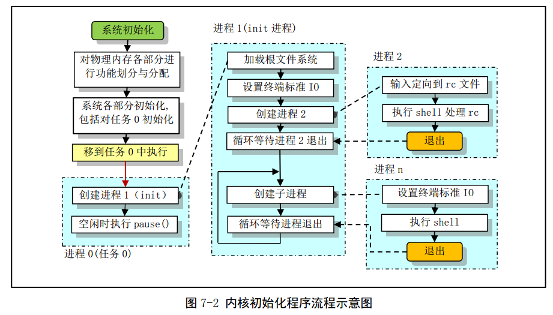

[toc]

程序功能描述

1. main.c 程序首先利用前面 setup.s 程序取得的机器参数设置系统的根文件设备号以及一些内存全局变
   量。  
2. 然后，内核进行各方面的硬件初始化工作。包括陷阱门、块设备、字符设备和 tty，还包括人工设置
   第一个任务（task 0）。 
3. 始化工作完成后， 程序就设置中断允许标志以开启中断，并切换到任务0 中运行。
4. 接下来内核会通过任务 0 创建几个最初的任务，运行 shell 程序并显示命令行提示符，从而 Linux 系统进入正常运行阶段  

在整个内核完成初始化后，内核将执行控制权切换到用户模式（任务0），也即CPU从0特权级切换到3特权级，此时main.c的主程序就工作在任务0中，然后系统第一次调用进程创建函数fork()，创建出一个用于运行init()的子进程（称为init进程），整个系统的初始化工作如下：

