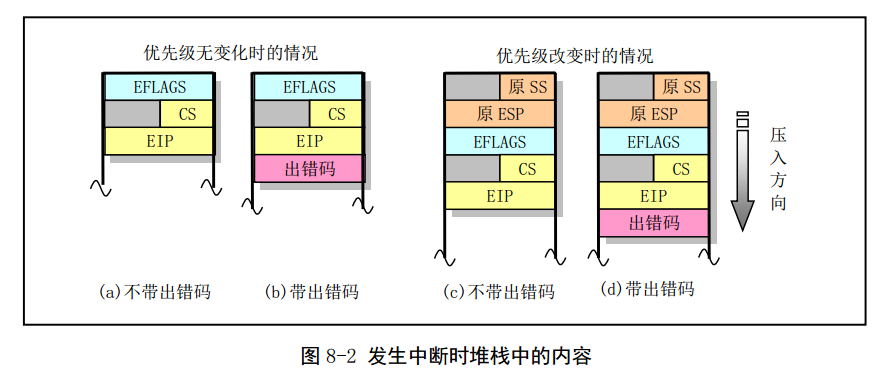
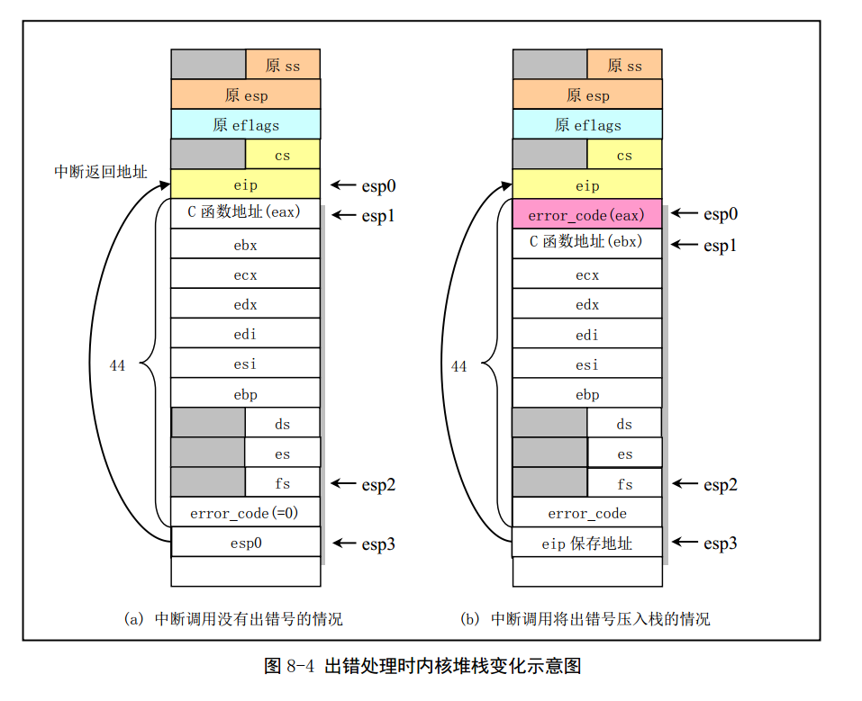
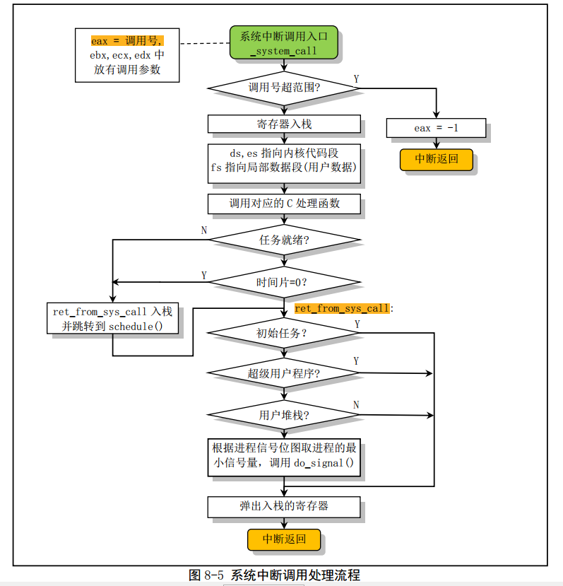

[toc]

# 中断处理程序对栈的内容的影响

在 Linux 系统中，**中断服务功能由内核提供**，因此**中断处理过程会使用进程的内核态栈**。 在用户程
序（进程）将控制权交给中断处理程序之前， CPU 会首先将至少 12 字节（EFLAGS、 CS 和 EIP）的信
息压入中断处理程序的堆栈中，即进程的内核态栈中

如果优先级别发生了变化，例如从用户级改变到内核系统级， CPU 还会将原代码的堆栈段值和堆栈指针压入中断程序的堆栈中。但在内核初始化完成后，内核代码执行时使用的是进程的内核态栈 。

所以当发生中断时，中断处理程序使用的是进程的内核态堆栈。

由于某些异常引起中断时，CPU 内部会产生一个出错代码压入堆栈  

# 系统调用处理相关程序

Linux 中应用程序使用系统资源时需要利用中断调用 INT 0x80 进行，并且需在寄存器 EAX 中放入
调用号。 如果需要给中断处理程序传递参数，则可用寄存器 EBX、 ECX 和 EDX 来存放参数。因此该中
断调用被称为系统调用。

根据这些中断处理相关函数名称的简单命名规则，我们可以这样来理解：通常以'do_'开头的中断处理过程中调用的 C 函数，要么是系统调用处理过程中通用的函数，要么是某个系统调用专用的函数；而以'sys_'开头的系统调用函数则是指定的系统调用的专用处理函数。例如， do_signal()函数基本上是所有系统调用都要执行的函数，而 sys_pause()、 sys_execve()则是某个系统调用专用的 C 处理函数。

# asm.s程序

asm.s 程序中包括大部分的硬件故障（或出错）处理的底层次代码.显示出错信息

# traps.c

tracp.c 程序实现了 asm.s 汇编程序中调用的 C 函数，这还包括内核初始化时调用的针对异常处理中
断向量设置的代码。  

代码最后的初始化函数 trap_init()是在前面 init/main.c 中被调用，用于初始化硬件异常处理中断向量（陷
阱门），并设置允许中断请求信号的到来。  

# sys_call.s 程序

在 Linux 0.12 中，用户使用中断调用 INT 0x80 和放在寄存器 EAX 中的功能号来使用内核提供的各种功能服务， 内核提供的这些服务被称之为系统调用服务  

