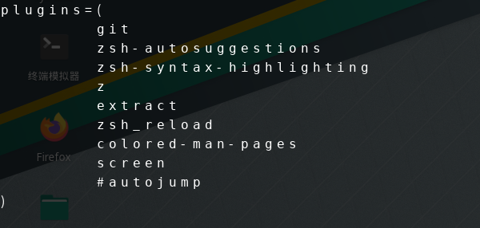

[toc]


我在manjaro上安装了如下的插件



# 安装

## 安装zsh

## 安装oh-my-zsh

在安装oh-my-zsh之前，首先需要安装好`zsh`：

```text
yum install -y zsh
```

切换shell为zsh：

```text
chsh -s /bin/zsh
```

重启终端：

```text
# 查看当前shell
echo $SHELL
```

输出`/bin/zsh`表示成功

oh-my-zsh的安装非常简单，参考官网，执行如下命令即可：

```text
# curl
sh -c "$(curl -fsSL https://raw.githubusercontent.com/robbyrussell/oh-my-zsh/master/tools/install.sh)"

# wegt 
sh -c "$(wget https://raw.githubusercontent.com/robbyrussell/oh-my-zsh/master/tools/install.sh -O -)"
```

输出如下表示成功：


## 配置oh-my-zsh

和`bash`不同，`zsh`的配置文件是`~/.zshrc`，实际上`oh-my-zsh`的默认配置也够我们使用了，但是这样其真正的强大之处并不能得到很好的体现，因此我们可以继续看看对应的插件和主题功能

## oh my zsh使用

- **配置文件：**完成安装后，会自动在主目录下生成一个隐藏文件~/.zshrc，此即为配置文件，也是最重要的文件。
- **主题：**oh my zsh提供了海量的主题，具体可参考[themes](https://link.zhihu.com/?target=https%3A//github.com/ohmyzsh/ohmyzsh/wiki/Themes)。找到自己心仪的主题后，只需在配置文件中将ZSH_THEME="robbyrussell"引号中主题名字替换，保存文件后重启shell（或直接在命令行中输入source ~/.zshrc使配置生效）即可。
- **插件：**丰富的插件是zsh的灵魂。可用的插件列表见链接[plugins](https://link.zhihu.com/?target=https%3A//github.com/ohmyzsh/ohmyzsh/wiki/Plugins)，每个插件文件夹下都有其对应的README文档供参考。若要使用某插件，只需在配置文件中将插件名字加入到plugins=()字段中的括号中即可。注意需以空格或换行来分隔多个插件名，而不能用逗号。修改后保存文件重启shell（或直接在命令行中输入source ~/.zshrc使配置生效）即可。

# oh my zsh


# zsh的插件

参考：https://github.com/ohmyzsh/ohmyzsh/tree/master/plugins

## zsh-autosugestions

1.Clone项目到`$ZSH_CUSTOM/plugins`文件夹下 (默认为 `~/.oh-my-zsh/custom/plugins`)

```
git clone https://github.com/zsh-users/zsh-autosuggestions ${ZSH_CUSTOM:-~/.oh-my-zsh/custom}/plugins/zsh-autosuggestions
```

2.[**zsh-autosuggestions**](https://github.com/zsh-users/zsh-autosuggestions)，如图输入命令时，会给出建议的命令（灰色部分）按键盘 → 补全


如果感觉 → 补全不方便，还可以自定义补全的快捷键，比如我设置的逗号补全，只需要在 `.zshrc` 文件添加这句话即可

```
bindkey ',' autosuggest-accept
```

3.官网中有多种[安装方式](https://github.com/zsh-users/zsh-autosuggestions/blob/master/INSTALL.md)，这里选择oh my zsh中的安装方式：

在 **Oh My Zsh** 的配置文件 (`~/.zshrc`)中设置:

```
plugins=(其他插件 zsh-autosuggestions)
```

4.运行 `source ~/.zshrc` 更新配置后重启**item2**。

> 当你重新打开终端的时候可能看不到变化，可能你的字体颜色太淡了，我们把其改亮一些：

```
cd ~/.oh-my-zsh/custom/plugins/zsh-autosuggestions
vim zsh-autosuggestions.zsh
# 修改 ZSH_AUTOSUGGEST_HIGHLIGHT_STYLE='fg=10' 
```

> 修改成功后需要运行 `source ~/.zshrc` 更新配置，然后开发新的**item2**窗口即可看到效果。


## zsh-syntax-highlighting

语法高亮，如果语法有错误，他会红色显示

安装方法如下（oh-my-zsh 插件管理的方式安装）：
1.Clone项目到`$ZSH_CUSTOM/plugins`文件夹下 (默认为 `~/.oh-my-zsh/custom/plugins`)

```
git clone https://github.com/zsh-users/zsh-syntax-highlighting.git ${ZSH_CUSTOM:-~/.oh-my-zsh/custom}/plugins/zsh-syntax-highlighting
```

2.在 **Oh My Zsh** 的配置文件 (`~/.zshrc`)中设置:

```
plugins=(其他插件 zsh-syntax-highlighting)
```

3.运行 `source ~/.zshrc` 更新配置后重启**item2**:


## z(命令快速跳转目录)

[**官方文档**](https://github.com/rupa/z)
**z** 插件也是 **autojump** 插件在 **oh-my-zsh** 内置的类似组件，基本包含所有功能。

### 作用

**使用 z 之后可以让你最快速的切换文件路径。**

> **z** 插件记住了你在命令行中跳转过的每个路径，并且记录了每个路径的访问次数，因此，它常常能猜到你想访问的路径。
> 记录文件就在用户根目录下，名字是 `.z`。
> 说“**常常能猜到**”，意思是有猜错的时候，比如，不曾访问过的路径，**z** 插件就不知道，没法跳转。

### 安装

**默认安装oh my zsh时就已经安装了 z 插件，具体可以在以下目录看到**

```
cd ~/.oh-my-zsh/plugins
```

所以你只需要在(`~/.zshrc`)中的插件列表中添加

```
vim ~/.zshrc
# 再插件列表中添加
plugins=(其他插件 z)
```

### 使用

| 参数 | 描述                                                 |
| ---- | ---------------------------------------------------- |
| -c   | 在当前目录下进行子目录匹配                           |
| -e   | `echo`最合适的匹配和对应的rank，但是不执行`cd`操作   |
| -h   | 显示帮助信息                                         |
| -l   | `echo`所有匹配的目录和对应的rank，但是不执行`cd`操作 |
| -r   | 进入所匹配目录列表中rank值最高的那个目录             |
| -t   | 进入所匹配目录列表中最近访问的那个目录               |
| -x   | 在.z缓存中清除当前目录的记录                         |

例子：

- `z foo` 进入到最匹配的`foo`关键字的目录
- `z foo bar` 进入层级匹配，先匹配`foo`关键字，再匹配`bar`关键字的目录
- `z -r foo` 进入匹配`foo`关键字目录列表中`rank`值最高的目录
- `z -t foo` 进入匹配`foo`关键字目录列表中最近访问的目录
- `z -l foo` 列出所有匹配`foo`关键字的目录列表


## extract plugin


This plugin defines a function called `extract` that extracts the archive file you pass it, and it supports a wide variety of archive filetypes.

This way you don't have to know what specific command extracts a file, you just do 

```shell
extract filename 
```

and the function takes care of the rest.

这个插件也是ohmyzsh自带的，只需要加这个进去就行了

To use it, add `extract` to the plugins array in your zshrc file:

```
plugins=(... extract)
```

### Supported file extensions

| Extension         | Description                          |
| ----------------- | ------------------------------------ |
| `7z`              | 7zip file                            |
| `Z`               | Z archive (LZW)                      |
| `apk`             | Android app file                     |
| `aar`             | Android library file                 |
| `bz2`             | Bzip2 file                           |
| `deb`             | Debian package                       |
| `gz`              | Gzip file                            |
| `ipa`             | iOS app package                      |
| `ipsw`            | iOS firmware file                    |
| `jar`             | Java Archive                         |
| `lrz`             | LRZ archive                          |
| `lz4`             | LZ4 archive                          |
| `lzma`            | LZMA archive                         |
| `rar`             | WinRAR archive                       |
| `rpm`             | RPM package                          |
| `sublime-package` | Sublime Text package                 |
| `tar`             | Tarball                              |
| `tar.bz2`         | Tarball with bzip2 compression       |
| `tar.gz`          | Tarball with gzip compression        |
| `tar.lrz`         | Tarball with lrzip compression       |
| `tar.lz`          | Tarball with lzip compression        |
| `tar.lz4`         | Tarball with lz4 compression         |
| `tar.xz`          | Tarball with lzma2 compression       |
| `tar.zma`         | Tarball with lzma compression        |
| `tar.zst`         | Tarball with zstd compression        |
| `tbz`             | Tarball with bzip compression        |
| `tbz2`            | Tarball with bzip2 compression       |
| `tgz`             | Tarball with gzip compression        |
| `tlz`             | Tarball with lzma compression        |
| `txz`             | Tarball with lzma2 compression       |
| `tzst`            | Tarball with zstd compression        |
| `war`             | Web Application archive (Java-based) |
| `xpi`             | Mozilla XPI module file              |
| `xz`              | LZMA2 archive                        |
| `zip`             | Zip archive                          |
| `zst`             | Zstandard file (zstd)                |

See [list of archive formats](https://en.wikipedia.org/wiki/List_of_archive_formats) for more information regarding archive formats.


## zsh_reload plugin

提供一个 src 命令，重载 zsh。对于经常折腾 zshrc 的我，这条命令非常实用。

The zsh_reload plugin defines a function to reload the zsh session with just a few keystrokes.

To use it, add `zsh_reload` to the plugins array in your zshrc file:

```
plugins=(... zsh_reload)
```

### Usage

To reload the zsh session, just run `src`:

```
$ vim ~/.zshrc  # enabled a plugin
$ src
re-compiling /home/user/.zshrc.zwc: succeeded
re-compiling /home/user/.oh-my-zsh/cache/zcomp-host.zwc: succeeded

# you now have a fresh zsh session. happy hacking!
```


## Colored man pages plugin

给你带颜色的 man 命令

This plugin adds colors to man pages.

To use it, add `colored-man-pages` to the plugins array in your zshrc file:

```
plugins=(... colored-man-pages)
```

It will also automatically colorize man pages displayed by `dman` or `debman`, from [`debian-goodies`](https://packages.debian.org/stable/debian-goodies).