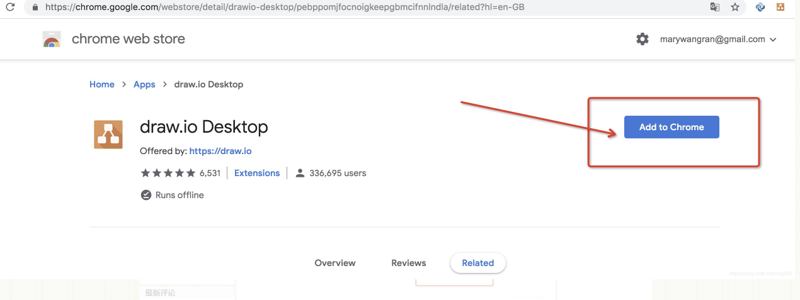
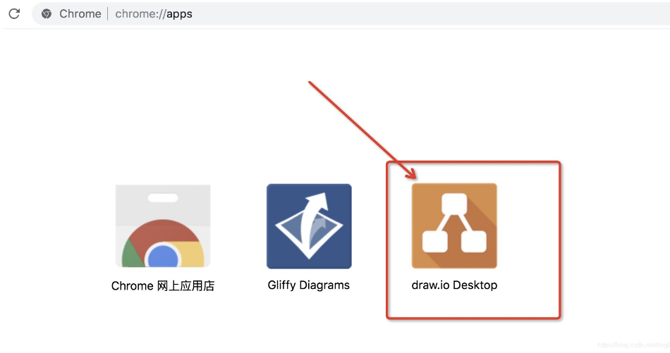
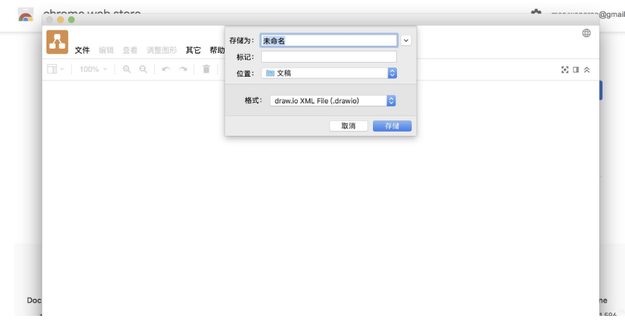
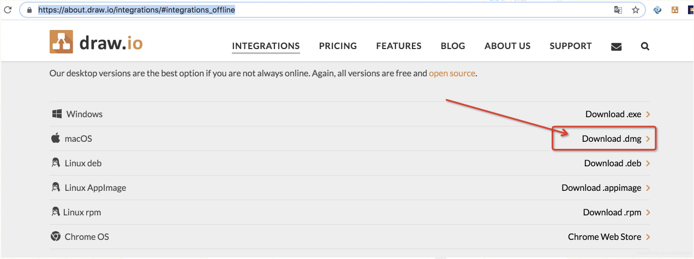
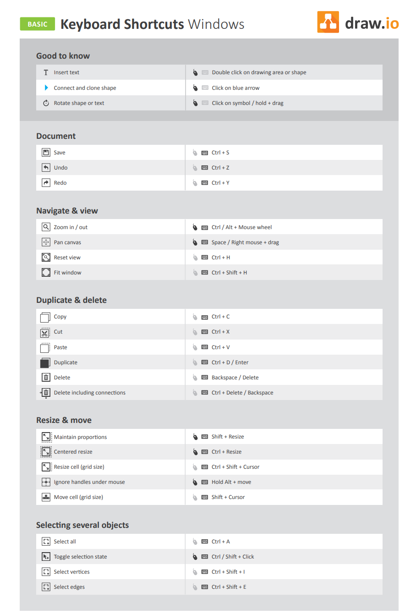

[toc]

转自：https://blog.csdn.net/dog250/article/details/89272808

# 插件版

补充下的，无疑插件版和桌面版要比WEB版的方便很多，至少不用自己搭建WEB服务了。

先说插件版。drawio当然是Google的咯。

首先下载这个Chrome APP插件：https://chrome.google.com/webstore/detail/drawio-desktop/pebppomjfocnoigkeepgbmcifnnlndla/related?hl=en-GB

然后就可以用了，Chrome浏览器输入APPs列表的URL： chrome://apps/

直接点击：

好了，就这么简单。

# 桌面版

再说桌面版的，这个基本就和Windows上的Office Visio的使用习惯一样了，安装在本地。

先下载它，最好的途径就是它的github项目本身：https://github.com/jgraph/drawio
在README.md中找到下载链接：https://about.draw.io/integrations/#integrations_offline

各个平台的，应有尽有。我选择MacOS的：

下载下来，双击解压安装，就OK了：

当然了，你依然可以配置不同的语言。

# draw.io快捷键

